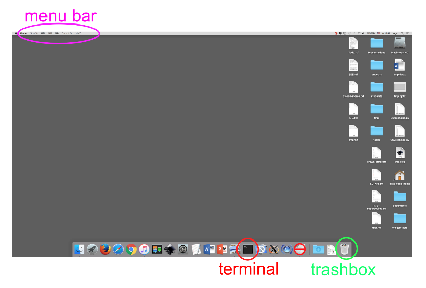

# シミュレーションを行う前に: 計算機の使い方

計算機シミュレーションの現場では、Windows ではなく、UNIX (Linux)系統の OS が使われることが多い。我々のグループでは、各個人が手元の Mac の端末から別の部屋にある CentOS の計算機に遠隔ログインして作業する。どちらも UNIX 系の OS である。この章は、全くの初学者がこれら UNIX 系の OS である程度の作業をできるようになることを目指して解説を行う。よほどのことが無い限り操作ミスで計算機が壊れるということはないので、遠慮せずに、自分でいろいろと試して学習すること。

## ネットワーク設定

### 大学の Wifi

`00ouwifi`に接続時に、Wifi 接続用の、ユーザー名とパスワードを聞いてくるので、パスワードは個人のものを入力し、ユーザー名(p から始まる 8 文字の英数字?)のうしろに`@2778`を付けると、研究室 VLAN(識別番号 2778)に入る(はず)

ユーザー名を聞いていない場合は、Wifi の設定から 00ouwifi を一旦削除して接続しなおす。

IP アドレスは`172.23.78.xxx`となる。

> いろいろやってみた。

|              | iPad          | MacBook       | VLAN       |
| ------------ | ------------- | ------------- | ---------- |
| \*vitroid    | 172.23.78.217 | 172.23.78.201 | chem3(lab) |
| vitroid@2773 | 172.23.73.247 | 172.23.73.236 | RIIS       |
| vitroid@2778 | 172.23.78.217 |               | chem3(lab) |
| vitroid@1363 |               | 10.1.110.246  | 生活系     |

> \*松本の端末はデフォルトネットワークを VLAN2778 としているため。
> ブラウザに表示される、OUNET2018 へのパスワード入力画面で@を付けても効力がないみたい。

### VPN 接続の方法

学外から接続する場合は、研究室設置の VPN(仮想プライベートネットワーク)が利用できる。Mac/Windows の VPN 機能にしかるべき設定をし、接続する。

IP アドレスは`192.168.3.xxx`となる。

### サーバ室 414 の Wifi

サーバ室 414 の近くであれば、サーバ室の Wifi が利用できる。

- 414-ac
- A129 Network

IP アドレスは`192.168.3.xxx`となる。

## Mac の使い方

Mac の画面は Figure 1.1 のようになっているはずである。画面の下側に並んでいるアイコンがそれぞれ一つのアプリケーションに対応している。通常は、クリックすることでそのアプリケーションが起動される。特殊な起動をする場合や、アプリケーションを終了するときなどは、control キーを押しながらアイコンをクリックし、現れたメニューから該当の項目を選んでクリックする。「control + クリック」(トラックパッドでは二本指でクリック)は Windows における右クリックに対応している。Mac でも 2 ボタンマウスを使えば、右クリックが「control + クリック」として機能する。[^1]



> **Figure 1.1** Mac OS X のデスクトップ画面の例。アプリケーションの並び順は人によって違う。ターミナルが無い人は、初期設定の問題なので、教員か先輩に尋ねること。

Windows では、それぞれの窓の上部にメニューが表示される。一方 Mac の場合、それぞれの窓の上部には、窓の拡大、格納、消去を行うボタンがついているだけである。その代わりに、画面の一番上のバーにその時アクティブになっている窓のメニューが表示される（Figure 1 の左上のピンクの楕円）。アプリケーションを一つも起動していない場合、もしくはデスクトップの背景をクリックしてアクティブな窓が無い状態にすると、Finder というアプリケーションのメニューが表示される。これはファイルやフォルダを管理する常駐アプリケーションである。

Windows との大きな違いの一つは、窓を消してもアプリケーションが終了しないということである。アプリケーションを終了させるには、その窓をアクティブにして上部のメニューから終了を選ぶか、画面下のアイコンを「control + クリック」してから終了を選ぶ必要がある。マシンの挙動が重くなった場合は、このようにして不要なアプリケーションを終了させると直ることが多い。

デスクトップにはファイルやフォルダを置くことができる。これは Windows と同じである。ゴミ箱は画面下のアプリケーションバーの右端にある (Figure 1 の右下の緑の円)。Mac 自体の電源を落とす時は、画面上の左端にあるリンゴマークをクリックして、「システム終了」を選べばよい。基本的に、電源は落とさなくて良い。帰宅時には蓋を閉じてスリープにする。スリープさせたくない場合は、Commad-Control-Q で画面をロックしておく。

## VScode のインストール

2022 年現在、Microsoft が提供している VS code というプログラム開発ソフトウェアが無料で利用できる。https://code.visualstudio.com/download 非常に使いやすいので、これを利用してプログラムを書き、実行することを強く推奨する。

以下の VSCode 拡張機能を追加する．(VSCode 画面左端にならぶアイコンの中の，田のような品のようなアイコンを押す)

- Python
- Remote Development
- Remote - SSH
- gromacs helper

ほかにも便利な拡張機能は多数あるが、闇雲にインストールすると VSCode が不安定化したり、拡張機能同士が干渉する可能性があるので、ネットで調べてエキスパートがお勧めするものをインストールするように。(よく似た別物がたくさんあります)

## ターミナルの使い方

<!-- > VSCode内のターミナルだけで十分では？ -->

コンピュータを操作する最も基本的な方法は、ターミナルでコマンドを入力する方法である (Figure 1 の赤い円)。これを起動すると一枚の窓が現れる(起動後は、ターミナルのアイコンを「control + クリック」して「新規ウィンドウ」を選ぶことで、複数の窓を出すこともできる)。キーボードからこの窓へコマンドを打ち込むことで、計算機に様々な作業をさせることができる。例えば、pwd とキーボードで打って Enter を押してみよう。[^2]

```pc
pwd
```

なにか一行の文字列が表示されたはずである。pwd は、「自分がいるディレクトリ（フォルダともいう）の名前を（最上層から省略せずに）表示する」という意味のコマンドである。ターミナルを開いた時に自分がいるディレクトリのことをホームディレクトリという。pwd によって表示されたのは、このホームディレクトリの名前である。次に

```pc
mkdir test1
```

と打ってみよう。これは「test1 という名前のディレクトリを作成する」という意味である。r と t の間にスペースがあることに注意しよう。ターミナルで文字を打ち込む場合、スペースの有無は重要である。ここで、r と t の間にスペースがないと、正しく動作しない。スペースは有るか無いかだけが問題であり、スペースが 1 以上なら、その数がいくつでも動作は変わらない。最後に

```pc
ls
```

と入力してみよう。これは「そのディレクトリにあるすべてのファイルとディレクトリを表示する」コマンドであり、実際に test1 というディレクトリが出来ていることが分かる。また、「Desktop」や「Downloads」などがホームディレクトリの一層下のディレクトリとして最初から存在していることも分かるだろう。

ここで紹介したコマンドは，Mac でも Linux でも共通である．なお，VSCode にはターミナルが内蔵されている．プログラムの開発をしながらそれを走らせてみたり，リモートの Linux と手許の Mac の間でファイルを交換したりするのに便利なので，本格的に作業を行う場合にはそちらを使うことになる．

## 研究室の計算機とそれらへの接続

手元の MacBook だけでは、研究を行うには不十分である。我々のグループは、数十台の高性能計算機を所有している（サーバ室 414 は、これらを置く専用の部屋）。Table 1.1 にこれを列挙する。プログラミングの練習や、その後の研究は、Mac Book からこれらの計算機に遠隔ログインして行う。

遠隔ログインする前に，Mac の`~/.ssh/Config`の先頭に次の行を加える．

```data
ForwardX11Timeout 2000000s
```

VScode で計算サーバに接続する場合には、ウィンドウの左下の青の「<sub>></sub><sup><</sup>」ボタンを押す。すると、ウィンドウの上のほうに「Connect to host」などの選択肢が表示されるので、一番上の「Connect to host」を選ぶ。次に「+ Add New SSH Host」を押すと入力を求められるので、以下のように入力する。

```pc
ssh user@172.23.78.44
```

`user`となっている部分は自分のユーザー名と置き換える。[^3] `172.23.78.44`は計算機`tc1`の IP アドレスである。初回ログイン時のみ，OS の種類を聞いてくる．接続先は Linux なので “Linux”を選ぶ．次回以降はリストから選ぶだけでログインできる．ログインしたら、メニューの「Terminal」を押し、「New Terminal」を押して新しい Terminal を開く。(VScode のターミナルはウィンドウの下のほうに表示される。)ターミナルで「uname」というコマンドを入力してみよ。

```shell
uname
```

正しくログインできていれば、「Linux」と表示されるはずである。Table 1.1 に挙げた計算機のどれを使用しても構わないが、最初の内は`tc1`だけで十分だろう。

> **Table 1.1** 我々のグループが所有する計算機 (2025 年 9 月)。chuck[34]というのは、chuck3 と chuck4 という名前の計算機があるという意味。他の計算機についても同様。故障などにより抜けていることもある。詳しい情報は LoadMeters http://172.23.78.52:8080 または http://192.168.3.72:8080 で調べる。

| hostname        | CPU                  | Number of Cores | Performance of each Core |
| --------------- | -------------------- | --------------- | ------------------------ |
| chuck[1234]     | Intel Xeon E5-2667   | 16              | High                     |
| blackbird[12]   | Intel Xeon E5-2697A  | 32              | Medium                   |
| blackbird[3456] | Intel Xeon Gold 6152 | 44              | Medium                   |
| tc              | Intel Xeon ??        | 96              | Medium                   |
| pm              | AMD EPYC 9754        | 128             | Medium                   |

## ファイルの編集

以下の作業は、Table 1.1 の計算機のいずれかに遠隔ログインしていると想定して進める。何かうまくいかなかった場合は、`hostname`コマンドを使って遠隔ログインした状態になっているかどうかを確認すること。

プログラムコードなどのように、文字だけからなるファイルをテキストファイルという。VScode のファイルメニューから、「New Text File」を押して新しいテキストファイルが作れる。保存する際に、ファイル名の末尾には適切な拡張子を付けるようにする。(Python プログラムなら`.py`、ただのテキストファイルなら`.txt`、MarkDown 形式のファイルなら`.md`など)[^4] 保存先は、ssh で接続しているリモートのサーバであることに注意。

### 練習

ファイルを新たに作る。名前は`test.py`、中身は以下の通り。

```python
#!/usr/bin/env python3

print("Hello World!)
```

## ディレクトリやファイル操作

ssh でログインした時に、自分が最初に居るディレクトリのことをホームディレクトリという（Mac のホームディレクトリとログインした先のホームディレクトリは異なることに注意）。ホームディレクトリでファイルを作りすぎると見づらくなるので、適宜、新しくディレクトリを作って、そこで作業をしたほうが良い。`practice`というディレクトリを作ろう。

```shell
mkdir practice
```

このディレクトリに移動するには`cd`というコマンドを使う。

```shell
cd practice
```

<strike>「practice」から見て一つ上のディレクトリに、先ほど作った test.py というファイルがあるはずである。これを、今いるディレクトリに移動させてみよう。ファイルの移動には mv というコマンドを使う。</strike>

```shell
mv ../test.py  .
```

ここで、`../`と`.`という記号が新しく出てきた。前者が「一つ上のディレクトリ」という意味である。`../`と`test.py`をつなげて書くことで、「一つ上のディレクトリにある test.py」という意味になる。`.`は、「今いるディレクトリ」という意味である(カレントディレクトリという)。移動させてきたファイルを VSCode で開いて、先ほど保存した内容と同じであることを確認せよ。

`mv`コマンドは、ファイルを移動させるだけでなく、ファイルの名前を変える時にも使う。

```shell
mv test.py new-test.py
```

これで、ファイル名が`test.py`から`new-test.py`に変更される。
もとのファイルを残し、同じ内容の別のファイルを作るには`cp`コマンドを使う。

```shell
cp new-test.py  backup_test.py
```

<strike>ファイルを編集するには gedit を使わなければならないが、</strike>そのファイルを見るだけで良いということもよくある。その場合は、`less`コマンドを使う。

```shell
less backup_test.py
```

ターミナル内にファイルの内容が表示される。窓が現れないので、起動が速い。わずかな差だと思うかもしれないが、仕事に慣れてくるとその差が気になるようになってくるので、`less`を使う機会が多くなるだろう。`less`コマンドを終了するには、キーボードで`q`を押せばよい。
不要なファイルを消す時は`rm`コマンドを使う。

```shell
$ rm backup_test.py
```

**rm コマンドで消去されたファイルを復元することはできない。** Windows のようにゴミ箱に一時的に置かれるということはなく、システムから完全に消去されるので、<u>気を付けて使用すること。</u>[^5]他にも様々なコマンドがあるが、そのすべてを列挙することはできない。google で「linux コマンド 逆引き」といった検索キーワードを使えば、目的の操作のコマンドを探すことができるだろう。LINUX の入門書や初心者向けの web ページを見てもよい。

> 以下大幅編集が必要

## プログラムの実行

次はいよいよ、プログラムを書いて動かしてみよう。VSCode で new-test.py を開く。最初に書いた落書きが残っているはずなので、それをすべて消す。それから、以下のように書き込んで保存してみよう

```python
i=4
j=3
print(i+j)
```

これは、「変数 i に 4、変数 j に 3 を代入し、その和 k を求め、それを画面に書き出す」プログラムである。

プログラムを実行するにはターミナルで以下のようにする。

```shell
python3 new-test.py
```

ファイル名の最後にピリオドを付けて示される部分を拡張子という。`new-test.py`でいえば`.py`がそれである。拡張子はそのファイルの種類を示すものである。`.py`は python のスクリプトという意味である (スクリプトとは、コンパイルせずに実行できるプログラムのことである。Fortran や C などのコンパイル言語と比べ、実行速度は遅いがプログラムを書きやすいという特徴がある。後の章で、いくつかの python スクリプトを使用する)。拡張子が誤っていると、計算機上でうまく処理が行われないことがあるので、注意すること。[^ext]
　これで、プログラミングを練習する環境は整った。

[^ext]: Unix シェルは拡張子でファイル種類を判断しないが、MacOS の Finder や MSDOS 系 OS は拡張子で判断する。

## ジョブの強制終了

プログラムを間違えると、すぐに終わるはずのジョブがなかなか終わらないことがある。また、研究が始まってからも、計算条件を間違っていた等の理由でやり直したいということが起こるだろう。このような場合にはジョブを強制終了させなければならない。　　
それには、そのターミナルをアクティブにした状態でキーボードの Control を押しながら c を押せばよい(このキー操作は`^C`と表示されることが多い)。ほとんどの場合はジョブが終わり、そのターミナルで再びコマンドを打てる状態になるはずである。

## データの保存場所

Table 1.1 に示したように、計算機室には多量の計算機があるが、そのどれからも同じ記憶メディア（ハードディスク)にアクセスできるように設定されている(この仕組みを NFS という)。どの計算機にログインしても、ホームディレクトリの場所は変わらない。そのため、Table 1.1 の計算機の間でファイルを移動させる必要はない。ただし、システムは計算機ごとに異なるため、同じように動作するとは限らない。(例えば、OS のバージョンが違い、そのために Python 等のバージョンが違ったり、intel compiler がインストールされてなかったり、いろいろ違いはある)

## 計算機室のファイルシステム\*

研究室には、ホームディレクトリのある記憶メディア以外にも、複数の記憶メディアがある。Table 1.2 にそれらをまとめる。それぞれのファイルシステムには、`cd`コマンドで移動できる。例えば`/r4`に移動するには、以下のようにする。

```shell
cd  /r4
```

そこで`ls`を打てば、何人かのユーザーのアカウント名のついたディレクトリがあることが分かるだろう。今まで使ったことのないファイルシステムを使うには、最初に管理者権限で使用者のディレクトリを作らなければならない。必要になったら、教員に申請すること。

> **Table 1.2** 松本グループの大規模記憶メディア(2023 年 11 月)。

| Filesystem | Hostname | Size / TB | Used | Memo                     |
| ---------- | -------- | --------- | ---- | ------------------------ |
| r1s        | jukebox1 | 5.3       | 91 % | ホーム                   |
| u          |          |           |      | r1s の別名(移転したはず) |
| r2         | jukebox0 | 58        | 95 % | データ置き場             |
| r3         | jukebox1 | 58        | 33 % | データ置き場             |
| r4         | jukebox2 | 58        | 97 % | データ置き場             |
| r5         | jukebox4 | 52        | 90 % | データ置き場             |
| r1l        |          |           |      | r5 の別名                |
| r6         | jukebox5 | ??        | ?? % | データ置き場、ホーム     |

> 用途の違いを書く

## 計算機室と Mac book の間のデータ移動

手元の MacBook のホームディレクトリ(のあるディスク)と、Table 1.1 の計算機におけるホームディレクトリ(のあるディスク)は異なっている。そのため、これらの間では何らかの方法でファイルを移動させる必要がある。基本的には `rsync`コマンドを使えば良いだろう。`rsync`コマンドは、MacBook のターミナルから実行する(Table 1.1 の計算機にログインしていない状態で実行するという意味)。tc1 (172.23.78.44)からファイルを移動する場合は以下のようにする。

```pc
rsync  -av  user@172.23.78.44:~/practice/new-test.f90   .
```

ここで、`~/`はホームディレクトリという意味である。最後のピリオドを忘れないように。また、user の部分は自分のユーザー名にすること。逆に、例えば MacBook から`test1.py`というファイルを tc1 の`~/practice/`というディレクトリに送るには、以下のようにする。

```pc
rsync  -av  test1.py  user@172.23.78.44:~/practice/
```

`rsync`コマンドは，転送元と転送先に同じ名前のファイルがあった場合には，転送元のファイルの内容が更新されている場合にのみ転送先を上書きする(上書きを回避する，あるいはバックアップを残す設定も可能)．大量のファイルが入ったディレクトリごとコピーする場合には非常に安全で高速である．一方，1，2 個のプログラムなどを転送する場合には、Finder と VSCode 間でファイルをドラッグドロップするという方法も便利である．

<strike>
## Dropboxの利用
Dropboxは、登録された計算機とweb上の記憶領域で同じファイルを共有するサービスである。web上の記憶領域には、登録された複数のユーザー（計算機）がアクセスすることができる。我々のグループでは、メンバー間でファイルをやり取りするためにこのDropboxを利用している。四年生は、それぞれのMacを与えられた時に、Dropboxの登録をしたはずである。やり取りされるファイルは、Dropbox内の「TheoChem」というフォルダ以下に置かれる。</strike>

[^1]: Mac のトラックパッドでは、マウスでは不可能なさまざまなジェスチャーが利用できる。
[^2]: 本稿では、ターミナルに打ち込む文字を、四角で囲われた黒い文字で表す。また、四角の中の各行の最後で Enter(Return)を打ち込むこということにする。行頭のプロンプト文字は人によって異なる。例えば松本の場合、`blackbird3.local:Run_MD matto$ `のようになっているが、本稿では単純に`$`で表す。プロンプト文字は入力する必要はない。
[^3]: 正しく設定されていれば、サーバログイン時にはパスワードを入力する必要がない。
[^4]: Unix ではファイルの拡張子には特別な意味はないので、自由に拡張子を付けてもかまわないし、拡張子がなくても問題はないが、一般によく使われる拡張子を付けておくと、 VScode がファイル形式を認識して便宜を計ってくれる。
[^5]: `rm` コマンドは危険で、`-f`や`-r`オプションが付くとさらに危険性が増す。例えば、`rm -rf /mydir`とするつもりで、うかつに`rm -rf / mydir`とタイプしてしまうだけで、すべてを失う。`rm`を気軽に使う癖をつけず、作業しているディレクトリに`trash/`ディレクトリを作り、消す代りにそこに投げこむといった方法をお薦めする。
