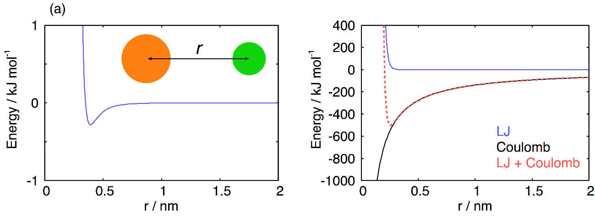
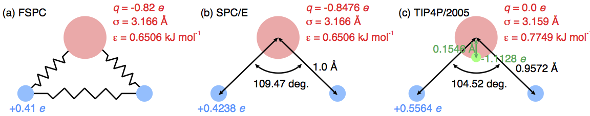
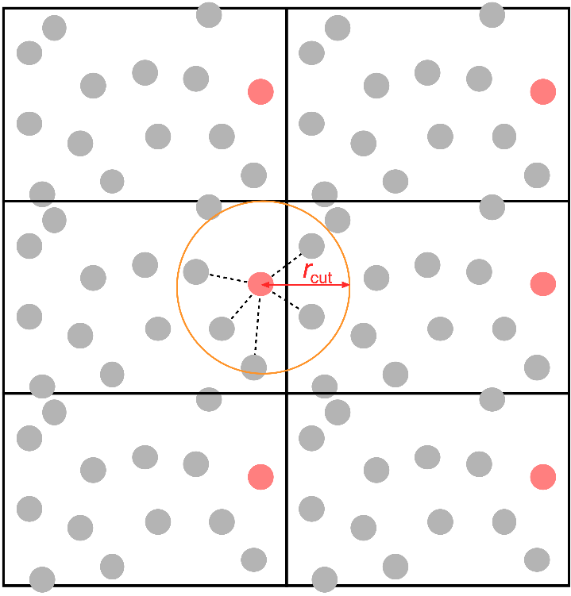

# 分子シミュレーション
我々の研究室では、分子シミュレーションにより水、氷、包接水和物、水溶液などを研究している。分子シミュレーションとは、分子動力学法、構造最適化、基準振動解析、モンテカルロ法などの総称である。この章では、これらのシミュレーション技法の基礎を解説する。

## 原子間相互作用
分子シミュレーションでは、粒子間の相互作用エネルギーが計算される。化学で扱われる粒子の最小単位は核と電子である。これらの間の相互作用（核-核、核-電子、電子-電子相互作用）を計算するには、電子を波動関数として扱う必要がある。このような量子力学的な計算には、高い計算コストが要求される。そのため、現在の計算機では、粒子数の少ないシミュレーションか、短時間のシミュレーションしかできない。
一つの原子は、核と幾つかの電子からなる。原子を最小単位とし、量子力学的な扱いをしない分子シミュレーションを、古典分子シミュレーションと呼ぶ。古典シミュレーションの計算コストは低く、研究室にある計算機でも10万原子程度までは扱うことができる（スパコンを使えばさらに大きな系を扱うことができる）。
二つの粒子の間の相互作用を二体相互作用という。古典シミュレーションでは、原子間の二体相互作用を、点電荷同士のクーロン相互作用、Lennard-Jones (LJ) 相互作用、調和振動子で記述することが多い。クーロン相互作用は次式で表される。
$$V\left(r_{ij}\right)={1\over 4\pi\epsilon_0}{q_iq_j\over r_{ij}}\tag{2.1}$$
ここで、$q_i$と$q_j$は原子$i$と$j$の上の点電荷、$r_{ij}$は原子$i$と$j$の間の距離、$\epsilon_0$は真空の誘電率を表す。LJ相互作用は次式で表される。
$$V\left(r_{ij}\right)=4\epsilon_{ij}\left\{\left(\sigma_{ij}\over r_{ij}\right)^{12}-\left(\sigma_{ij}\over r_{ij}\right)^6\right\}\tag{2.2}$$
$\epsilon_{ij}$と$\sigma_{ij}$はLJエネルギーパラメータ、LJサイズパラメータと呼ばれる。調和振動子のポテンシャル関数は次式となる。
$$V\left(r_{ij}\right)={k_{ij}\over 2}\left(r_{ij}-r_e\right)^2\tag{2.3}$$
調和振動子は、水のO-H伸縮振動など、分子内振動を表すために用いられる。$r_e$はその振動の平衡位置、$k_{ij}$はばね定数である。三つの式に現れるパラメータ$q$、$\epsilon$、$\sigma$、$r_e$、$k$は、密度、比熱、融点、沸点、臨界点、原子間距離、拡散係数、赤外振動スペクトル、ラマン振動スペクトルなど、様々な実験データを再現するように決められる。しかしながら、量子効果を無視しているために、すべての実験データを同時に再現する古典パラメータというものは存在しない。そのため、一つの分子に対しパラメータセットを一意に決定することができない。水の場合は、数十のパラメータセットが提案されている。

真空中に孤立した水のHOH角は104.5度であり、その角度から離れるとポテンシャルエネルギーが増加する。多くの場合、分子内の角度についてのポテンシャルは調和振動子で扱われる。

エタンのC-C結合周りの回転を記述するには、H-C-C-Hの二面角が適当である。エタンの場合は、二面角が0、120、240度の場合より60、180、300度の場合のほうが安定である。このような軸回りのポテンシャルエネルギーの変化は、三角関数で記述されることが多い。

水のように単純な分子の場合は、分子内の原子間距離や角度が完全に固定されていて動かないという近似をとることが多い。この近似は、分子内振動の振幅が非常に小さいという事実に基づく。これを剛体近似という。剛体近似のシミュレーションでは、分子間に働くクーロン相互作用とLJ相互作用だけが計算される。我々のグループのシミュレーションのほとんどは、剛体近似である。長い炭化水素やタンパク質などの場合は、分子の構造変化が重要となる。このような場合には剛体近似は不適切であり、分子内伸縮や二面角などの分子内相互作用をあらわに考慮する必要がある。

## カットオフ距離
分子シミュレーションのプログラムを実行すると、二体相互作用の部分の計算に最も長い時間がかかる。粒子数がNならば、すべての組み合わせについて二体相互作用を計算すると、$N(N-1)/2$回の計算が必要である。この計算回数を減らすために、相互作用のカットオフが行われる。
Na+イオンとCl−イオンが一つずつ存在し、その間の距離が$r$だとしよう。この二つの粒子の間にLJ相互作用をプロットするとFigure 2.1aのようになる。この相互作用は、近距離では大きな正の値をとり、距離が離れるほど減衰して、ある距離で極小となる。それから徐々に増加して0に漸近していく。Eq. 2.2を使ったLJ相互作用の計算は、ある距離よりも近いときだけ行えばよく、それより遠い場合は0としてしまってよい。これがカットオフである。Figure 2.1aの場合は、1 nmくらいをカットオフ距離とすればいいだろう。なお、イオンに限らず、どのような粒子についても、LJ相互作用は1 nm程度でほとんど0になる。

> **Figure 2.1** (a) Na+イオンとCl−イオンの間に働くLJ相互作用[^Joung2008]。 (b) Na+イオンとCl−イオンの間に働くLJ相互作用、クーロン相互作用とそれらの和。

[^Joung2008]:[I. S. Joung and T. E. Cheatham, J. Phys. Chem. B 112, 9020 (2008)]

イオン間に働くクーロン相互作用をFigure 2.1bの黒線で示す。異なる符号の電荷なので、距離が近づけば近づくほどポテンシャルエネルギーは低くなる。クーロン相互作用も、LJ相互作用の場合と同様に、距離rが大きくなれば0に漸近する。しかしながら、LJ相互作用に比べると0に減衰するまでの距離が非常に長い。LJ相互作用がほぼ0となる$r = 1$ nmでも、クーロン相互作用エネルギーは$−200$ kJ mol−1という大きな値となるため、カットオフを行うわけにはいかない。クーロン相互作用については、あるカットオフ距離までの相互作用の計算（実空間）と、それより遠くの粒子との相互作用の計算（逆格子）を別々に行い、それらを足し合わせるEwald法という技術が用いることで、相互作用の計算時間を削減する。その説明にはフーリエ変換の知識が必要であり、四年生には難しいので、ここでは割愛する。

クーロン相互作用は、イオン間だけでなく、中性分子間にも存在する。例えば水の場合、水素原子の上に$+\delta e$、酸素原子の上に$−2\delta e$の点電荷があるとして、分子間クーロン相互作用が計算される ($\delta$の値はモデルによるが、おおよそ0.5程度である)。中性分子間のクーロン相互作用は、イオン間のそれと比べると弱いが、水やメタノールのような極性分子の場合は、Ewald法を用いるべきである。二酸化炭素やメタンのように極性が無い分子の場合は、クーロン相互作用がかなり弱くなるので、LJ相互作用の場合と同様に1 nm程度でカットオフを行っても問題はない。

### 課題1
式1と式2を使って、$r_{ij} = 0.4\textrm{ nm}$におけるNa+とCl−の間の相互作用を計算せよ。LJパラメータはそれぞれ$\epsilon_{ij} = 0.2809\textrm{ kJ mol}^{-1}$、$\sigma_{ij} = 0.3495\textrm{ nm}$である。
### 課題2
$r_{ij} = 0.3\textrm{ nm}$から$20\textrm{ nm}$まで$0.01\textrm{ nm}$刻みでクーロン相互作用とLJ相互作用を計算するFortranプログラムを作成し、その結果を`gnuplot`で図にせよ。`gnuplot`は7章で解説されている。

## 水の古典的ポテンシャルモデル
　我々のグループの主な研究対象は水である。前述のように、水については非常に多くのモデルが提案されている。ここではいくつかの代表的なモデルについて簡単に説明する。

水分子は一つの酸素原子と二つの水素原子からなる。これらの原子間の振動を調和振動子やモースポテンシャルで表すモデルを、flexible waterモデルと総称する。FSPCモデルはその代表例である[^Toukan1985]。このモデルでは、酸素原子に$−0.82 e$の負電荷、水素原子に$+0.41 e$の正電荷が置かれる(Figure 2.2a)。電荷によるクーロン相互作用は異なる分子の間にのみ働く。酸素原子同士にはLJ相互作用が働くが、水素原子には働かない。O-H伸縮はモースポテンシャル、H-O-H変角は調和振動子で記述される。O-H伸縮も調和振動子にするバージョンもある。

O-H伸縮運動やH-O-H変角運動のばね定数は非常に大きい。そのため、ばね定数が高い極限、すなわちO-H長とH-O-H角が全く変化しない剛体であると近似しても問題がないことが多い。このような剛体モデルの代表例がSPC/Eモデルである[^Berendsen1987]。このモデルでも、LJ相互作用は酸素原子同士にしか働かない (Figure 2.2b)。酸素原子に$−0.8476 e$の負電荷、水素原子に$+0.4238 e$の正電荷が置かれる。SPC/Eモデルは、液体の水や超臨界水の物性をよく再現する。
点電荷は必ずしも原子の上に置かれなくても良い。水分子に質量をもたない第四の架空の原子を置き、そこに負電荷があるとするモデルがある (Figure 2.2c)。その一つがTIP4P/2005モデルである[^Abascal2005]。TIP4P/2005モデルは、液体の水だけでなく、氷の物性も比較的よく再現する。我々のグループで最もよく使われているモデルである。
水の酸素の不対電子を再現するために、架空の負電荷サイトを二つ置くモデルもある。TIP5Pがその代表例である[^Mahoney2000]。点電荷サイトが増えた分、計算コストが高くなるので、特別な理由がない限りは使われない。

[^Toukan1985]: K. Toukan and A. Rahman, Physical Review B 31, 2643 (1985).
[^Berendsen1987]: H. J. C. Berendsen, J. R. Grigera, and T. P. Straatsma, J. Phys. Chem. 91, 6269 (1987).
[^Abascal2005]: J. L. F. Abascal and C. Vega, J. Chem. Phys. 123, 234505 (2005)
[^Mahoney2000]: M. W. Mahoney and W. L. Jorgensen, J. Chem. Phys. 112, 8910 (2000).

> **Figure 2.2** 代表的な水のポテンシャルモデル。

## 周期境界条件
液体や固体を総称して凝縮系と呼ぶ。実験では、アボガドロ数程度の粒子数で構成される凝縮系が測定対象となる。一方、シミュレーションではそのように大きな数を扱うことはできない。有限の粒子数で無限系を扱うために、周期境界条件が用いられる。まず、一つの直方体の箱（セル）があると考える（他の形もありうるが、そのような状態を考えることは稀である）。その箱の中にある数の分子が入っているとする。周期境界条件のシミュレーションでは、Figure 2.3に示されるように、この箱が周期的に無限に並んでいるとする。この時に、箱の右端にいるある分子の相互作用について考えてみよう。この分子は、カットオフ距離$r_\textrm{cut}$以内にいるすべての分子と相互作用をする ($r_\textrm{cut}$はセルの最も短い辺の1/2より短くなければならない)。周期境界条件の下では、図に示すように、この分子は同じ箱の中にいる分子と相互作用するが、同時に隣の箱の中にいる粒子とも相互作用する。

> **Figure 2.3** 周期境界条の概念図。

　周期境界条件では、セルが無限に並ぶため、粒子数も無限ということになるが、分子間相互作用を計算する上では、一つのセルの中の粒子だけを考慮すればよい。無限系になるとは言っても、一つのセルに含まれる粒子数があまりに少ないと、非現実的なシミュレーションとなってしまう。均一系の場合は、数百程度の分子数で十分である場合が多い。二つの相が共存する場合など、不均一な系の場合には、分子数をさらに増やす必要がある。また、結晶成長などの非平衡過程のシミュレーションを行う場合も、大きな系にする必要がある。分子数は、対象とする系、現象、利用できる計算機の数などから慎重に決定しなければならない。

## 分子動力学法
　分子動力学法は、最も主要な分子シミュレーション手法の一つである。英語ではMolecular Dynamics (MD)と呼ばれる。MDシミュレーションは、個々の粒子についてニュートン方程式を立て、それを数値的に解いていく方法である。

粒子iについてのニュートン方程式は次式で表される。
$$m_i{d^2r_i\over dt^2}=F_i\tag{2.4}$$
ここで$m_i$と$r_i$はそれぞれ粒子iの質量と座標ベクトル、$F_i$は他のすべての粒子が粒子iに及ぼす力である。三次元空間の運動を記述するため、両辺がともにベクトルであることに注意せよ。粒子jが粒子iに与える力を$f_{ij}$とすると、$F_i$は以下で表される。
$$F_i=\sum_{j\ne i}f_{ij}\tag{2.5}$$
力は粒子間相互作用の座標微分で与えられる。
$$f_{ij}=-\nabla_i V_{ij}=-\left(\hat x{\partial\over\partial x_i}+\hat y{\partial\over\partial y_i}+\hat z{\partial\over\partial z_i}\right)V_{ij}\tag{2.6}$$
ここで$\hat x$、$\hat y$、$\hat z$はそれぞれ$x$、$y$、$z$方向の単位ベクトルである。
　ニュートン方程式を解く、とは、Eq. 2.4を使って座標を時間の関数にするという意味である。粒子数が二つの場合は、時間の関数を厳密に式で表すことができる（これを解析的に解くという）。例えば、質量mを持つ二つの粒子がどちらもx軸の上に存在し、それらの間の相互作用がEq. 2.3で与えられる場合、粒子iの座標は時間の関数として以下のように与えられる。
$$x_i(t)=A\cos(\omega t+\theta)\\
y_i(t)=\textrm{const.}\\
z_i(t)=\textrm{const.}\tag{2.7}$$
ここで、$\omega$は$\sqrt{k/m}$で与えられる振動数であり、振幅$A$と位相$\theta$は初期条件（速度と座標）で決まる定数である。
粒子数が3以上の場合は、ニュートン方程式を解析的に解くことが原理的にできない。そのため、計算機により近似的に解くという手法が用いられる。様々な方法があるが、ここでは最も単純なベルレ(Verlet)法について説明する。$\Delta t$が十分小さいとし、時刻$\Delta t$における粒子$i$の座標ベクトル$r_i(\Delta t)$をマクローリン展開すると
$$r_i(\Delta t)=r_i(0)+\Delta t{dr_i(0)\over dt}+{\Delta t^2\over 2!}{d^2r_i(0)\over dt^2}+\cdots\tag{2.8}$$
が得られる。同様に$r_i(-\Delta t)$をマクローリン展開すると
$$r_i(-\Delta t)=r_i(0)-\Delta t{dr_i(0)\over dt}+{\Delta t^2\over 2!}{d^2r_i(0)\over dt^2}+\cdots\tag{2.9}$$
となる。Eq. 8と9を足し合わせると、
$$r_i(\Delta t)+r_i(-\Delta t)=2r_i(0)+\Delta t^2{d^2r_i(0)\over dt^2}+\cdots\tag{2.10}$$
となる。高次の項を無視してEq. 4を使うと
$$r_i(\Delta t)=2r_i(0)-r_i(-\Delta t)+\Delta t^2{F_i(0)\over m_i}+\cdots\tag{2.11}$$
Eq. 2.11の左辺を求めるためには、右辺のすべての項が分かっていなければならない。質量は原子によって決まっている定数である。パラメータ$\Delta t$は、通常の分子シミュレーションでは1 fs ($1 \times 10^{-15}$秒) 程度にしておけば良い。時刻0における座標は、初期条件として与えておく。時刻0における速度も初期条件として与える。初期速度$v_i(0)$から、時刻$-\Delta t$における座標$r_i(-\Delta t)$が以下のように求められる。
$$r_i(-\Delta t)=r_i(0)-v_i(0)\Delta t\tag{2.12}$$
時刻0における力$F_i(0)$はEq. 2.5により求められる (静電的な相互作用だけを考える場合は、ポテンシャルエネルギー$V_{ij}$は座標だけの関数である)。これで、右辺の全ての項がそろった。

Eq. 2.11によって時刻における座標が得られたなら、それを使って時刻における座標を次式で得ることができる。
$$r_i(2\Delta t)=2r_i(\Delta t)-r_i(0)+\Delta t^2{F_i(\Delta t)\over m_i}\tag{2.13}$$
右辺第1項と第2項はすでに分かっているので、あとは$\Delta t$における座標からEq. 2.5によって$F_i(\Delta t)$を求めればよい。時刻$3\Delta t$における座標は同様に
$$r_i(3\Delta t)=2r_i(2\Delta t)-r_i(\Delta t)+\Delta t^2{F_i(2\Delta t)\over m_i}\tag{2.14}$$
となる。後はこれを繰り返すだけである。卒業研究では、100 ns ($100\times 10^{-9}$秒) 程度のシミュレーションを行うことになる。1ステップが1 fsの場合、100,000,000回の時間発展を行うことになる。

ベルレ法は、ある数の粒子についてニュートン方程式を単純に解く方法である。運動がニュートン方程式に従っている場合、エネルギー保存則が成り立つ。したがって、ポテンシャルエネルギーと運動エネルギーの和は一定に保たれる。周期境界条件を用いた場合、そのセルの体積も一定である。粒子数$N$、体積$V$、エネルギー$E$が一定なこのようなシミュレーションをNVEシミュレーションと呼ぶ。三つの量、$N$、$V$、$E$はすべて示量変数である。温度$T$や圧力$P$のような示強変数は、NVEシミュレーションの計算結果として与えられる(N、V、Eを与えることでTやPが求まる)。

ほとんどの場合、示量変数ではなく、示強変数を与えて計算条件を設定するほうが便利である。そのために、温度を一定にしてMDを行う方法や、圧力を一定にしてMDを行う方法がいくつも開発されている。粒子数、圧力、温度を一定にするNPTシミュレーションが行われることが多いが、計算の目的によっては粒子数、体積、温度を一定にするNVTシミュレーションが用いられることもある(化学ポテンシャルμを一定にするシミュレーション技法も存在するが、特殊な目的にしか用いられない)。温度・圧力一定のMD技法は複雑なので、本稿ではその詳細を説明しない。

四年生の間は、自分で研究用のMDプログラムを書くことはない。研究には、次の章で説明するGROMACSという高性能なソフトウェアを用いることになる。

### 課題3
Eq. 2.2とEq. 2.6を使って、粒子jがiに及ぼすLJ相互作用による力を数式で表せ。

### 課題4
ベルレ法を用いて水素分子の時間発展を計算せよ。原子間相互作用はEq. 2.3の調和振動子で表されるとする。時刻0で二つの水素原子はそれぞれ$x= −0.351 \textrm \AA$と$x = +0.351 \textrm \AA$にあるとし、初速度は0であるとする。(FortranまたはPythonで)
1. 水素原子の質量、振動数、平衡距離を文献（マッカーリ・サイモン等）から見つけよ。
2. 質量と振動数から、ばね定数を求めよ。単位系はi) MKSA、ii) 何らかの係数をかけたMKSA、iii) 原子単位系のいずれかを用いると良い。ii)が使われることが多いが、iii)も便利である。
3. 課題3と同様に、ポテンシャルの表式から力の表式を導出せよ。
4. 以上、i-iiiの値と式を用いて、10ステップの時間発展を行い、二つの原子の座標を時間に対してプロットせよ。時間刻み$\Delta t$は1 fsとする。正しくできていれば、周期7.5 fsほどの$\cos$関数になるはずである。手計算、表計算ソフト、自作プログラムのいずれを用いても良い。
5. ポテンシャルエネルギー、運動エネルギー、それらの和である全エネルギーを各ステップで求めて、プロットせよ。計算が正しければ、全エネルギーはほとんど変化しないはずである。
6. 時間刻み$\Delta t$を2 fsにして、5ステップの計算を行え。手計算でない場合は、$\Delta t$を0.1 fsで100ステップの計算も行え。時間刻みを小さくするほど、全エネルギーがよく保存することを確認せよ（時間刻みを小さくすれば計算精度が上がるが、同じ時間を計算するために多くのステップ数が必要になる。実際の研究で行う計算では、この兼ね合いで最適な時間刻みを決める。分子内振動が有る場合は$\Delta t$= 0.2 fs、無い場合は$\Delta t$= 1 fs程度が適切である）。
### 課題5
水のMDを自作せよ。これは発展課題であり、四年生の間はやらなくても良い。大学院に進む人は、M1の間に7まで目指せ。博士を取りたい人は、11までできるようになっておくこと。`TheoChem/MD-Tutorial`に初心者向けのMDプログラム作成手引きがあるので、参考にすると良いだろう。なお、MDのような大規模なプログラムは、一つのファイルではなく、複数のファイルに分けて分割コンパイルするべきである。`make` (もしくは`gmake`)を利用するとよい。
  1. 周期境界条件なしで、アルゴン2分子のMDを書け。カットオフはなしとする。
  2. 周期境界条件なしで、アルゴン256分子のMDを書け。カットオフはなしとする。
  3. 周期境界条件、立方体セルで、アルゴン256分子のMDを書け。カットオフ距離は、セル長の半分とする。
  4. アルゴンのMDにスイッチング関数を導入せよ。全エネルギーの保存がどのように変わるか。
  5. アルゴンのMDに速度スケーリングによる温度制御を導入せよ。ニュートン方程式ではなくなるので、全エネルギーは保存しなくなる。
  6. 周期境界条件で、水256分子のMDを書け。水のモデルにはFSPCを用いよ。カットオフ距離はセル長の半分とする。$\Delta t = 0.1$fsでスイッチング関数を使用したNVE計算ならば、全エネルギーがきちんと一定になるはずである。
  7. SPC/Eモデルの水のMDを書け。オイラー角の方法、四元数の方法、SHAKE(RATTLE)法のどれを用いても良い（最近の汎用プログラムではSHAKEかそれに類する方法が使われている）。
  8. TIP4P/2005モデルの水のMDを書け。
  9. 水のMDにEwald法を実装せよ。
  10. Noséの方法など、ハミルトニアンが保存するNVT MDを作成せよ。
  11. NPT MDを作成せよ。

## 構造最適化
系のポテンシャルエネルギーは、座標を入力として一意に決定される。構造最適化とは、与えられた初期構造をもとに、ポテンシャルエネルギーを最低にする粒子の座標を求めることである。optimization、energy minimization、quenchingなどともいう。構造最適化には様々な方法があるが、そのうち最も簡単なものが再急降下法である。この方法では、MD計算と同様に、ステップごとに座標を変化させる。MDではニュートン方程式を満たすように座標を変化させるが、再急降下法では力の向きに平行に座標を変化させる。
$$r_i(\Delta t)=r_i(0)+a{F_i(0)\over m_i}\tag{2.15}$$
ここでaはある定数である。この式に従って計算を続けると、ポテンシャルエネルギーは減少を続け、ある値に漸近していく。ポテンシャルエネルギーの値が変化しなくなった時の構造が、最適化構造である。
構造最適化は後述する基準振動解析の入力に用いる構造を作るために用いられる。MD計算の結果から、温度によるゆらぎの効果を取り除くためにも用いられる (ある構造を構造最適化して得られる構造は、その系を瞬間的に0 Kよりわずかに高い温度にして、十分に長時間経過した後に得られる構造と同じである)。
四年生が研究のためにこのプログラムを書くことはない。GROMACS、ないしは教員が作成したプログラムを使うことになる。[^6]

[^6]: GROMACSには構造最適化の機能が備わっている。https://manual.gromacs.org/current/reference-manual/algorithms/energy-minimization.html 手順については別記する。

### 課題6
水素分子の構造最適化を行え。初期配置やパラメータは課題4のそれと同じものを用いよ。効率よく最適化を行うには、aの値をどのようにすれば良いか。

## 基準振動解析
赤外分光やラマン分光の実験で得られるスペクトルは、状態密度 (density of states)と振動強度の積で表される（motional narrowingを無視した場合）。状態密度は「どの振動数の運動がどれだけあるのか」を示しており、振動強度は「その振動数の赤外ないしはラマン活性がどれだけあるのか」を示している。基準振動解析(規準振動解析とも書く)は、前者の状態密度を求めるシミュレーション技法であり、英語ではnormal mode analysisという。
温度が十分に低い場合は、原子間相互作用を調和振動子とみなしても、それほど問題ない (水素結合のように分子間に働く相互作用であっても、ポテンシャルの谷の近傍では調和振動子的になっている)。系の粒子数がNであり、粒子間相互作用が調和振動子で表される場合、すべての粒子運動を互いに独立な3N − 6個の調和振動子の運動の和で表すことができる。例えば、一つの水分子の場合、N = 3なので、振動の数は3N − 6 = 3となる。この三つの運動は、それぞれ対称伸縮運動 (二つのO-Hが同じ位相で振動)、非対称伸縮運動 (二つのO-Hは逆位相で振動)、変角運動 (H-O-H角の振動)と呼ばれる。基準振動解析を行うことで、この三つの運動におけるそれぞれの原子の変位とその振動数が求められる。より複雑な分子や、多数の分子が一つの系にある場合は、それぞれの運動も複雑になるが、同じように変位と振動数が得られる。この振動数の分布が、状態密度である。
　調和振動子の場合、そのエネルギー、エントロピー、それらの和である自由エネルギーを解析的に表すことができる。例えば、自由エネルギーは次式で表される。
$$F_v=k_BT\ln\left[2\sinh\left(h\nu\over 2k_BT\right)\right]\tag{2.16}$$
ここで、$k_B$はボルツマン因子、hはプランク定数、$\nu$が振動数である。基準振動解析を行えば、系のすべての運動の振動数が分かる。Eq. 16により、それぞれの運動についての自由エネルギーを求め、それらを足し合わせれば、系全体の振動についての自由エネルギーを求めることができる。前述のように、調和近似は十分に低い温度でなければ成り立たない。したがって、この計算に入力として与える構造は、最適化構造でなければならない。
結晶の場合、系の自由エネルギー$A$は、Eq. 16の振動自由エネルギー$F_v$、配置のエネルギー$U_q$、配置のエントロピー$S_c$を用いて、次式で表される。
$$A=F_v+U_q-TS_c\tag{2.17}$$
配置のエネルギー$U_q$とは最適化構造におけるポテンシャルエネルギーのことである。配置のエントロピーは0ないしは定数である。結晶の自由エネルギーが求まれば、それを用いて相図を描くことが可能となる。これが、我々のグループにおける基準振動解析の主な用途である。なお、この方法は固体にしか適用できない。液体や気体の自由エネルギーを求めるには、別の方法が必要である。
基準振動数解析で実際に行われる作業は、mass-weighted Hessian matrixの作成とその対角化である。どちらも4年生には難しいため、本稿ではその説明を行わない。研究に使う場合は、教員からプログラムが渡される。
## モンテカルロ法
モンテカルロ法とは、乱数を用いた数値計算技法の総称であるが、分子シミュレーションの分野ではそのうちのメトロポリス法のことを指すことが多い。Monte Carloは短縮してMC法とも呼ばれる。2000年以前は頻繁に使われていたが、近年では一部の系でしか用いられていないため、本稿では割愛する (MCはEwald法との相性が悪いために使われなくなった)。
## 参考文献
### 分子動力学シミュレーション、モンテカルロ法、原子間相互作用、周期境界条件
1. 岡崎進、吉井範行、「コンピュータ・シミュレーションの基礎」
2. 上田顕、「分子シミュレーション」
3. M. P. Allen, D. J. Tildesley, “Computer simulation of liquids”.
### 構造最適化
1. W. H. Press, S. A. Teukolsky, W. T. Vetterling, B. P. Flannery, “Numerical recipes in C”. (日本語版あり)
### 基準振動解析
1. 和達三樹、「物理のための数学」
2. 近藤保編、「大学院講義物理化学」
3. T. Nakamura, M. Matsumoto, T. Yagasaki, and H. Tanaka, J. Phys. Chem. B 120, 1843 (2016).