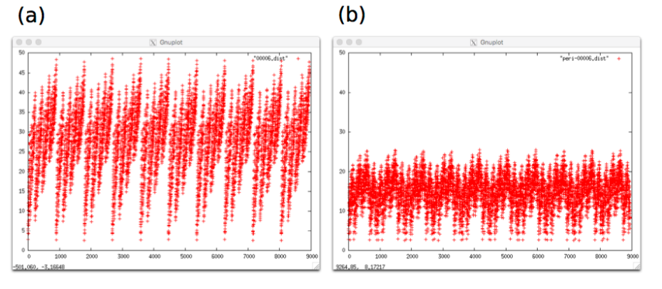
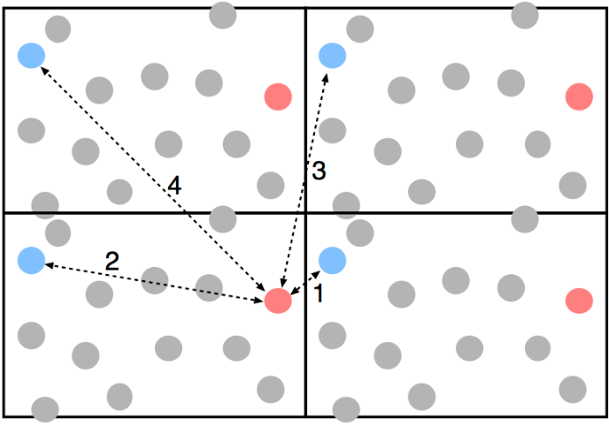

# シミュレーションデータの解析
Fortranの文法書の内容と、MD計算のデータ解析の実際との間には、幾らかの乖離がある。この章の目的は、この乖離を埋めることである。また、データ処理に役立つ幾つかの技術についても解説する。

## ファイルを開いてデータを読み込む
解析を行うには、まずプログラム内でMDの計算結果のファイルを開いて読み込まなければならない。3章の氷の計算結果である`00006-0.gro`を入力ファイルとしよう。

GROMACSのテキスト形式の座標データ`.gro`の中身の構造については3章で説明した。これをもとに、Pythonで読みこんでみよう。

> **Source code 4.1** read_gro.py
```python
#!/usr/bin/env python

import sys

title  = sys.stdin.readline()
n_atom = int(sys.stdin.readline())
for i in range(n_atom):
    line = sys.stdin.readline()
    residue_id = int(line[0:5])
    residue    = line[5:10].strip()
    atom       = line[10:15].strip()
    atom_id    = int(line[15:20])
    x          = float(line[20:28])
    y          = float(line[28:36])
    z          = float(line[36:44])
    # 速度は省略
    print(f"{atom_id} {x} {y} {z}")

cell = [float(x) for x in sys.stdin.readline().split()]
print(cell)
strip()関数は，文字列の先頭と末尾の空白をとりのぞく．
```
このプログラムを、`read_gro.py`という名前で保存し、そのまま実行できるように、実行パーミッションを設定する。
```shell
chmod +rx read_gro.py
```
試しに、ファイルリストを表示してみると、`read_gro.py`には他と異なるフラグが設定されているのがわかる。
```shell
ls -al
…
-rw-r--r--@  1 matto  staff   8192  7 29 16:51 mdout.mdp
-rwxr-xr-x@  1 matto  staff    529  7 29 20:21 read_gro.py*
…
```
プログラムはただのテキストファイルだが、実行パーミッションが設定された場合には、プログラムとみなされ、適切なインタプリタ(解釈プログラム)によって実行される。

gromacsの実行結果(例えば`00003.gro`)を読みこませてみよう。
```shell
./read_gro.py < 00003.gro
```
プログラム中の`sys.stdin`は、標準入力と呼ばれ、コマンド実行時に `< filename`の形で読みこませたファイルが標準入力に接続される。`readline()`は文字通り1行読みこむ関数。文字列として読みこんだファイルの内容を、用途に応じて整数`int`や実数`float`に変換して利用している。固定長形式なので、文字列を固定文字数で分割して、それぞれに処理を行っている。`strip()`関数は文字列の前後の空白をとりのぞく。

セルサイズの情報は自由フォーマットなので、行を`split()`関数を使って空白で分割し、それらを`float`に読みかえている。

このプログラムでは、デモンストレーションとして、読みこんだ行を逐一`print`しているだけなので、データを何も蓄えていない(読んだ端から忘れていく)が、通常はデータは何かの処理を行うために読みこむので、次の処理をしやすい形でデータをまとめておくと便利である。そこで、上のプログラムを、列ごとに別々の配列(numpy array)として保管するように書きかえる。
> **Source code 4.2** read_gro2.py
```python
#!/usr/bin/env python

import sys
from collections import defaultdict
import numpy as np

def read_gro(file):
    """
    gromacsの.groファイルを読みこむ。

    あとで出力する場合にそなえ、できるだけデータをそのままの形で保持する。
    """

    frame = {"resi_id": [],
            "residue":  [],
            "atom":     [],
            "atom_id":  [],
            "position": []}

    title  = file.readline()
    # 終了判定。1文字も読めない時はファイルの終わり。
    if len(title) == 0:
        return
    n_atom = int(file.readline())
    for i in range(n_atom):
        line = file.readline()
        residue_id = int(line[0:5])
        residue    = line[5:10].strip()
        atom       = line[10:15].strip()
        atom_id    = int(line[15:20])
        x          = float(line[20:28])
        y          = float(line[28:36])
        z          = float(line[36:44])
        # 速度は省略

        frame["resi_id"].append(residue_id)
        frame["residue"].append(residue)
        frame["atom"].append(atom)
        frame["atom_id"].append(atom_id)
        frame["position"].append([x,y,z])

    cell = [float(x) for x in file.readline().split()]

    # numpy形式に変換しておく。
    frame["resi_id"] = np.array(frame["resi_id"])
    frame["residue"] = np.array(frame["residue"])
    frame["atom"] = np.array(frame["atom"])
    frame["atom_id"] = np.array(frame["atom_id"])
    frame["position"] = np.array(frame["position"])

    # cellは行列の形にしておく。
    if len(cell) == 3:
        # 直方体セルの場合
        cell = np.diag(cell)
    else:
        # 9パラメータで指定される場合は、順番がややこしい。
        # v1(x) v2(y) v3(z) v1(y) v1(z) v2(x) v2(z) v3(x) v3(y)
        x = [cell[0], cell[5], cell[7]]
        y = [cell[3], cell[1], cell[8]]
        z = [cell[4], cell[6], cell[2]]
        cell = np.array([x,y,z])

    frame["cell"] = cell
    return frame

frame = read_gro(sys.stdin):
print(frame)
```
このように関数を定義しておくと、再利用がしやすくなる。

実際には、1つの`gro`ファイルに何フレームかの座標データが連続して入っている場合がある。あらかじめいくつのフレームが含まれているかがわかっていれば、その数だけ読みこみを繰りかえせば良い。しかし、データ数がわかっていない場合もありえるので、データの終わりが来るまで繰りかえすようにプログラムを書いておくのが親切である。このために、上のプログラムをすこしだけ書きかえる。
> **Source code 4.3** read_gro3.py
```python
#!/usr/bin/env python

import sys
from collections import defaultdict
import numpy as np

def read_gro(file):
    """
    gromacsの.groファイルを読みこむ。

    あとで出力する場合にそなえ、できるだけデータをそのままの形で保持する。
    """

    # 無限ループ
    while True:
        frame = {"resi_id": [],
                "residue":  [],
                "atom":     [],
                "atom_id":  [],
                "position": []}

        title  = file.readline()
        # 終了判定。1文字も読めない時はファイルの終わり。
        if len(title) == 0:
            return
        n_atom = int(file.readline())
        for i in range(n_atom):
            line = file.readline()
            residue_id = int(line[0:5])
            residue    = line[5:10].strip()
            atom       = line[10:15].strip()
            atom_id    = int(line[15:20])
            x          = float(line[20:28])
            y          = float(line[28:36])
            z          = float(line[36:44])
            # 速度は省略

            frame["resi_id"].append(residue_id)
            frame["residue"].append(residue)
            frame["atom"].append(atom)
            frame["atom_id"].append(atom_id)
            frame["position"].append([x,y,z])

        cell = [float(x) for x in file.readline().split()]

        # numpy形式に変換しておく。
        frame["resi_id"] = np.array(frame["resi_id"])
        frame["residue"] = np.array(frame["residue"])
        frame["atom"] = np.array(frame["atom"])
        frame["atom_id"] = np.array(frame["atom_id"])
        frame["position"] = np.array(frame["position"])

        # cellは行列の形にしておく。
        if len(cell) == 3:
            # 直方体セルの場合
            cell = np.diag(cell)
        else:
            # 9パラメータで指定される場合は、順番がややこしい。
            # v1(x) v2(y) v3(z) v1(y) v1(z) v2(x) v2(z) v3(x) v3(y)
            x = [cell[0], cell[5], cell[7]]
            y = [cell[3], cell[1], cell[8]]
            z = [cell[4], cell[6], cell[2]]
            cell = np.array([x,y,z])

        frame["cell"] = cell
        # returnの代わりにyieldを使うと、繰り返し(iterator)にできる。
        yield frame

for frame in read_gro(sys.stdin):
    print(frame)
```
## gromacs形式で書き出す
`read_gro3.py`で読みこんだ1フレームを，そのまま`.gro`ファイルに戻す関数も準備しておこう．

課題3-1で書いた，NaCl結晶の構造を`.gro`ファイルに出力するコードを思いだしながら，frameの中身を書きだすのはそう難しくはない．

`write_gro`関数は，引数に`frame`と出力先にファイル(ファイルハンドル)を指定する．オプションで，最初の行のメッセージも書きこめるようにする．
```python
def write_gro(frame, file, remark="Written by write_gro"):
    """
    fileにframeを書きだす。
    """

    # frameを解体する
    residue_id = frame["resi_id"]
    residue = frame["residue"]
    atom = frame["atom"]
    atom_id = frame["atom_id"]
    positions = frame["position"]

    # 1行目はメッセージ行
    print(remark, file=file)
    # 2行目は原子数
    Natom = len(positions)
    print(Natom, file=file)
    # 原子もそのまま
    for i in range(Natom):
        ri = residue_id[i]
        r = residue[i]
        a = atom[i]
        ai = atom_id[i]
        pos = positions[i]
        print(f"{ri:5d}{r:5s}{a:5s}{ai:5d}{pos[0]:8.3f}"
f"{pos[1]:8.3f}{pos[2]:8.3f}", file=file)
    # セルは、直方体とそれ以外で書き方が違う
    cell = frame["cell"]
    if cell[1,0] == 0:
        print(cell[0,0], cell[1,1], cell[2,2], file=file)
    else:
        print(
            cell[0,0], cell[1,1], cell[2,2],
            cell[1,0], cell[2,0], cell[0,1],
            cell[2,1], cell[0,2], cell[1,2],  file=file)
```
確認のために，`gro`ファイルをただ読んで書きだすだけのプログラムを書いてみる．
> **Source code 4.4** read_write.py
```python
#!/usr/bin/env python3

from read_gro3 import read_gro
from write_gro import write_gro
import sys

for frame in read_gro(sys.stdin):
    write_gro(frame, file=sys.stdout, remark="Test")
```
次のようにして実行して，入力ファイル`00006-last.gro`と出力ファイル`out.gro`の中身が一致していることを確認せよ．
```shell
./read_write.py < 00006-last.gro > out.gro
```
ここまでの例では原子の速度情報を省略してしまったが，速度もframeに含まれていれば，出力されるように拡張しておくと，使い道がひろがるかもしれない．

## データとプログラムを別の場所に置く
　解析の対象となるファイルに合わせて、毎回プログラムを書いてコンパイルするよりも、汎用的なプログラムを書いて、それを使いまわすほうが好ましい(前節で`gro`ファイル名などをreadするようにしたのは、汎用化の一例である)。汎用プログラムの実行ファイルは一つだけあればよく、それは解析の対象となるファイルのあるディレクトリとは別の場所に置かれるだろう。ホームディレクトリの直下に`code`というディレクトリを新たに作って、そこで解析プログラムを開発することにしてみよう。3章のチュートリアルでは、`~/GMX-test/Tutorial_A/Run_MD`というディレクトリでMD計算が行われ、`00006-0.gro`もここにある。このデータを処理するには、`~/GMX-test/Tutorial_A/Run_MD`にいる状態で
```shell
 ../../code/read_gro3.py
```
とするか、
```shell
 ~/code/read_gro3.py
```
とすればよい．前者は今いるディレクトリからの相対的な場所指定になっており、一方、後者はホームディレクトリ`~/`を基準とした場所の指定となっている。

`~/code/`というのは、あくまで練習用のディレクトリである。実際の研究を進める時には、適切な場所に適切なディレクトリを作成して、プログラムコードを管理すること。いろいろなことに使える汎用的なプログラムはホーム直下のフォルダーに置いておくと良いが、ある特定の系のために作ったプログラムならば、そのデータのすぐ近くに置いておくとわかりやすいだろう。

頻繁に使用する実行プログラムについては、ログイン時に読み込まれる設定ファイル(`~/.bashrc`、`~/.bash_profile`など。)の中でその実行プログラムのエイリアス（別名）を登録すると便利である。他に、実行ファイルのあるディレクトリにパスを通す、という方法もある。

## 原子間の距離を計算する
MDシミュレーションの解析の多くで、原子間の距離を計算する必要がある。`00006.gro`の最初の水の酸素原子と、それ以外の全ての酸素原子との間の距離を計算するプログラム、`dist_OO.py`を書いてみよう。

すでに`gro`ファイルを読みこむ関数は`read_gro`で定義したので、これを再利用したい。そこで、`read_gro3.py`をpythonモジュールに変換する。といっても、特にすることはない。`read_gro3.py`は単独で実行すると、標準入力から`gro`ファイルを読みこみ、それを`print`する。これらの処理はmoduleとして利用する場合には必要ないので、単に削除するか、あるいは最後の2行を次のように書きかえておこう。[^13]
```python
if __name__ == "__main__":
    for frame in read_gro(sys.stdin):
        print(frame)
```
[^13]:  `if __name__ == "__main__":`という書き方は、ひとつのPythonファイルをモジュールとしても単独の実行プログラムとしても利用したい、という場合によく使う「おまじない」です。最終的にはモジュールとして使う予定だけど、単独で動かせばテスト(バグが生じないかいろいろ試してみる)が実行できるようにしておく、という使い道があります。

こうしておくことで、`read_gro3.py`はひきつづき単独のプログラムとして利用することもできる(その場合は、上で修正した2行が実行される)一方、モジュールとして利用する場合には上の2行は無視される。

`dist_OO.py`の中で`read_gro`関数を利用したいので、最初に`import`する。そして、原子の座標情報とセルの情報を標準入力から読みこむ。
```python
from read_gro3 import read_gro
for frame in read_gro(sys.stdin):
```
`frame`には，`gro`ファイルの1フレーム分のいろんな情報がまざっているので，そのなかから，次の処理に使う3つの要素をとりだす．
```python
cell = frame["cell"]
positions = frame["position"]
atoms = frame["atom"]
```
さらに，numpyのfancy indexを使って，酸素原子の座標だけを抽出する．
```python
oxygens = positions[atoms=="OW"]
```
i番目の酸素原子の座標はoxygens[i]に入っている。最初の酸素原子と、すべての酸素原子の相対位置ベクトルは、numpyのベクトル演算により次のように書ける。
```python
d = oxygens - oxygens[0]
```
また、ベクトルの大きさは、単純に二乗和を計算するか、
```python
L=(d[0]**2+d[1]**2+d[2]**2)**0.5
```
自分自身との内積をとるか、
```python
L=(d @ d)**0.5
```
あるいはnumpyの`linalg.norm`関数で計算できる。例えば、aが3次元のベクトル(numpyの3要素のarray)であれば、
```python
L=np.linalg.norm(a)
```
はベクトルの大きさを計算する。`atoms["O"]`はn行3列(nは酸素原子の数)の行列で、距離は列方向の二乗和の平方根をとればいい。Pythonでは行方向が第0次元、列方向が第1次元なので、
```python
L = np.linalg.norm(d, axis=1)
```
で一気にすべての行のベクトルの大きさを計算できる。これらをまとめると次のようになる。
> **Source code 4.5** dist_OO.py
```python
#!/usr/bin/env python
import sys
import numpy as np
from read_gro3 import read_gro

for frame in read_gro(sys.stdin):
    cell = frame["cell"]
    positions = frame["position"]
    atoms = frame["atom"]
    oxygens = positions[atoms=="OW"]
    celli = np.linalg.inv(cell)
    d = oxygens - oxygens[0]
    L = np.linalg.norm(d, axis=1)
    for r in L:
        print(r)
```
これを`dist_OO.py`という名前で保存し、実行パーミッションを与えて実行してみよう。
```shell
chmod +rx dist_OO.py
./dist_OO.py < 00006.gro > 00006.dist
```
正しくできていれば、`00006.dist`の中に、432×21 = 9072行の数字が出力されているはずである．`gnuplot`を起動して次のように打ってみよう。
```gnuplot
gnuplot> p "00006.dis" w p 
```
Figure 4.1aのようになるはずである。縦軸が計算された距離である。氷中では分子の並進運動がないため、21個の配置に関する計算結果は、互いにほとんど変わらない。その結果として、周期的なパターンが見えている。


> **Figure 4.1** 酸素原子間の距離計算の結果。(a)周期境界条件を考慮しない場合、(b)考慮した場合。

## 周期境界条件を考慮した距離の計算
ここまでに作ったプログラムには、実は誤りがある。このMDシミュレーションは周期境界条件のもとで行われているが、それが距離の計算に考慮されていない。Figure 4.2の左下のセルにいる赤い粒子について考えてみる。周期境界条件のために、この粒子と青い粒子との距離が4種類もある。2章で説明したように、通常、セル長の半分の距離より離れた場合は、粒子間の相互作用はないとみなされる。この図では、左下のセルの赤い粒子は右下のセルの青い粒子としか相互作用しない。したがって、原子間距離を求める場合は、図中の距離1を求めなければならない。ところが、これまで書いたプログラムでは、同じセルの中の粒子間距離、すなわち距離2が計算されてしまっている。


> **Figure 4.2** 周期境界条件における原子間距離。

例えば、0番目の酸素と1番目の酸素の単純な相対位置ベクトルはpythonでは次の式で計算できる。
```python
d = oxygens[0] - oxygens[1]
```
　これに周期境界条件による補正を加えるには、こんな風に書く。
1. シミュレーションセルを表す行列の逆行列を作る。(cellは、単位胞のa, b, c軸をそれぞれ行ベクトルとして積みあげた形の行列。)
   ```python
   celli = np.linalg.inv(cell)
   ```
   それぞれの原子の座標を、セルの形に対する相対位置に換算する。`r0`のベクトルの要素はどれも0〜1の範囲となる。`@`はベクトルの内積や、ベクトルと行列の積が計算できる便利な演算子。
   ```python
   r0 = oxygens[0] @ celli
   r1 = oxygens[1] @ celli
   ```
2. 2つの原子の相対位置ベクトルを計算する。
   ```python
   d = r0 – r1
   ```
   相対位置ベクトルの数値が[-0.5, 0.5)になるように「丸める」。`floor(x)`は実数`x`よりも小さい最大の整数を返す関数で、`floor(x+0.5)`は四捨五入と等価である[^floor]。`x`から、`x`を四捨五入したものを引くと、[-0.5, 0.5)の数値が得られる。

   [^floor]: 四捨五入する関数`round()`を呼べばいいじゃないかと思うかもしれないが、恐しい罠があるので使わないことをお勧めする。

   ```python
   d -= np.floor(d+0.5) 
   ```
   ふたたびセル行列をかけて、実寸のベクトルに戻す。
   ```python
   v = d @ cell
   ```
3. ベクトルの大きさを計算する。
   ```python
   L = np.linalg.norm(v)
   ```

セルが直方体でなく、cellに非対角要素が含まれている場合も、まったくこのまま適用できるのがこの方法の長所である。

上の手順をコンパクトに書くと、以下のようになる。
```python
celli = np.linalg.inv(cell)
d = (oxygens - oxygens[0]) @ celli
d -= np.floor(d+0.5)
L = np.linalg.norm(d @ cell, axis=1)
```
そして、`dist_OO.py`にこの変更を適用すると以下のようになる。
> **Source code 4.3** dist_OO2.py
```python
#!/usr/bin/env python
import sys
import numpy as np
from read_gro3 import read_gro

for frame in read_gro(sys.stdin):
    cell = frame["cell"]
    positions = frame["position"]
    atoms = frame["atom"]
    oxygens = positions[atoms=="OW"]
    celli = np.linalg.inv(cell)
    d = (oxygens - oxygens[0]) @ celli
    d -= np.floor(d+0.5)
    L = np.linalg.norm(d @ cell, axis=1)
    for r in L:
        print(r)
```
上のプログラムでは、`d`はベクトルではなくベクトルのリスト(n行3列のarray)であることに注意。Numpyのベクトル演算を利用している。

上のプログラムは、すべての酸素原子の、酸素原子0からの距離を計算し表示しているが、最も近い分子の番号と，その距離だけを表示したい場合は、`numpy.min`関数を使う。
> **Source code 4.4** nearest.py
```python
#!/usr/bin/env python
import sys
import numpy as np
from read_gro3 import read_gro

for frame in read_gro(sys.stdin):
    cell = frame["cell"]
    positions = frame["position"]
    atoms = frame["atom"]
    oxygens = positions[atoms=="OW"]
    celli = np.linalg.inv(cell)
    d = (oxygens - oxygens[0]) @ celli
    d -= np.floor(d+0.5)
    L = np.linalg.norm(d @ cell, axis=1)
    print(np.min(L[L>0]), np.argmin(L[L>0]))
```
fancy indexを使って、距離0の要素を除外している。(そうしないと、原子0から一番近い原子は0自身で、その距離は0となってしまう)また、`numpy.argmin`は、最小値の代わりに、最小値となる配列要素の番号を返す。(最初の酸素が0番)

## 解析結果をpymolで見る
1番目と最近接の酸素原子がどれなのかを、pymolで見て分かるようにしてみよう。これを行うには、1番目と最近接の酸素原子の名前をOw以外にした`gro`ファイルを作ればよい．

`nearest.py`に`write_gro`を組みあわせる．また，見分けたい酸素をN(窒素)に置きかえることで表示されかたを変えてみよう．

`nearest.py`では，酸素原子の座標だけを`oxygens`に抽出し，一番近い酸素をさがした．しかし，この方法では，一番近い酸素が，もとの`frame`の中で何番目の原子の番号かがわからない．そこで，速度は遅いが，ループにより最も近い酸素原子を割り出すことにする．
> **Source code 4.5** nearest2.py
```python
#!/usr/bin/env python

import sys
import numpy as np
from read_gro3 import read_gro
from write_gro import write_gro

for frame in read_gro(sys.stdin):
    cell = frame["cell"]
    positions = frame["position"]
    atoms = frame["atom"]
    celli = np.linalg.inv(cell)
    # argwhereは、与えられた条件を満足する要素の番号を返す。
    O_index = np.argwhere(atoms=="OW")
    # oxygen0は、最初の酸素原子のインデックス(frameの全原子のなかでの)
    oxygen0 = O_index[0]

    Natom = len(atoms)
    nearest = -1
    Lmin = 1e10
    for i in range(Natom):
        if atoms[i] == "OW":
            d = (positions[i] - positions[oxygen0]) @ celli
            d -= np.floor(d+0.5)
            L = np.linalg.norm(d @ cell)
            if 0 < L < Lmin:
                Lmin = L
                nearest = i
    atoms[nearest] = "N" # Nitrogenize
    atoms[oxygen0] = "N"
    write_gro(frame, sys.stdout)
```
ターミナルで次のように入力して，得られた`out.gro`をダウンロードして`pymol`で表示してみよう．窒素におきかえられた水分子は青く表示されるはずだ．
```shell
./nearest2.py < 00006-0.gro > out.gro
```
### 課題1
`nearest2.py`は最初の酸素原子と，それに一番近い酸素原子だけを抽出する．これを，任意の酸素原子と，それに近い順に4番目までの酸素原子を抽出するように書きかえよ．(作例あり)

## yaplotを使う*
`pymol`は原子と結合を描くことに適したソフトウェアである。これとは別に、空間内の線、円、多角形を描くことに適した`yaplot`というソフトウェアがある。これらを利用して、三次元空間の構造的特徴やネットワークを視覚化すると、物理現象の理解の助けとなるだろう。