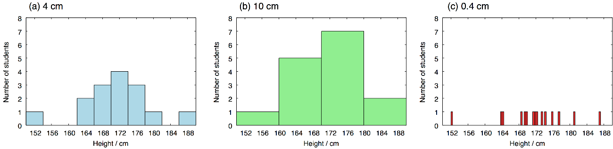
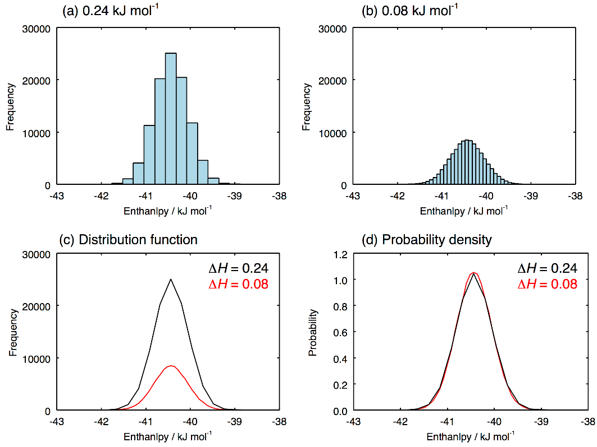
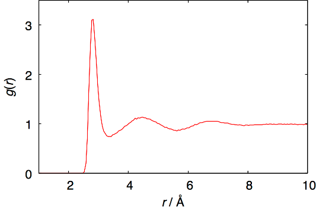

# 分布関数

分子動力学シミュレーションのデータの解釈には、分布関数が非常に役立つ。分子間相互作用エネルギー、粒子間距離、四面体パラメータなど、様々な物理量の分布関数を計算することで、系の状態を理解することが可能となる。この章では、分布関数を求める基本的なアルゴリズムについて解説する。

なお、学習目的でヒストグラムの作り方を詳解しているが、単純なヒストグラムを作るだけなら`numpy.histogram`などを用いればよい。

## ヒストグラム

分布関数に限らず、計算機上では基本的に関数を離散的な値のセット、すなわち配列として扱う。したがって、分布関数を計算するということは、ヒストグラム（度数分布）を作成することと同じである。具体的な例として、ある一つの学級における男子生徒の身長の分布について考えよう。身体測定の結果、次のようなデータが得られたとする。

> **Table 5.1** ある学級の男子生徒の身長

| 出席番号 | 身長 / cm |
| -------- | --------- |
| 1        | 172.0     |
| 2        | 173.4     |
| 3        | 152.3     |
| 4        | 186.9     |
| 5        | 164.2     |
| 6        | 168.7     |
| 7        | 171.3     |
| 8        | 175.7     |
| 9        | 181.2     |
| 10       | 163.9     |
| 11       | 169.8     |
| 12       | 177.5     |
| 13       | 174.1     |
| 14       | 169.3     |
| 15       | 171.8     |

このデータについてヒストグラムを作る。プログラムを作る前に、まずは手作業でヒストグラムを描いてほしい。横軸の間隔は 4 cm とし、150 < x ≤ 154、154 < x ≤ 158、158 < x ≤ 162、162 < x ≤ 166、166 < x ≤ 170、170 < x ≤ 174、174 < x ≤ 178、178 < x ≤ 182、182 < x ≤ 186、186 < x ≤ 190 のそれぞれの範囲（これをビンという）に入る人数を数え上げて、棒グラフを描く。 Figure 5.1a のようになるはずである。



> **Figure 5.1** 異なる bin_width の値で計算された身長のヒストグラム。

人数が 15 人くらいならば手作業で図を描けるが、15000 人とでもなれば絶望的である。計算機を使わなければならない。プログラム上では、ヒストグラムを一つの 1 次元配列で表す。はじめに、その配列のサイズ（ビンの数）を定義しなければならない。そのためには、配列で扱う値の最小値と最大値を指定する必要がある。これらの値は、扱うデータのすべてが収まるように決めるべきである。手作業の場合と同様に、最小値を 150 cm、最大値を 190 cm とする。

```python
value_min = 150.0
value_max = 190.0
```

横軸の間隔も、同じく 4 cm ということにする。

```python
bin_width = 4.0
```

これらの値から、配列サイズ（ビンの数）は次のように求められる。

```python
n_bin = int((value_max - value_min)/bin_width)
```

40 cm の範囲を 4 cm ごとに区切るので、この値は 10 となる。配列サイズは整数でなければならないので、int 関数を作用させる。このサイズの配列`int_hist`を定義し、そのすべての要素の値を 0 にしておく.

```python
import numpy as np
hist = np.zeros(n_bin)
```

配列 hist の 10 個の要素が 10 個のビンを表す。一つ目のビン、`hist[0]`は 150 cm から 154 cm の身長の人を数え上げるためのビンである。同様に `hist[1]`が 154 cm から 158 cm、...、`hist[9]`が 186 cm から 190 cm の範囲のためのビンである。ある身長の値が、0 番から 9 番のどのビンに対応するかを判定しなければならない。これは次のように行う。

```python
bin = int((value_1 - value_min)/bin_width)
```

ここで、`value_1`が身長の値を示す。例として、これに 155.2 を入れてみよう。狙い通り、`int_value`の値、すなわちビンの番号は 1 となる。
表のデータが`data.txt`というファイルに収まっているとしよう。プログラム内で、このファイルを標準入力から読みこむ。

```python
import sys
for line in sys.stdin.readlines():
    values = line.split()
    value_1 = float(values[1])
    bin = int((value_1 - value_min)/bin_width)
    hist[bin]+=1
```

後は、この配列`int_hist`を出力するだけである。この配列は`n_bin`の要素からなるので、for ループで出力する。また、ビンの番号 i を身長の値に戻さなければならない。

```python
for i, height in enumerate(hist):
    r = (i+0.5)*bin_width + value_min
    print(r, height)
```

ぜんぶつなぐと次のようになる。

> **Source code 5.1** hist.py

```python
#!/usr/bin/env python

# importはプログラムの先頭に集約する。
import sys
import numpy as np

# 値の範囲。読みこむデータがこの範囲外だとエラーになる。
value_min = 150.0
value_max = 190.0
# binの幅
bin_width = 4.0

# binの個数
n_bin = int((value_max - value_min)/bin_width)

# 配列の初期化
hist = np.zeros(n_bin)

# データは標準入力sys.stdinから1行ずつ読まれる
for line in sys.stdin.readlines():

   # カラムに分割
   values = line.split()

   # 統計をとりたいデータは第1カラム、実数に変換
   value_1 = float(values[1])

   bin = int((value_1 - value_min)/bin_width)
   hist[bin]+=1

# 配列histの内容が順にheightに入る。iはbinの番号(0〜9)
for i, height in enumerate(hist):
    # bin番号を、区間の中値に換算する。
    r = (i+0.5)*bin_width + value_min
    print(r, height)
```

上のプログラムを`hist.py`という名前で保存し、以下のように実行する。`sample.txt`には Table 5.1 の内容が入っているものとする。

```shell
chmod +x hist.py
python3 hist.py < sample.txt > sample.hist
```

出力結果`sample.hist`をプロットしたものが Figure 5.1a である。

```shell
gnuplot
gnuplot> plot "sample.hist" w boxes
```

ヒストグラムを描く上で、横軸の間隔`bin_width`の値が重要である。同じ入力データで、間隔を 10 cm とした結果が Figure 5.1b である。Figure 5.1a と比べると情報の解像度が落ちている。間隔は狭いほど解像度が上がるが、それぞれのビンの統計的な精度が下がっていく。間隔を 0.4 cm と極端に短くした結果が Figure 5.1c である。分布としての意味がなくなってしまっている。サンプル数が 15 人ではなく、例えばその数万倍の大きな数ならば、間隔 0.4 cm でも意味のある結果が得られるはずである。この議論から明らかなように、横軸の間隔`bin_width`はあらかじめ決められる値ではない。解像度と統計的精度を両立する最適な値を、データを処理しながら自分で見出さなければならない。どうしても両立できない場合は、サンプル数を増やすか、解析手法そのものを見直す必要がある。

## 確率密度

分子シミュレーションの解析では、非常に大きなサンプル数のデータを扱うことが多いため、横軸の間隔をかなり狭くすることができる。例として、液体の水のエンタルピーの分布を扱ってみよう。10 ns のシミュレーションを行い、0.1 ps ごとにデータを保存すれば、それだけで 100,000 個のサンプルとなる (エンタルピーは`edr`に出力されるので、その出力頻度は`mdr`ファイルの`nstenergy`で設定される)。この場合のヒストグラムを Figure 5.2a、Figure 5.2b に示す。これらの図にはそれぞれ異なる横軸方向の間隔、$\Delta H = 0.24$ kJ mol<sup>-1</sup>と$\Delta H = 0.08$ kJ mol<sup>-1</sup>が用いられている。もともとのサンプル数が多いため、間隔の狭い Figure 5.2b の場合でも、統計的に信頼できる結果になっている。間隔が十分に狭くなったのなら、それは連続的な関数とみなしてよいだろう。これを分布関数と呼ぶ。この場合は、棒グラフではなく、線でプロットすべきである。これを行ったものが Figure 5.2c である。$\Delta H= 0.24$ kJ mol<sup>-1</sup>についてはまだ幾らか線が滑らかでないが、ΔH= 0.08 kJ mol-1 の線は十分に滑らかであり、連続的な関数とみなして問題ないことが分かる。



> **Figure 5.2** 液体の水(298 K、1 bar)のエンタルピーの分布。(a)と(b)は異なる二つの横軸の間隔で計算されたヒストグラム。(c)はそれらを関数として線でプロットしたもの。(d)はさらに規格化を行い確率密度としたもの。

Figure 5.2c の分布関数には一つの問題がある。黒線も赤線もエンタルピーの分布という物理的に同じものでありながら、そのピークの高さが異なっており、比較が難しい。同様の問題は、サンプル数が変わった場合にも生じる。元のサンプル数を倍の 200,000 にしたら、ピークの高さも倍になるだろう。どのような横軸の間隔、サンプル数でも似た結果となるようにすることが望ましい。多くの場合、この問題は次の式を満たすように分布関数$f(H)$に係数$C$をかけることで解決する。
$$C\int_{-\infty}^\infty f(H)dH=1\tag{5.1}$$
離散化されている場合は次式となる.
$$C\sum_{i=1}^N f(H_i)\Delta H=1\tag{5.2}$$
前節のプログラムの変数名と対応させると、$n$が`n_bin`、$f$が`int_hist`、$\Delta H$が`bin_width`となっている。得られた関数、$p(H) = Cf(H)$を Figure 5.2d にプロットする。このように規格化された分布関数を確率密度と呼ぶ。分布関数の規格化の方法はこれだけに限らない。例えば、次節で解説する動径分布関数は、無限遠で値が 1 になるように規格化される。目的に応じて適切な方法で規格化するべきであるが、確率密度にしておけば大抵は問題ない.

Figure 5.2d のピークの位置は、分子当たりのエンタルピーのおおよその平均値を表す (分布が完全な対称でないので厳密な平均値ではない)。一方、ピークの幅は定圧比熱を表している.
$$\left<\left(H-\left<H\right>\right)^2\right>=k_BT^2C_p\tag{5.3}$$
この関係は、統計力学の等温等圧アンサンブルの式で H と H2 の平均、$\left<H\right>$と$\left<H^2\right>$を表し、$\left<H^2\right>-\left<H\right>^2$と比熱の定義である$C_p=\partial\left<H\right>/\partial T$を比較することで得られる。

### 課題 1

水の NPT MD 計算を行って、mdinfo ファイルからエンタルピー、ポテンシャルエネルギー、密度の確率密度を求めよ。(298 K, 1 bar)と(640 K, 146 bar)の計算を行い比較せよ。後者は TIP4P/2005 モデルの臨界点である。シミュレーションの長さ、データの出力頻度、確率密度のビンの間隔などは、滑らかな確率密度が得られるように自分で工夫すること。(作例あり)

### 課題 2\*

定圧比熱を求めよ。常温と臨界点でどのように変わるか。比熱の計算法は二つある。一つは Eq. 5.3 を使ってエンタルピーのゆらぎから求める方法、もう一つは、目的の温度と、それより少し高い温度でエンタルピーを求め、$C_p=\partial\left<H\right>/\partial T\sim\left(H(T+\Delta T\right)-T\left(T\right)/\Delta T$を使うという方法である。実際には、Eq. 5.3 を使う方法はうまく行かないことが多い。このような揺らぎに関係する量は、熱浴や圧力浴の種類やパラメータに大きく依存するためである。Nose-Hoover 熱浴と Berendsen 熱浴で結果を比較してみよ。数値微分を使う方法ならば、熱浴に依存しないということも確認せよ。同様の問題は、等温圧縮率や膨張率など、他の熱力学的応答関数を計算する場合にも顕著となる。熱力学的応答関数とは示量変数を示強変数で微分した物理量のことであり、これらはすべてその示量変数の揺らぎとして表すことができる。

## 動径分布関数

動径分布関数 g(r)とは、ある注目した粒子の周りに、他の粒子がどのくらい存在するかを表す分布関数である。これ自身が重要な情報であり、また、その後の解析のための基礎データともなる。プログラムの流れは以下のようになる。

> **Source code 5.2** hist2.py

```python
#!/usr/bin/env python

# importはプログラムの先頭に集約する。
import sys
import numpy as np
from read_gro3 import read_gro
import itertools as it

# 値の範囲。読みこむデータがこの範囲外だとエラーになる。
value_min = 0.2
value_max = 1.2
# binの幅
bin_width = 0.1
# binの個数
n_bin = int((value_max - value_min)/bin_width)

# 配列の初期化
hist = np.zeros(n_bin)

for frame in read_gro(sys.stdin):
    cell = frame["cell"]
    atoms = frame["atom"]
    positions = frame["position"]
    celli = np.linalg.inv(cell)

    oxygens = positions[atom=="OW"]

    # oxygensには酸素原子の座標が入っている。
    # その中から2つ選ぶ組みあわせについて
    for a, b in it.combinations(oxygens, 2):
        # 座標の差をとり、
        d = a - b
        # 周期境界条件を施し、
        d -= np.floor(d @ celli + 0.5) @ cell
        # ヒストグラムを作る。
        ...

    # 配列histの内容が順にheightに入る。iはbinの番号
    for i, height in enumerate(hist):
        # bin番号を、区間の中値に換算する。
        r = (i+0.5)*bin_width + value_min
        # ヒストグラムから動径分布関数への換算
        ...
```

規格化の因子については、岡崎進、吉井範行、「コンピュータ・シミュレーションの基礎」を参考にすること。無限遠で$g(r) = 1$になるように定義されている。

### 課題 3

液体の水の MD 計算を行い、その結果を使って動径分布関数を求めよ。水の場合は、O-O、O-H、H-H を区別して動径分布関数を計算しなければならない。これを考慮してプログラムを書くこと。

298 K、1 bar の水の O-O 動径分布関数は Figure 5.3 となる。議論する上でまず重要になるのは、第一ピークの位置である。Figure 5.3 では、これは 2.82 Å である。次に重要なのは配位数、すなわち第一ピークに含まれる水分子の数である。これは次式で与えられる。
$$N=\int_0^{r_\textrm{min}}4\pi r^2\rho g(r)dr\tag{5.4}$$
ここで、$r_\textrm{min}$は$g(r)$の最初の極小値の位置、$\rho$は数密度を表す。Figure 5.3 のデータだと、$r_\textrm{min} = 3.38 \mathrm{\AA}$、配位数$N$は 5.6 となる。扱う系や現象によっては、第二、第三ピークが重要となることもある。



> **Figure 5.3** 水の O-O 動径分布関数。温度は 298 K、圧力は 1 bar。

### 課題 4

水の配位数を求めるプログラムを書け。これは、動径分布関数を求めるプログラムの出力部分を少し書き換えるだけで出来る。動径分布関数を先に計算し、それを元に Eq. 5.4 から求めるという方法もある。液体の水、氷、超臨界水でどのような違いがあるか。
