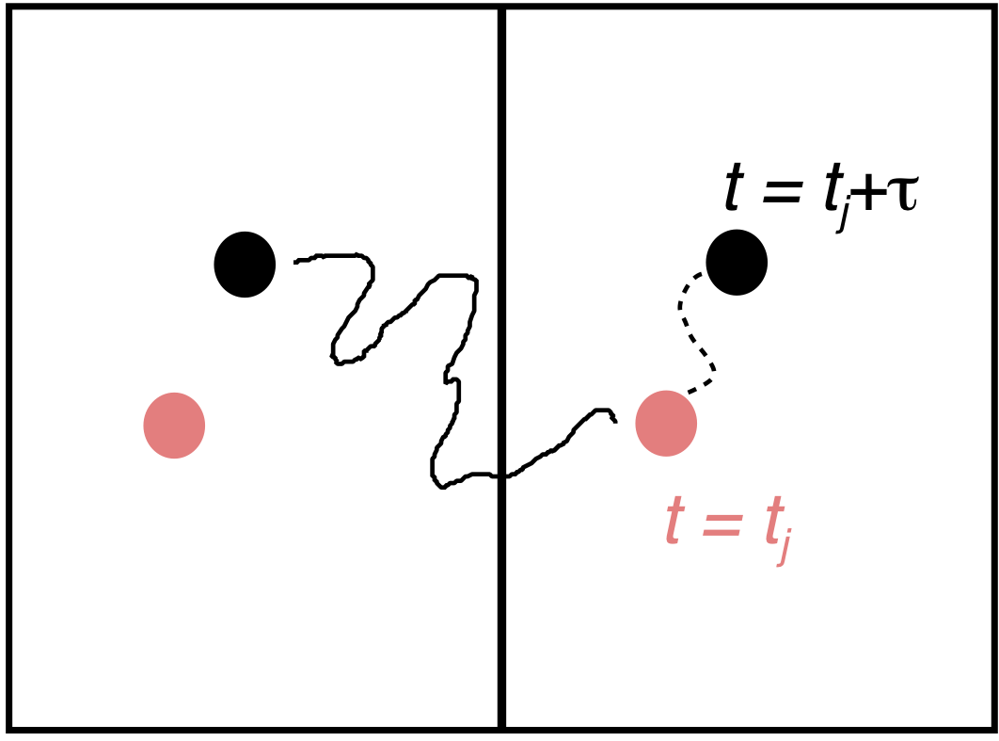
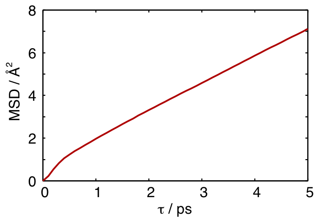

# 発展的な解析手法1. 運動の解析

この章では、MDによる運動（ダイナミクス）の解析の基礎を説明する。

## 平衡状態に内在する運動
系の状態は平衡状態と非平衡状態に分類される。平衡状態とは、詳細釣り合いが成り立つ状態である。具体的に言うならば、あらゆる物理量が、それぞれある値の周りを揺らぎ、その値も揺らぎの大きさも時間とともに変化しない状態をさす。MD計算では、ポテンシャルエネルギーや密度の時間変化を見ることで、系が平衡に達しているかどうかが判断される。

平衡状態の運動は、i)量子的な運動、ii)古典的な振動、iii)拡散の三つに分類される。i)の具体例は、ゼロ点振動である。これは量子的な振動固有状態の運動であり、核座標の期待値は時間とともに変化しない。したがって、この運動は如何なる古典的な運動とも対応しない。量子的な確率密度の染み出しと解釈されるトンネル現象に対応する古典運動もない。通常のMDの研究では、このような量子的な運動は完全に無視される。そのため、本章ではこれらについての説明は行わない。

ii)の古典的な振動とは、粒子が時間とともに周期的に（三角関数的に）運動する状態を指す。分子内自由度のあるモデルを用いたMD計算では、共有結合に相当する振動運動、例えば3300 cm<sup>–1</sup>の水のOH伸縮などを扱うことができる。剛体モデルであっても振動運動は存在する。水の場合は、500 cm<sup>–1</sup>を中心とした広い分布をもつ秤動(もしくは衡振)運動、200 cm<sup>–1</sup>のO-O振動、60 cm<sup>–1</sup>のO-O-O変角運動が存在する。秤動運動は、水素結合により束縛された状態の水分子の周期的な振り子運動であり、束縛回転運動とも呼ばれる。O-O振動とO-O-O変角運動は、束縛状態における分子の並進運動である。なお、古典的な振動運動は、量子力学的には振動固有状態の足し合わせで表される。この場合、座標や運動量の期待値が時間とともに周期的に変化する。振動固有状態の純状態であるi)のゼロ点振動とは全く異なることに注意せよ。

液体や気体の中の一つの分子に注目しよう。数100フェムト秒程度の時間スケールでみると、その分子の重心座標は振動的に動いているように見える。水ならば、その振動数は前述の200 cm<sup>–1</sup>と60 cm<sup>–1</sup>である。このような速い振動を無視して、10ピコ秒くらいのもっと遅い時間スケールで分子の重心運動を見てみると、そこには全く周期性はない。粒子は系の中をランダムに動いている。このような運動がiii)の拡散である。液体の中の分子拡散の速さは、化学反応や結晶化など多くの動的過程の時定数を決定づける重要な量である。結晶中には、基本的に分子拡散は存在しない。しかしながら、本来あるべき場所に分子がある、ないしは余計な分子が存在するといった点欠陥は結晶の中で拡散する。また、多結晶の境界である結晶粒界の分子も拡散する。これらは、結晶の機械的な安定性や電気的な性質に大きな影響を及ぼしている。

## 自己拡散係数
拡散係数とは、その名の通り、拡散の速さを特徴づける量である。水に絵の具を一滴垂らした状態を考えよう。絵の具は時間とともに広がっていく。この広がる速さが拡散係数である。水と絵の具は異なる物質なので、この場合は相互拡散係数となる。同じ物質、例えば、水の中の水の拡散の速さを表すものが自己拡散係数である。同じ水なので、絵の具のように区別できないと思うかもしれないが、軽水中の重水分子に注目することによって、実験的に測定することができる。

シミュレーションでは、平均二乗変位(mean squared displacement, MSD)から拡散係数が求められる。入力に用いるファイルには、$N$個の粒子の$N_t$個のスナップショットが入っているとしよう。簡単のため、Arのような単原子系を想定する(水のような多原子分子の場合は、その重心座標に対して同様の計算を行えばよい)。スナップショット間の時間間隔を$\Delta t$とする。MSDは時間$\tau$の関数であり、次式で与えられる。
$$MSD(\tau)=\left<\left(r(\tau)-r(0)\right)\right>={1\over NN_t}\sum_{j=1}^{N_t-N_\tau}\sum_{i=1}^N\left(r_i\left(t_j+\tau\right)-r_i\left(t_j\right)\right)^2\tag{7.1}$$
ここで、$r_i(t)$は$i$番目の粒子の時刻tにおける座標ベクトルである。また$N_\tau$は次式で与えられる。
$$N_\tau=\tau_\textrm{max}/\Delta t\tag{7.2}$$
ここで、$\tau_\textrm{max}$は$\tau$の最大値である。後述するように、適切な$\tau_\textrm{max}$は系の相互作用や温度によって決まる。

均一系では、粒子ごとに違いはない。そのため、$i$について和を取って平均を取る。平衡系では、時間の原点に意味はない。そこで、時間原点$t_j$についての平均が取られる。MSDは$\tau$の関数であり、0から$\tau_\textrm{max}$までの全ての$\tau$についての計算が行われる。したがって、合計3つ、すなわち、$i$について、$j$について、そして$\tau$についてのforループがプログラム内で必要となる。

MD計算で扱われる系には、通常、周期境界条件が課されている。この場合、時間$\tau$の間の変位を$r_i\left(t_j+\tau\right)$と$r_i\left(t_j\right)$だけから求めることはできない。Figure 12にあるように、赤から黒への粒子移動が、点線を経たのか、それとも実線を経たのかを区別することができないためである。これは、$\tau$の値が大きい時に深刻な問題となる。プログラム内で何らかの工夫が必要である。


> **Figure 7.1**  周期境界条件における変位。

以上を踏まえたプログラムの流れを以下に示す。

> **Source code 7.1** msd.py
```python
#!/usr/bin/env python

import sys

import numpy as np

from read_gro3 import read_gro

# 酸素の座標だけを抽出。
# 周期境界条件の取り扱いを簡単にするために、cellの逆行列をかけてfractional coordinateにしておく。
rpos = []
cells = []
for frame in read_gro(sys.stdin):
    cell = frame["cell"]
    celli = np.linalg.inv(cell)
    cells.append(cell)
    positions = frame["position"]
    atoms = frame["atom"]
    oxygens = positions[atoms=="OW"]
    rpos.append(oxygens @ celli)

# 平均二乗変位を記録する最長の時間(フレーム数)
n_tau = 30
n_mol = rpos[0].shape[0]
n_frame = len(rpos)

msd = np.zeros(n_tau)
accum = np.zeros(n_tau)
accum[0] = 1

# headフレームを、時刻の原点とする。
for head, cell in enumerate(cells):
    displace = np.zeros([n_mol, 3])
    for cur in range(head+1, min(n_frame, head+n_tau)):
        # 直前のフレームからの変位 (全原子まとめて計算)
        delta = rpos[cur] - rpos[cur-1]
        # fractional coordinateにおける周期境界条件
        delta -= np.floor(delta+0.5)
        # 時刻headでの位置を原点とした時の、時刻curでの移動後の位置
        displace += delta
        # セルサイズをかけて実寸(nm)に戻す。
        pos = displace @ cell
        # 原点からの二乗変位の合計
        msd[cur-head] += np.sum(pos**2)
        # サンプル数 (あとで割って平均する)
        accum[cur-head] += n_mol

msd /= accum
for i, v in enumerate(msd):
    print(i, v)
```
上のプログラムを`msd.py`という名前で保存し、実行する。
```shell
chmod +x msd.py
make 00004-0.gro
python3 msd.py < 00004-0.gro > 00004.msd
```
うまく動くことがわかったら、`gro`ファイルから`msd`ファイルを生成する手順も`Makefile`に書きくわえておく。
```makefile
%.msd: %-0.gro
	python3 msd.py < $*-0.gro > $*.msd
```
すると、`make 00004.msd`と入力するだけで、`00004.tpr`ファイルから`00004-0.gro`を経て自動的に`00004.msd`が生成する。

Figure 7.2に水のMSDを示す。通常の液体では、ある程度$\tau$が大きくなると、それから先はMSDが線形に増加するようになる。図のデータの場合は、$\tau$ > 2 ps の領域は十分に直線的であるとみなして良いだろう。3次元系の自己拡散拡散係数は、次式で与えられる。
$$D={1\over 6\tau}MSD(\tau)\tag{7.3}$$
すなわち、MSDの直線領域の傾きを求め、6で割ればDとなる。図の$\tau$ > 2 psの領域の傾きは1.28 Å<sup>2</sup> ps<sup>-1</sup>である (傾きはgnuplotのfitting機能で求めるとよい)。これを6で割って単位変換をすると2.1 × 10–9 m<sup>2</sup> sec<sup>-1</sup>となり、これは文献値とよく一致している [^JCP2005]。なお、拡散係数の値はシミュレーションセルの形やサイズに依存する[^JCPB2004]。図の計算は1000分子の立方体セルで行われている。

[^JCP2005]:J. Chem. Phys. 123, 234505 (2005).
[^JCPB2004]:I.-C. Yeh and G. Hummer, J. Phys. Chem. B 108, 15873 (2004).


> **Figure 7.2**  298 K, 1 barにおけるTIP4P/2005水モデルのMSD.  

$\tau_\textrm{max}$の値は、MSDが完全に直線となる領域を十分に長く含むようにとる必要がある。しかしながら、分子の種類や温度によって直線となる$\tau$は異なり、これを事前に知ることはできない。また、積算量($N$と$N_t$)が不十分な場合も直線にならない。適切な$\tau_\textrm{max}$、$N$、ならびに$N_t$の値は、予備計算を進めながら自分で決定する必要がある。

### 課題1*
300, 320, 340, 360 Kで水の拡散係数を計算し、それをアレニウスプロットすることで拡散の活性化エネルギーを求めよ。水素結合に換算して、何本のエネルギーとなっているか。

## 速度相関関数*
MSDは遅い拡散過程の解析に適しているが、振動運動をはっきりと見ることができない。速い振動運動の解析には、速度相関関数が適している。
$$C(\tau)={\left<v(\tau)\cdot v(0)\right>\over \left<v(0)\cdot v(0)\right>}\tag{7.4}$$
ここで、$v(\tau)$は時刻$\tau$における原子の速度ベクトルを表す。相関関数の計算方法は、MSDのそれとよく似ている。MSDで二つの座標ベクトルから変位を求めた部分を、速度ベクトルの内積に置き換えるだけである。これをフーリエコサイン変換すると、振動状態密度(Vibrational density of tates, vibrational DOS)が得られる(Power spectrumとも呼ばれる)。これは、系の振動状態に関する最も基本的で重要な量である。なお振動状態密度は、2章で触れた基準振動数解析という全く異なる方法でも得ることができる。
### 課題2*
298 K, 1 barの水のMD計算を行い、水の酸素原子、水素原子、重心座標のそれぞれについて速度相関関数を求めよ。さらに、それらをフーリエコサイン変換して状態密度にせよ。なおGROMACSでは原子の速度ベクトルは`gro`ファイルに出力されている(各原子について最後の3つの数字)。フーリエ変換にはFortran, perl, Pythonなどのライブラリを使うと便利である。勉強のために自作してもよい。

## その他の相関関数*
　速度相関関数は、時間相関関数の一例にすぎない。一般には、以下の形で表される。
$$C_{AB}(\tau)={\left<A(\tau)\cdot B(0)\right>\over \left<A(0)\cdot B(0)\right>}\tag{7.5}$$

AとBは何らかの物理量を表す。AとBがスカラーなら$\left<\cdots\right>$の中は積であり、ベクトルなら内積となる。$C(t)$は$t=0$で1、$t\gt 0$では一般に1よりも小さくなる。AとBが同じ物理量の場合は自己相関関数という。相関関数は線形応答理論により様々な実験と結び付けられる。例えば、Aを系の双極子モーメント、Bをその時間微分とし、それをフーリエ変換すれば赤外分光実験で測定される複素感受率となる(BがAの時間微分の場合は応答関数と呼ばれる)。また、AとBをどちらも電流ベクトルとした相関関数をフーリエ変換すると振動数依存の電気伝導度となる。 　水や水溶液のMD計算の解析には、結合相関関数が非常に有用である。これは次式で与えられる。
$$C(\tau)={\left<h(\tau)\cdot h(0)\right>\over \left<h(0)\cdot h(0)\right>}\tag{7.6}$$
ここで$h(\tau)$は、時刻$\tau$で水素結合が形成されていたら1、そうでないなら0となる関数である。詳細については[^Rapaport]を見よ。この相関関数が$1/e$まで減衰する時間を水素結合の寿命とみなすことができる。この方法は、水素結合だけでなく、イオン結合など如何なる種類の結合についても適用することができる。

[^Rapaport]:D. C. Rapaport, Mol. Phys. 50, 1151 (1983)やA. Luzar and D. Chandler, Nature 379, 55 (1996)

### 課題3*
298 K, 1barの水の水素結合の寿命を求めよ。

## 非平衡過程*
この章では平衡状態に内在する運動について考えてきたが、それ以外の運動もある。200 Kの氷があるとする。系の温度を350 Kにしたとすると、氷は融けて液体となるだろう。氷が完全に水となるまで、ポテンシャルエネルギーは増加を続ける。この過程には分子座標の変化を伴うが、これは明らかに平衡揺らぎではない運動である。他の例を考えよう。水に振動数3300 cm<sup>–1</sup>の赤外光を瞬間的に照射し、すぐに止めたとしよう。赤外光により、OH伸縮運動が励起され、そのエネルギーはより低い振動数の運動に徐々に伝わる。OH振動の振幅は光の照射により増加し、その後、元の値へと戻っていく（古典的に描写したならば）。これも平衡揺らぎではない。

例に挙げたような非平衡過程をMDで研究する場合には、二つの方法がある。一つは、実際の現象を模した非平衡状態のシミュレーションを行うことである。この方法は、大きな系や長い計算時間が必要となることが多いこと、構造解析などを工夫しないと適切な情報が得られないこと、望む非平衡現象を再現する初期状態の設定が難しいことなどの短所がある。しかしながら、もしこれらの問題を解決したならば、直接的で、実験と比較しやすく、視覚的にも理解しやすい結果が得られるという魅力がある。

もう一つは、非平衡過程と平衡状態の物理量を関係づける理論をもとに、平衡MD計算から必要な情報を取り出すという方法である。この場合は、大規模なシミュレーションを必要としないことが多い。また、基本的には、拡散係数や相関関数など、計算方法がすでに確立している物理量を計算するだけで済む。非平衡現象と平衡物理量にどのような関係があるかは、現象によって異なる。例えば、非平衡過程である溶液中の結晶成長速度は、多くの場合にWilson-Frenkelの式で良く記述されるが、この式には拡散係数や液体と結晶のエンタルピー差といった平衡物理量が含まれている。また、揺動散逸理論によって、様々な非平衡現象と平衡揺らぎを関係づけることもできる。しかしながら、緩和過程と平衡物理量を結びつける理論が必ずしも成り立つとは限らない。可能ならば、非平衡シミュレーションと平衡シミュレーションの双方を行うことが望ましい。
