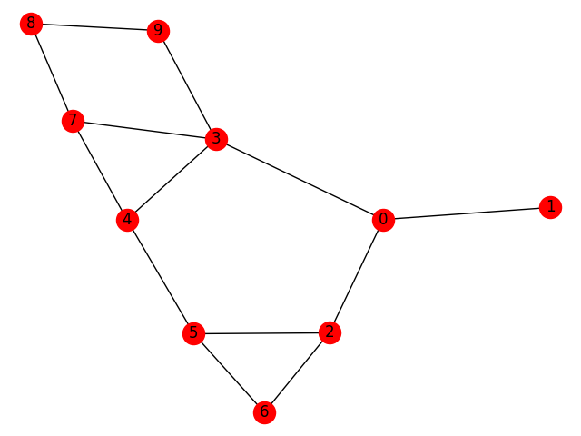
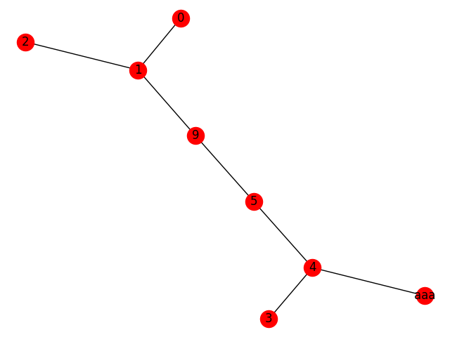

# 発展的な解析手法 2. NetworkX の使い方\*

NetworkX とはグラフ(ネットワーク)を扱うための Python のパッケージ(ライブラリ)である。これを用いることで、Fortran などを使うととても手間のかかる処理を手軽に行えるようになることがある。この章では、グラフの基本、NetworkX の使い方の基礎、MD のデータ解析へのいくつかの応用について説明する。なお、この章はすべて発展的な内容である。核生成をテーマとしている人は必ず読むべきだが、それ以外の人は学習と研究がある程度進んだ段階で、参考として読めば良い。

## グラフ

この章で扱う"グラフ"とは、一般的な図表を意味するのではなく、グラフ理論が対象とするものに限られる。グラフ理論とは、物のつながりに関する様々な性質を探求する分野である。シミュレーションのデータ解析に利用するだけならその詳細な知識はおそらく必要ない(矢ケ崎は入門書を 1 冊斜め読みしただけである)。一つのグラフは、点(node ないしは vertex)と、点の間を繋ぐ線(edge)からなる。Figure 8.1 にグラフの例を示す。このグラフは 0 から 9 の 10 個の node からなる。この図では単純に数字で node を表しているが、必ずしもそうする必要はない。例えば、それぞれの node を都市の名前とすれば、グラフは交通網を表す図となる。一つの node が原子を表せば、分子をグラフで表すことができる。



> **Figure 8.1** 単純無向グラフの例。10 個の node と 13 本の edge からなる。

Figure 8.1 では、それぞれの edge に向きが定義されていない。すなわち、0 と 1 は互いに繋がっているが、0 から 1 と 1 から 0 の間に区別はない。このようなグラフを無向グラフという。

node を都市だとした場合、0 から 1 へは通れるが、逆側には通行規制が敷かれて通れないという状態を考えることができる。この場合は、edge を線ではなく矢印で表すほうがふさわしい。このようなグラフを有向グラフという。シミュレーションデータの解析の場合、大抵は無向グラフで十分だが、ice rule のように水素結合の向きが重要になる問題では、有向グラフが必要になることもある。本章では無向グラフのみを扱うこととする。

二つの node の間に複数の edge (multiple edge)がある状態を考えることもできる。また、一つの node から出た線が、他の node を通らずに同じ node に戻る loop もありうる。Networkx はこれらも扱うことができるが、分子シミュレーションのデータ解析にはおそらく必要ないだろう。multiple edge や loop を含まないグラフを単純グラフという。

node に名前以外の属性を持たせることができる。edge にも、重みやその他の属性をつけることができる。本章ではこれらは扱わないこととする。

## NetworkX の基本的な使い方

Python の対話モードで、実際に NetworkX を使ってみる。すでに、Python と NetworkX の両方がインストールされているものとする。まずはターミナルで Python を起動する(この章では Python そのものについての解説は行わない)。

```shell
python
```

次に、以下を入力する。

```python
>>> import networkx as nx
```

これで NetworkX を使えるようになった。まず最初に空のグラフ G を用意する。

```python
>>> G = nx.Graph()
```

このグラフに node や edge を追加していくには、次のようにする。

```python
>>> G.add_node(7)
>>> G.add_node("alpha")
>>> G.add_edge(0,3)
>>> G.add_edge("alpha",2)
>>> G.add_edge(2,1)
>>> G.add_edge(1,4)
>>> G.add_edge(2,4)
```

node は数字でも文字列でも良い。edge を定義すると、自動的にそれを構成する node も G に含まれる。定義した node や edge を消去することもできる。

```python
>>> G.remove_node(2)
>>> G.remove_edge(0,3)
```

グラフを完全に初期化するには以下のようにする。

```python
>>> G.clear()
```

リスト(配列)に含まれた複数の node や edge をまとめて定義することもできる。

```python
>>> G.add_nodes_from([0,3,5])
>>> G.add_edges_from([(0,1),(1,2),(9,1),(5,9),(3,4),(4,5),(4,"aaa")])
```

Matplotlib がインストールされていれば、グラフを図にすることができる。

```python
>>> import matplotlib.pyplot as plt
>>> nx.draw(G,with_labels=True)
>>> plt.show()
```

Figure 8.2 のような図が表示されるはずである。



> **Figure 8.2** 数字と文字列が混在するグラフの例。

NetworkX では、グラフから様々な情報を抜き出すことができる。以下に簡単な例を示す。

```python
>>> G.nodes()
>>> G.edges()
>>> G.number_of_nodes()
>>> G.number_of_edges()
```

上から、構成する全ての node のリスト、すべての edge のリスト、node の数、edge の数が表示される。

## 二面角を構成する粒子を抜き出す

ここからは、具体的な応用例を示す。構造解析の基本の一つは、結合の定義であろう。

これには pairlist モジュールが有用である。

```python
# 周期境界条件でない場合
import pairlist as pl

positions = # ノードの位置が格納された(N,3)のnp.array

for i, j, d in pl.pairs_iter(positions, maxdist=1.0):
    # ノードi, j間の距離dは1以下
    ...
```

```python
# 周期境界条件の場合は、第3引数でセルの形状を渡す(3x3 matrix)。
# また、positionsがfractional coordinate(セル相対座標)かどうかを指示する。
for i, j, d in pl.pairs_iter(positions, 1.0, cell, fractional=False):
    # ノードi, j間の距離dは1以下
    ...
```

NetworkX を利用すると、結合の情報のみから、繋がった 4 点の組み合わせの全てを容易に抜き出すことができる。以下はそれを行うプログラムの例である。この書き方だと、4 点相関でありながら、ループは 3 重で済む。Fortran では、どう書いたとしても、このサンプルよりはるかに長くなるだろう。

> **Source code 8.1** dihed.py

```python
#!/usr/bin/env python

import networkx as nx

G = nx.Graph()
G.add_edges_from([(0,1),(0,2),(0,3),(0,4),(4,5)])

for edge in G.edges():
    neighbors =  G.neighbors(edge[0])
    neighbors_0 = []
    for node in neighbors:
        if node != edge[1]:
            neighbors_0.append(node)

    neighbors =  G.neighbors(edge[1])
    neighbors_1 = []
    for node in neighbors:
        if node != edge[0]:
            neighbors_1.append(node)

    if len(neighbors_0) == 0:
        continue
    if len(neighbors_1) == 0:
        continue

    for node_0 in neighbors_0:
        for node_1 in neighbors_1:
            print(node_0,edge[0],edge[1],node_1)
            # 二面角の計算
```

二面角の計算を Python スクリプト内部で行うなら、原子座標のデータも読み込む必要がある。スクリプトで二面角を構成する 4 点の組み合わせを出力して、それを入力として他のプログラムで二面角を計算しても良い。

## 閉じた環を探す

水や氷の水素結合ネットワークには閉じた環が存在する。最も安定な水素結合ネットワークの環構造は 6 員環であり、実際に氷 Ih の内部では全ての分子が 6 員環を形成している。液体中や氷 VI などの高圧氷、さらにはクラスレートハイドレートの中には、6 員環以外の環構造が存在する。このような環構造を探すプログラムを Fortran で書くのは難しい。ネットワークの中から、6 員環以下のすべてのリングを探し出して表示するプログラムを示す。それなりに長いが、他の言語を使うともっと恐ろしいことになる。`nx.all_simple_paths`のおかげで、非常に楽になっている。また、python の集合のデータ型(set)や for の仕様にもかなり助けられている。

> **Source code 8.2** cycle.py

```python
#!/usr/bin/env python

import networkx as nx

G = nx.Graph()
G.add_edges_from(
    [(0, 1), (1, 2), (2, 3), (3, 4), (4, 1), (0, 5), (5, 7), (7, 8), (8, 4), (5, 8)]
)

max_ring_size = 6
# Count the number of 2,3,4,...,max_ring_size-membered rings.
all_rings = []
for node in G:
    for neighbor in G.neighbors(node):
        if node < neighbor:
            paths = nx.all_simple_paths(
                G, source=node, target=neighbor, cutoff=max_ring_size - 1
            )
            for path in paths:
                path.sort()
                all_rings.append(path)

# Remove overlap.
uniq_all_rings_0 = []
for path in all_rings:
    if not path in uniq_all_rings_0:
        uniq_all_rings_0.append(path)

# Remove paths of len(path) == 2 because they are not "rings" but edges.
uniq_all_rings_1 = []
for path in uniq_all_rings_0:
    length = len(path)
    if length > 2:
        uniq_all_rings_1.append(path)

# Romove rings that completely include other ring(s).
tobe_removed = []
for ring_i in uniq_all_rings_1:
    n_size_i = len(ring_i)
    set_i = set(ring_i)
    j = 0
    for ring_j in uniq_all_rings_1:
        n_size_j = len(ring_j)
        if n_size_i < n_size_j:
            set_j = set(ring_j)
            and_set = set_i & set_j
            num_overlap = len(list(and_set))
            if num_overlap == n_size_i:
                tobe_removed.append(j)
        j = j + 1
```

環を数えるアルゴリズムは、`cycless`モジュールで提供されている。これを用いると、環の探索は次のように簡潔に書ける。

```python
from cycless import cycles

g = nx.Graph()
# グラフgの中身をここで定義
...

for cycle in cycles.cycles_iter(g, 6):
    # cycleには6員環以下の環のノードのラベルが列挙される。
    ...
```

`.gro`ファイルを標準入力から読みこみ、水素結合のグラフを作り、環を数えるコードはこんな感じ。

> **Source code 8.3** ring_analysis.py

```python
#!/usr/bin/env python
# groファイルを読みこみ、HBをつないでリングの統計をとる。
# この部分はMolSimTutorialsからそのままもってきた

from codes.read_gro3 import read_gro

import networkx as nx

# 松本作: 周期境界条件のもとで近接点対をリストする
import pairlist as pl

# 松本作: グラフの中にサイクルをさがす
from cycless import cycles

for frame in read_gro(sys.stdin):
    # シミュレーションセル
    cell = frame["cell"]

    # シミュレーションセルの逆行列
    celli = np.linalg.inv(cell)

    # 酸素原子の座標
    oxygens = frame["position"][frame["atom"] == "OW", :]
    # 水素原子1の座標
    hydrogens1 = frame["position"][frame["atom"] == "HW1", :]
    # 水素原子2の座標
    hydrogens2 = frame["position"][frame["atom"] == "HW1", :]
    # 酸素原子の座標をセルの逆行列をかけてfractional coordinateに変換
    rO = oxygens @ celli
    # 水素原子1の座標をセルの逆行列をかけてfractional coordinateに変換
    rH1 = hydrogens1 @ celli
    # 水素原子2の座標をセルの逆行列をかけてfractional coordinateに変換
    rH2 = hydrogens2 @ celli

    # グラフを作成
    g = nx.Graph()
    # 酸素原子と水素原子1の距離が0.245以下の場合
    for o, h1, d in pl.pairs_iter(rO, 0.245, cell, pos2=rH1):
        # 距離が0.1以下の場合は、グラフに追加しない(共有結合)
        if d > 0.1:
            g.add_edge(o, h1)
    for o, h2, d in pl.pairs_iter(rO, 0.245, cell, pos2=rH2):
        if d > 0.1:
            g.add_edge(o, h2)
    for cycle in cycles.cycles_iter(g, 10):
        # 環のサイズが10以下の場合は、環のサイズを出力
        print(len(cycle))
```

## クラスターの数と構成要素

過冷却溶液における結晶の均一核生成を考えよう。この過程では、液体の中で小さな結晶のクラスターが現れては消えていく。そのうち、少数のクラスターが臨界サイズを超え、消えることなく成長していく。過飽和蒸気における液滴の生成や、過飽和水溶液からの溶質結晶の析出なども同様の現象である。このような核生成過程の解析では、ある瞬間構造の中にクラスターは何個あるのか、それらのサイズはどの程度なのか、といった量が必要となる。

ある粒子がクラスターを構成する一員か否かは判定できているとしよう。液滴の場合なら全ての粒子がそうであるし、結晶生成なら動きの遅い粒子やポテンシャルの低い粒子がそうである。また、これらの粒子の間の結合も粒子間距離などから定義できるとしよう。グラフを使わずに、これらの情報からクラスターを定義することもできるが、力技のコードでは効率が悪く、また可読性も低くなる。

NetworkX を利用すると以下のようになる。このサンプルでは、粒子数が 3 より大きなクラスターの数、並びにそれらのサイズが出力される。このスクリプトでポイントとなるのは、`nx.connected_components(G)`である。これはグラフ内のすべてのクラスターの要素のリストを返してくれるメソッドである。

> **Source code 8.3** cluster.py

```python
#!/usr/bin/env python

import networkx as nx

G = nx.Graph()
G.add_edges_from([(0,1),(1,2),(3,4),(4,5),(5,6),(6,3),(7,8)])
G.add_nodes_from([9,10])

n_cluster_size_threshold = 2

# Generate connected components (i.e., clusters)
all_components = []
for component  in nx.connected_components(G):
    tmp_nodes = []
    for node in component:
        tmp_nodes.append(int(node))
    tmp_nodes.sort()
    if len(tmp_nodes) > n_cluster_size_threshold:
        all_components.append(tmp_nodes)

# Sort so that larger component becomes earlier
all_components.sort(key = lambda x:len(x), reverse = True)

n_components = len(all_components)
print("number of clusters:",n_components)
print("cluster size: ",end='')
for component in all_components:
    print(len(component),end=' ')
print()
```
