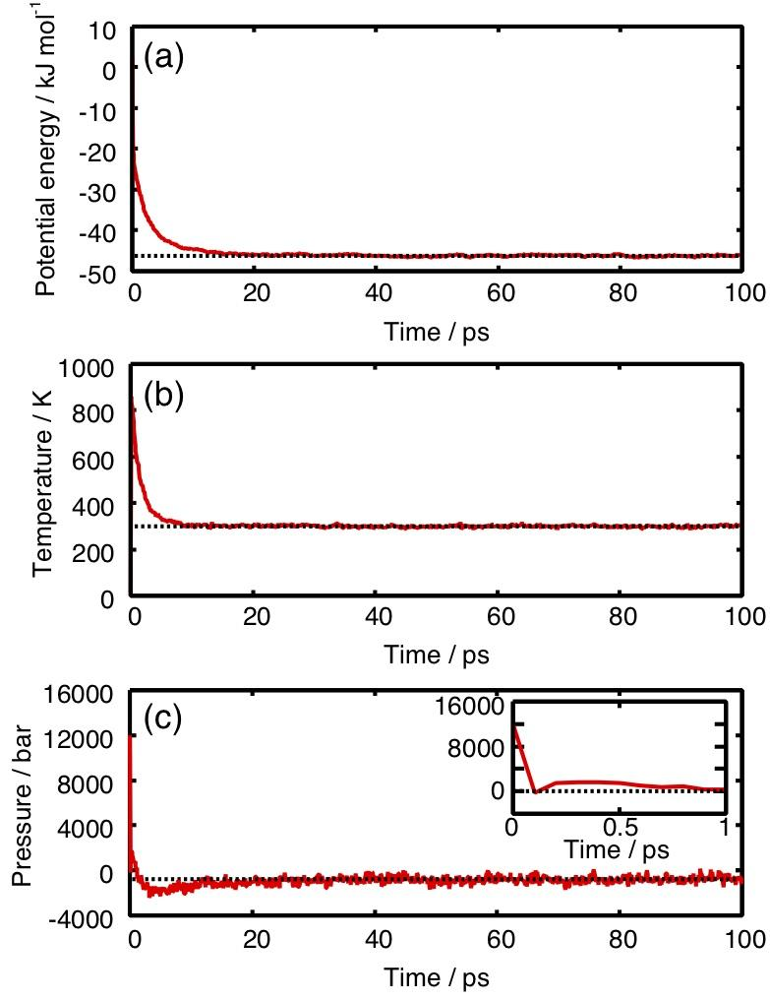
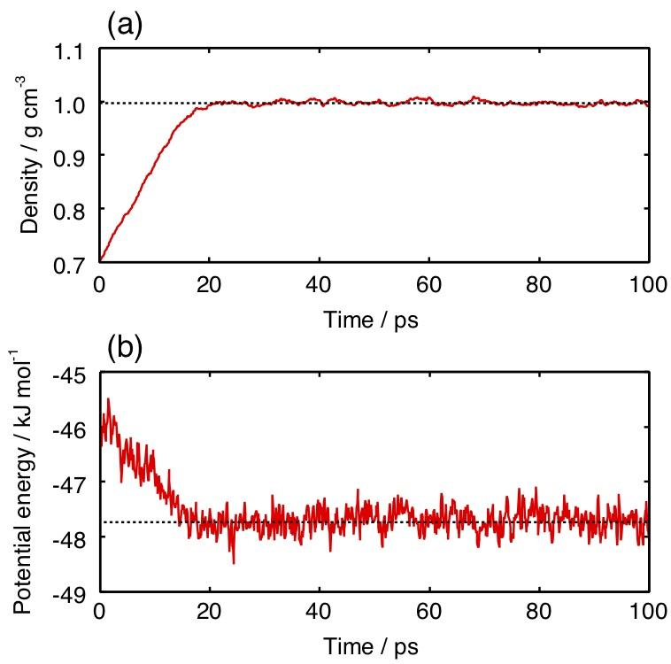
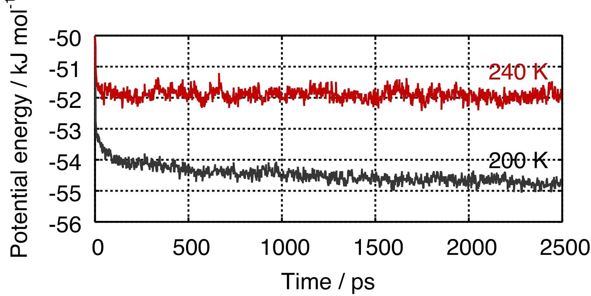
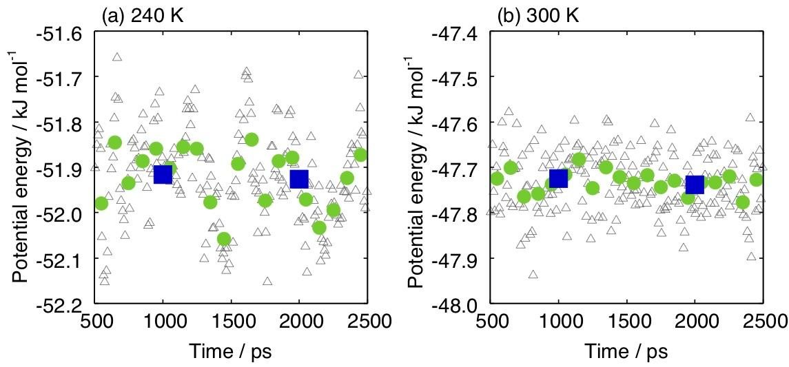
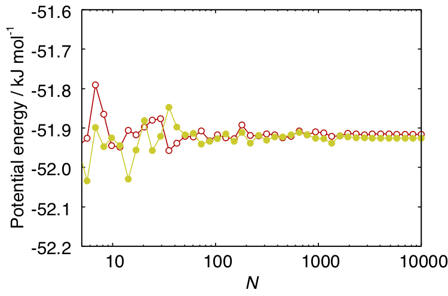
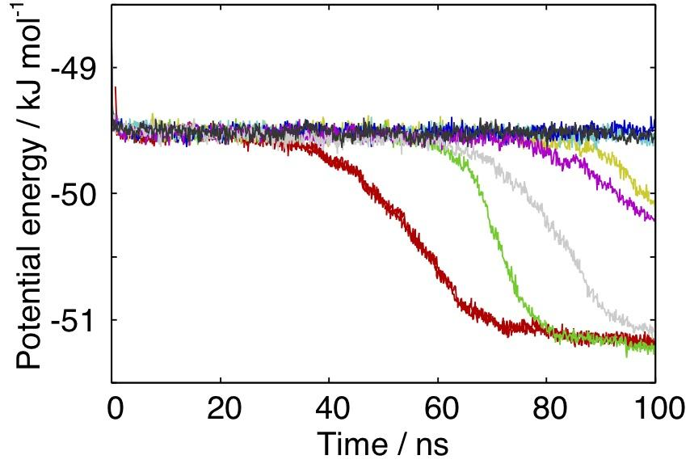

# MD計算の進め方と条件設定
MDシミュレーションのプログラムが正しく動き、解析のプログラムが正しく書けていても、その結果が“正しくない”ことがある。正しい結果を得るためには、MDシミュレーションをどのように行うかが重要である。また、データは正しいが無駄が多いということも初心者にはよく見られる。3章で簡単に説明したが、適切なデータの取り方についてこの章ではより詳しく解説する。

## 液体の平衡化
MD計算では、初めに系を目的の熱力学的条件の平衡状態にしなければならない。ここでは、液体の水の物性の温度依存性を計算したい場合を考える。分子数は1000、圧力は1 barとする。計算のために初期構造を用意する必要がある。液体なので、その構造が乱雑であることは明らかである。しかしながら、与えられた温度におけるエントロピーを事前に知ることはできないし、仮にわかっていたとしても、それに対応する一つの構造を作ることはできない。何らかの乱雑な構造を作り、それを目的の温度で平衡化しなければならない。
液体の計算では、シミュレーションセルの内部にランダムに分子を配置して初期構造とすれば良い。完全にランダムに状態を作ると、場所によって原子間距離がかなり近いところができてしまう。この状態からMD計算を始めると、強い原子間反発によりシミュレーションの1ステップの時間Δtの間に原子が大きく移動する(2章11式のFiがとても大きな値になるため)。GROMACSでは、Δtの間にあまりに大きく原子が移動するとエラーとなって計算が不正終了する。これを避けるために、初期構造を作る場合は、完全なランダムでなく、原子間距離がある値よりも大きくなるような制限をつけなければならない。また、できるだけ原子間距離が近づかないようにするために、目的の条件より少し小さな密度にする(3章課題2はそのように設定されている)。
原子間距離に制限が付いていたとしても、乱数で生成された初期構造は現実のそれよりも不安定である。その結果として、初期配置から計算される圧力は非常に高くなってしまう。この状態で等圧MD計算を行うと、シミュレーションセルがΔtの間に大きく変化してしまい、これまたエラーとなってしまう。これを避けるために、シミュレーションの最初は”Pcoupl = no”としてNVT MDにするべきである。また、温度も非常に大きく揺らぐので、アルゴリズムとして安定な”tcoupl =  v-rescale”を使う。この設定で300 KのMD計算を行った場合の水1分子あたりのポテンシャルエネルギーをFigure 16aに示す。密度は0.7 g cm-3である。ポテンシャルエネルギーが15 ps程度で速やかに−45 kJ mol-1程度に変化していることがわかる。これは主に、分子配向(分子の向き)による緩和である。Figure 16bに温度変化を示す。初期状態で反発的な構造だった分子の向きが急激に変化するため、一時的に温度が850 Kとなっている。v-rescale熱浴が付いているために、このような状態からでもわずか10 ps程度で目的の温度に達する。Figure 16cは圧力の時間変化である。これまた反発的な相互作用のために、初期状態では12000 barという莫大な値になっている。もし等圧計算を行っていたならば、これを反映してセル長が急激に増大し、エラーとなっていただろう。


> Figure 16. ランダムな初期構造からのNVT計算による平衡化。密度は0.7 g cm-3、温度は300 K。TIP4P/2005モデルを使用。

初期構造が悪いとMD計算が動かない。あまりに悪い場合は初期構造を作りなおさなければならないが、そうでないなら、Δtを小さな値にすることでMDが走るようになることもある。小さなΔtでしばらくNVT MDを行い、ポテンシャルエネルギーがある程度の値まで下がったらΔt = 0.002 psに戻せば良い。
NVT計算が終わったら、次に密度を緩和させる。圧力浴の設定を”Pcoupl = Berendsen”もしくは”Pcoupl = Parrinello-Rahman“にしてセル長が変化できるようにする。前者の方がアルゴリズムとして安定だが、後者の方が統計アンサンブルとして正確である。実際には、どちらを選んでも同じような結果になることが多い。今回は安定性を重視してBerendsenを使うことにする。Figure 16bが示すように、温度の緩和が終わっているので、熱浴の設定を”tcoupl = nose-hoover”に変える。この方法はv-rescaleよりアルゴリズムとして少し不安定だが、統計アンサンブルとして正確で、系の揺らぎをより正しく計算できる。Figure 16の最後の状態から、この条件で計算を行った場合の密度とポテンシャルエネルギーの時間変化をFigure 17に示す。密度は20 ps程度で1.0 g cm-3に近づき、また、これに伴いポテンシャルエネルギーが減少している。密度にもポテンシャルエネルギーにも、それから後に大きな変化が見られないため、この状態で平衡に至っていると解釈できる。このデータの場合は、少し余裕をもって、t > 50 psを本計算の領域として解析に用いるのが妥当であろう。


Figure 17. 密度0.7 g cm-3から1 barの平衡状態への緩和。温度は300 K。

Figure 17の最終構造を元に、より低い温度への平衡化を行う。240 Kと200 Kに温度を変えた時のポテンシャルエネルギー変化をFigure 18に示す。 240 Kへの緩和は数百ピコ秒程度で終わっている。 t ~ 200 psの振る舞いが緩和なのか揺らぎなのか判断できないが、余裕を持ってt > 500 ps を平衡状態とすれば問題はないだろう。これに対し、200 Kではポテンシャルが減少を続けており、2500 psの段階でも平衡化が終わっていない。この温度の平衡化のためには、さらに計算を延長しなければならない。


Figure 18. 300 Kから240 K(red)、ならびに200 K(black)への水の緩和。圧力は1 bar。

系の平衡化に必要な時間は、分子の配置や配向の変化が遅いほど長くなる。そのため、Figure 18に示すように、低い温度では長い時間を要する。一般に、計算を行う前に平衡化に必要な時間を予想することは難しい。したがって、いかなる場合にも、目的の物理量が明らかに一定値になったと判断できるまで計算を延長し、十分に平衡化されていることを確認する手間を惜しんではならない。

## サンプリングの長さ
平衡化が終われば、その後のトラジェクトリから目的の物理量を求めることができる。だが、その計算にどのくらいの長さのデータを使えば良いのだろうか？
Figure 18に示すように、240 Kのトラジェクトリのt > 500 psの領域は平衡状態にある。このMD計算では0.1 psごとにポテンシャルエネルギーを保存していた。そのため、500 ps から2500 psの2 nsの範囲について20000点のサンプルがある。これをtwindow = 10 psごと(100点ごと)に分割し、それぞれの分割領域のポテンシャルエネルギーの平均値を求めた結果がFigure 19aの黒い三角で示されている。値は−52.15 kJ mol-1から−51.75 kJ mol-1の範囲は散らばっている。したがって、10 psの積算で得られる平均値の信頼性は最初の2桁に満たないということになる。同様に、twindow  = 100 ps (1000点)ごと、twindow = 1000 ps (10000点)ごとに分割して得られた平均値が緑の丸と青い四角になる。平均を求めるのに用いた時間範囲が長くなると、平均値がある値に収束していく様子が見て取れる。500 ps < t < 1500 psの時間領域の平均値である左の四角は−51.916 kJ mol-1、1500 ps < t < 2500 psの平均値である右の四角は−51.926 kJ mol-1である。したがって、twindow = 1000 ps (10000点)の値の信頼性は3から4桁あるということになる。同様の計算を300 Kのデータに対して行った結果がFigure 19bである。300 Kでは値のばらつきが小さい。これは、240 Kの場合よりもいくらか小さなtwindowで同程度の信頼性のある平均値を得ることができることを意味する。


Figure 19. ポテンシャルエネルギーのデータをtwindow = 10 ps (black triangle)、100 ps (green circle)、1000 ps (blue square)の幅の領域に分割し、それぞれについて取った平均値。

## サンプルの数
Figure 19の 青の四角の値が十分に収束していたのは、twindow が長いからなのか、それともサンプル数が多いからなのか。前者が主要因ならば、トラジェクトリからサンプルを保存する間隔を0.1 psより長くしても良いということになる。これにより、シミュレーション時間は同じでも、使用するハードディスクの容量を減らすことができる。逆に、サンプルの数が重要ならば、サンプルを保存する間隔を0.1 psより狭くすることで、ディスクの容量は変わらないが、シミュレーション時間を短くすることができる。
どちらが重要かを確かめるべく、twindow = 1000 psのデータから均等にN点のサンプルを取り出して平均値を求めた。Figure 20に示す。サンプル数がおよそ100点もあれば、10000点全てを使った場合とほとんど同じ結果となっていることがわかる。これに対し、twindow = 10 psで平均を取ったFigure 19の黒の三角は、同じ100点のサンプル数にも関わらず、ばらつきが大きい。この比較から、重要なのはサンプルの数ではなく、十分な長さのtwindow であることがわかる。


> Figure 20. サンプル数による平均値の違い。240 Kのポテンシャルエネルギー。赤は500 ps < t < 1500 ps、黄色は1500 ps < t < 2500 psのデータ。どちらの場合も、N = 100の値とN = 10000の値がそれほど変わらない。

twindow が短いままサンプルの数を増やしても平均値の精度がよくならないのは、サンプル同士の独立性が低くなるためである。極端なケースとして、サンプル同士の時間間隔が0.1 fs程度の場合を考えてみよう。実際にMD計算をしてみてmdviewで確認すればすぐにわかるが、このような時間間隔では分子はほとんど動かない。したがって原子座標から計算される物理量もほとんど変化しない。このように互いによく似たサンプルをいくら集めても、統計的に無意味である。
Figure 20は、240 Kのポテンシャルエネルギーの平均値を求めるには100から1000程度のサンプル数で十分なことを示している。他の大抵の物理量も、サンプル同士が十分に独立ならば、1000程度のサンプル数で十分な結果が得られることが多い。
サンプル同士が独立となる時間間隔は、実際に計算してみないとわからない。平衡化の場合と同じく、基本的には分子の配置や配向の変化の速さに依存する。分子があまり動かない低温では、サンプル間の時間間隔を長めにしておけば、少ないディスク使用量で済ませることができる。

## 計算条件の設定方針
以上を踏まえた適切な計算条件の設定方針について解説する。ここでいう計算条件とは、計算のステップ数(nsteps)、座標を保存する頻度(nstxout)、速度を保存する頻度(nstvout)、エネルギーを保存する頻度(nstenergy)、並列計算のコア数(N_thread)などのことである。MDの1ステップの時間はΔt = 0.002 psとする。
計算機とハードディスクが無限にあるならば、計算条件について考えることなどない。MDの各ステップで座標とエネルギーを保存し、ステップ数をひたすら大きくしていけば、計算結果の精度はいくらでも上がる。しかしながら、前述の通り、短い時間間隔でサンプルを保存しても統計的に無意味でディスクの無駄となる。また、必要な精度に達したのならば、それ以上のステップ数の計算を行っても意味がない。自分が利用できる計算機資源の量を把握し、その範囲内でできる限り精度の高い結果を得られる計算条件を摸索しなければならない。以下では、計算の段取りの例を示す。人によって計算する対象が異なるので、全く同じように進める必要はないが、どのようなことに留意しながら進めていけば良いか、感じを掴んで欲しい。
計算すべき系が決まったら、まずはnsteps = 5000ステップ(10 ps)程度の短いNVT MDシミュレーションを行い、その系の計算コストを見積もる。コア数N_threadは4、8、16のどれかにしておくとよい(素数だとうまく動かないことがある)。200-500原子あたり1コアくらいになるようにコア数を選ぶ。nstxoutは500とする。計算が終了してから、出力の一つである00001.logの最後の部分を見てみよう。次のようになっているはずである(違っていたのなら、それは何らかの理由で不正終了していたということである。大抵は、 i) 原子間距離が近すぎる、ii) top fileの分子数が間違っている、iii) セル長の設定が間違っている、のどれかである)。
```data
              Core t (s)   Wall t (s)        (%)
       Time:       38.510        2.419     1592.0
                 (ns/day)    (hour/ns)
Performance:      357.259        0.067
Finished mdrun on node 0 Thu Mar 28 15:59:43 2019
```
これは、計算時間の情報である。左下の数字だけ見ておけばよい。1日に357.259 nsのシミュレーションが進むという意味である。
次にnum_gro2mdv.plでmdvファイルを作り、mdviewで確認する。10コマのデータになっているはずである。この段階で”du -h”とコマンドを叩いてみよう。出てきた数字が、10個のサンプルを出力した場合に使用したディスク容量である。水1000分子の場合は1.5 MBとなる。
自分の計算に必要な計算時間とディスク容量を確認できたら、続けてNPTによる平衡化を行う。Figure 16とFigure 17に示されるように、目的の温度と圧力によって必要な時間が変わるので、データを見ながら、計算を延長していくことになる。だいたい10分くらいかかるような計算を走らせて様子を見てみる。今の条件だと、357/(24*6)  = 2.5 nsくらいの計算を走らせることになる。ここでは、キリのよい2 ns (nsteps = 1,000,000)にしてみる。この段階では座標を保存する必要はないので、nstxout = nsteps/10くらいで良い。原子速度は全く必要ないので、nstvout = nstepsとする。平衡化しているかどうかを判断するために、エネルギーはきちんと出力する。エネルギーのファイル(edrファイル)は座標ファイル(trr)よりだいぶサイズが小さいので、高めの頻度で出力しても問題ない。nstenergy = 500 (1 ps)くらいにしておけば、2 nsのデータで2000点得られるので、十分に傾向をみることができる。計算が終わったらポテンシャルエネルギーと密度をチェックする。Figure 17の240 Kのような結果が得られたなら、平衡化は終わりである。200 Kのような結果ならば平衡化を続ける。あと少しで平衡になりそうならば、同じくらいのnstepsで計算を続ける。まだまだ平衡になりそうになければ、1～24時間くらいの計算を流しておく。この場合は、新しいnstepsに対してnstxout = nsteps/10、ならびにnstvout = nstepsと設定し直す事を忘れないように。例えば12時間の計算を行うとしよう。357/2 ~ 180 nsの計算である。最初に行った10分の計算ではnstxout = 100,000 = 0.2 nsだった。このnstxoutで180 nsの計算をすると180/0.2 = 900もの座標が出力される。したがって、本来なら1.5 MB程度で十分だった所に、900/10 * 1.5 = 135 MBものディスクを使用することになってしまう。このテストは水1000分子という小さな系なので大したサイズにはならないが、10000分子なら1.35 GBなので馬鹿にならない。なお、エネルギーのファイルのサイズはそれほど大きくならないので、こちらは元と同じnstenergy = 500のままで良い。
何日も計算しても平衡に達しないことがあるかもしれない。卒論なり、修論なりの締め切りに間に合わなかったら元も子もない。こういう場合は、4点か5点、高い温度の計算をやってみると良い。それぞれの平衡に達した時間(teq)を温度に対してプロットすれば、目的の温度の平衡化にどれだけ時間がかかるか、見積もることができる (Arrhenius式か、Vogel-Tammann-Fulcher式で温度依存性を近似できることが多い)。あまりに時間がかかりそうならば、諦めて別のことをしたほうが良い。
平衡化が終わったら本計算に移る。必要な本計算の長さは物理量によるので、やってみないとわからない。どのような物理量を計算するにしても、とりあえず平衡化にかかった時間teqの10倍くらいを本計算の長さとすれば良いだろう。この10 teqの間にだいたい1000点くらいの座標が出力されるようにnstxoutを設定しておくと良い。ディスクに余裕があるならば10000点くらいとっても良い。原子速度を解析に使うことは稀である。したがって、nstvoutは非常に大きな値にしておいて、速度をほとんど出力しないようにしておく。
本計算が終わったら、目的の物理量を計算する。Figure 19で行ったように、データを分割してそれぞれの領域の平均値を求める。大抵は、本計算の前半と後半に2分割して、それぞれの結果を比較するだけで十分である。前半と後半の結果が（自分の議論に必要な範囲で）十分に似ているならば、計算は終わりである。前半と後半の両方を使った平均値を最終結果とすれば良い。もし計算が足りないのなら、本計算の長さを倍にする。新しく得られた範囲の結果が前の結果と似ていれば終了、そうでないならさらに延長する。
様々な温度の結果を比較する場合は、それぞれの条件で平衡化や本計算に必要なシミュレーション時間が異なってくる。あまり温度範囲が広くないならば、最も緩和の遅い低温の条件に揃えて、他の温度の計算を行う。緩和速度があまりに異なる場合は、温度領域ごとにシミュレーション時間を変えても良い。いずれにせよ、論文にする場合は平衡化時間や本計算の時間をはっきりと明示しなければならない。

## 非平衡計算
非平衡シミュレーションでは、不安定な状態から平衡状態に至る緩和過程そのものが研究対象となる。様々な非平衡過程が存在するが、我々のグループでは、不安定な相から最安定な相へ至る相転移過程を研究対象とすることが多い。3章のFigure 6に示した水と氷の二相共存状態を考えよう。もしシミュレーションの温度が氷の融点よりも低ければ、液体部分が不安定な相ということになる。したがって、この条件でシミュレーションを行うと、時間とともに結晶成長が進んで液体領域が減っていく。これに伴い、ポテンシャルエネルギーは減少を続ける。したがって、この章のこれまでの部分で説明したような「平衡化してから物理量を計算する」という流れではなく、「物理量の時間変化そのものの解析」を行うことになる。時間を横軸に取った図を描く場合、少なくとも100 ~ 1000点くらいのデータがないと、図が荒くなってしまう。これを考慮して座標出力頻度を決定する必要がある。
核生成、結晶成長、相分離など、相転移の非平衡シミュレーションの厄介なところは、現象によって速さが大きく変わるということである。場合によっては、年単位でシミュレーションを行っても相転移が観察できないということもある。常圧の水の結晶核生成がまさにその例である。研究室配属されてから修士を取るまで計算機を回し続けても氷はできない。逆に、たかだか10000 step程度のシミュレーションで核生成が観察される系もある。あまりに遅い現象の場合は、計算条件や、場合によってはテーマそのものを考え直す必要がある。
遅い現象を対象としており、最終的にどのくらいの長さのシミュレーションが必要になるか分からない場合は、100 psに1回くらいの頻度で座標を出力すれば良いだろう(3章で説明した通り、一つのファイルサイズが1 GB程度になるようにジョブを区切ること)。この条件で計算を長く続けると、ディスク使用量が大きくなりすぎるかもしれない。その場合は、i) num_gro2mdv.plを使って?????.trrから?????-0.groと?????-0.mdvを出力し、ii) mdvから均等に1/10の座標データを抜き出して別のファイルに保存、iii) 元となったtrr、gro、mdvを消去すると良い。

## 初期配置の数
通常の液体のMD計算の場合、平衡に達してから十分に長いシミュレーションを行うことで、様々な構造がサンプルされる。そのため、初期配置は一つで良い。
液体の温度を下げていくと、ガラス(アモルファス)化する。アモルファスになってしまうと分子は動かないので、シミュレーション時間を長くしても得られる結果が変わらない。アモルファスの物理量を求める場合は、異なる液体構造から温度を下げて複数のアモルファス構造を作り、その平均や分布を議論しなければならない。
結晶の場合は、与えられた温度と圧力に対して、構造が一意に決定される。例えば常圧のNaClの結晶はB1と呼ばれる構造であり、全てのイオンの位置が決まっている。そのため、シミュレーションの初期構造は一つで良い。しかしながら、我々の主な研究対象である氷は例外的にこの扱いができない。常圧の氷である氷Ihの中の酸素の配置は一意に決定されるが、水素の位置については秩序がない。氷III、VI、VIIなども同様である。このような氷をproton-disordered iceあるいは水素無秩序氷と呼ぶ。これらについては、複数のプロトン配置の構造を作り、それらの計算結果の平均を取らなくてはならない。氷IIやIXのように、水素の位置も完全に決まっている氷もある。これらをproton-ordered iceと呼ぶ。この場合は、初期配置は一つで良い。
非平衡計算の場合は、液体の場合でも、複数の初期配置のシミュレーションを行った方が良い。相転移現象の多くは、何らかの自由エネルギー障壁を超える過程である。この場合、障壁を超える時間は同じ温度、圧力であっても異なることが多い。Figure 21に、ある高圧氷が核生成するシミュレーションにおけるポテンシャルエネルギーの時間変化を示す。温度と圧力は全て同じ260 K、3.3 GPaだが、核形成によりポテンシャルエネルギーが下がり始める時刻は30 nsから90 nsという広い範囲に及んでいる。これらの平均が、この温度、圧力における核生成の待機時間ということになる。


Figure 21. 温度260 K、圧力3.3 GPaのTIP4P/2005のポテンシャルエネルギーの時間変化。初期状態は液体。Ice T2と呼ばれる結晶の核生成のためにポテンシャルエネルギーが減少する。[^JPC2018]

[^JPC2018]: J. Phys. Chem. B 122, 7718 (2018).

## 系の大きさ
分子数が多くなると、計算時間は遅くなり、ディスク使用量大きくなる。できるだけ小さくしたい所だが、あまりに小さいと正しい結果が得られなくなる。極端なケースとして、水分子が2つか3つしかない状態を考えてみよう。たとえ周期境界条件を課していたとしても、これでは液体や結晶の水を表すことができないことは明らかである。
対象となる物理量や現象によって、必要な系の大きさは異なる。最低でもシミュレーションセルの大きさが 3 nm × 3 nm × 3 nm程度になるようにしておくべきだろう。水の場合は、だいたい1000分子くらいである。核形成などを見たいときは、もっと大きな系にしないとその様子がよくわからない。また、臨界点近傍などの揺らぎが大きな場合も、大きな系が必要になることがある。
実際に研究を進める時には、まず、小さめの系でデータを集めて、必要なシミュレーションの長さやサンプル数などを調べておく。それから、シミュレーションセルを1.5倍か2倍に大きくした計算を行う。小さな系と同じ結果になるのなら、以降の計算は全て小さな系で進めてよい。もし明らかに値が異なるなら、値が変わらなくなる系の大きさを見出す、もしくは値のサイズ依存性が明らかになるまで系を大きくしていかなければならない(例えば、拡散係数はセル長に反比例することが知られている[^JPC2004])。

[^JPC2004]: J. Phys. Chem. B 108, 15873 (2004).