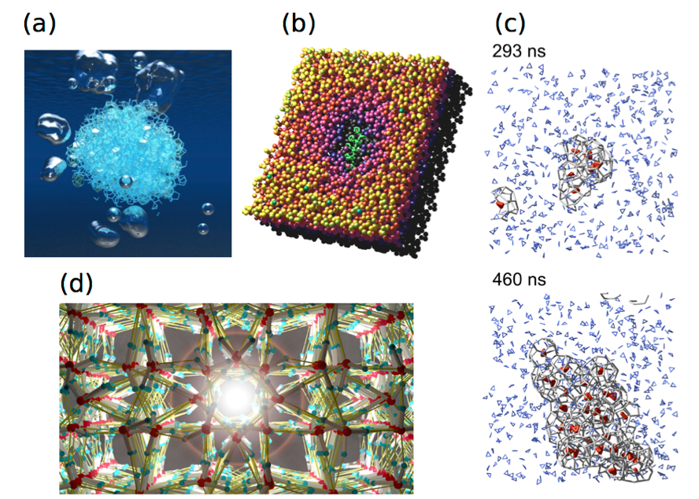

# スライド資料の作り方
この章では、卒論発表などのために必要な基礎知識を説明する。

## PowerPointによるスライド作成
発表資料はPowerPointを使って作る。最初に貸与されたMac Bookにインストールされているはずである[^1]。四年生の多くは、これまでにほとんどプレゼンを行った経験がないだろう。スライド作成における注意事項を列挙する。
[^1]:  インストールされていない場合は，情報統括センターのウェブページから入手できる．http://www.citm.okayama-u.ac.jp/citm/service/ms.html 

1. Title、Introduction（はじめに）、Method（方法）、Result & Discussion（結果と考察）、Conclusions（結論）、Acknowledgements（謝辞）、Appendix（付録）の順番でスライドを作る。
   1. 最初のTitleページには、発表タイトルと自分の所属や氏名を書く。何か、発表を象徴する図を入れても良い。
   1. Introductionでは、そのテーマの科学的な重要性や社会的な重要性、既存の研究の紹介、なぜそのテーマに至ったか、そのテーマで何を明らかにするかを説明する。
   1. Methodにはあまり時間をかけず、方法の本質的な部分だけ説明する。細かいことはスライドに書くだけで、読み上げずに飛ばす。
   1. Result & Discussionが発表の本体である。結論に至る経緯を順序良く説明する。
   1. Conclusionsはスライド一枚で発表の要約を行う。可能なら、研究結果から推測できること、今後の研究の進展などについても記述する。10分程度の短い発表の場合は、繰り返しの内容となる部分については書いておくだけで飛ばしてよい。
   1. Acknowledgementsでは世話になった所属研究室外の人や団体への謝辞を一枚にまとめる。Conclusionsの余白に書いても良い。卒論発表や修論発表では、基本的には必要ない。
   1. Conclusionsの後に追加情報としてAppendixがあると良い。データの詳細や、重要だが時間の都合で飛ばした内容などを用意しておく。質疑応答で役に立つ。慣れれば、発表本番で、想定以上に時間が余った場合の穴埋めにも使える。
2. 内容は、正しく、誤解なく、分かりやすく伝えることを意識する。
   1. 文とグラフだけでうまく説明できない場合は、簡単な概念図を加えると良い。簡単なものならPowerPointで書いても良いが、複雑な図を描きたいのならドローソフトを使うと良い（後述）。
   2. 研究室内でしか使わない用語は避ける。ある特定の研究分野でしか使わない用語もできれば避ける。どうしても必要なら、簡単で分かりやすい説明を入れる。
   3. 略語は、極めて一般的なものを除いて、使うべきではない。5.
   4. 自分で勝手に用語を作らない。
   5. 同じデータでも、見せる順番で分かりやすさが大きく変わる。よく考えよう。
   6. グラフを見せる場合は、必ずその横軸と縦軸について説明する。自分にとって見慣れた図も、聴衆にとっては初めて見るものだということを忘れないように。
3. スライド1枚あたり1-2分になるようにする。
   1. 重要でないところはもっと短くても良いし、込み入った説明が必要ならもう少し長くても良い。
   1. 短いスライドを矢継ぎ早に繰り出すスタイルや、一枚のスライドに非常に長い時間をかけるスタイルもあるが、あまりお勧めはしない。
1. <strike>スライドのサイズは4:3にすること。古いプロジェクターだと、16:9を表示できない。サイズは「デザイン」のタブで設定できる。</strike>
1. デザインは見やすさを第一に考える。
   1. 文字のサイズをできるだけ大きくする。ディスプレイで見ている分には十分な大きさに見えても、プロジェクターで表示するとそれほど大きく見えないことも多い。会場の後ろのほうに座っている人も、ちゃんと読めるように意識する。行間も広めにする。
   1. プロジェクターだと明朝体やセリフフォントは見にくい。日本語はメイリオ、ヒラギノ角ゴ、MSゴシックなどのゴシックフォント、英数字はArialのようなサンセリフフォントを使うと良い。特別な理由がない限り、フォントは統一すること。
   1. 線や文字の色と背景色が近いと非常に見にくい。背景が白で文字が黄色や明るい緑、というような配色は避けること。特にこだわりがないなら、背景色は白、文字は黒でよい。もちろん、見やすければ他の配色でもよい。
   1. あまり多くの色を使うと逆に見にくくなってしまう（色彩感覚が優れている人ならば、その限りではないかもしれないが）。文字の位置、サイズ、太さをまず工夫し、それでも足りない、ないしはそれ以上に意味の強調や明確な区別を行いたい場合に色を使うようにする。
   1.影や立体などの効果は使わないほうが無難である。これらを使って良いデザインにすることもできるが、PowerPointの機能でこれを行うと安っぽくなってしまうことが多い。画面切り替えのアニメーションなども、下手に使うと安っぽくなるので気を付けよう。
   1. 基本的に、スライドには長い文を書かない。短いフレーズや文、または、それらの箇条書きにする。
   1. グラフや表はできるだけ大きくする。縦軸や横軸の文字の大きさにも注意すること。
1. 文字の形式には意味があるので、気を付けること。
   1. 温度T、圧力Pなどの物理変数は斜体にする。NaCl、H2Oなどは斜体にしない。
   1. 数式内の$x$や$a$のような変数は斜体にする。$\sin$や$\exp$などは斜体にしない。ベクトルや行列は$\mathbf r_i$のように太字で表す。
   1. 数字と単位の間には半角のスペースを一つ入れる。単位は斜体にしない。
1. 文献を引用する場合は、筆者名、タイトル、雑誌名、volume、最初のページ、年を入れて、次のように書く。タイトルは省略してもよい。H. Tanaka, T. Yagasaki, and M. Matsumoto, “On the Thermodynamic Stability of Clathrate Hydrates VI: Complete Phase Diagram”, _J. Phys. Chem. B_ **122**, 297 (2018).
1. スライド資料を作ったら、必ず一度はプロジェクターで映して、見た目を確認すること。
1. 発表の本番は落ち着きが第一である。
   1. ポインターで常に画面を指し続ける必要はない。あまり早く動かさないようにも気を付ける。
   1. あまり早口にならないように。
   1. 会場の全ての人に届くように声を出す。
   1. 自分のスライドをずっと見ているのではなく、聴衆の方にも目を向けること。
   1. 質疑応答は大変だが、過剰に恐れる必要もない。相手の言うことが分からなければ聞き返してよいし、それでも分からなければ素直に「これから勉強します」と答えてよい。長時間、黙りこんでしまうことだけは避けること。
   1. 質疑応答であるスライドに戻る場合は、矢印キーで戻ると良い。スライドショーを解除してスライド一覧からそのページに戻る人もいるが、ページ数が非常に多いケースを除けば、矢印キーのほうが早く戻れる。
## PDFファイルから図を取り込む
四年生は化学ゼミナールの単位を取らなければならない。これは、英語の論文を読んで、その内容をPowerPointにまとめて発表するというものである。Mac Bookで論文のPDFファイルから画像なり文章なりを取り込んでPowerPointに貼るには、以下のようにする。
1. PDFファイルをプレビューというアプリケーションで開く。普通にダブルクリックすればよい。
1. プレビューのメニューで「ツール」→「長方形で選択」(または「選択ツール」)を選ぶ。
1. マウスで図として取り込みたい領域を選択する。
1. 「command + c」を押す。
1. PowerPointに移動して、そこで「command + v」を押す。

## povrayを活用する*
　povファイルはアスキーファイルである。mdviewが出力するpovファイルやincファイルをエディタで編集してからpovrayコマンドを実行することで、かなり見た目を変えることができる。また、mdviewに頼らず、一からpovファイルを作るスクリプトを書けば、もっと自由に絵を描くことができる。povrayで作った幾つかの図をFigure 23に示す。

> **Figure 11.1**  povrayで作成された図。(a) 水中で泡を放出しながら分解するメタンハイドレート。 (b) 結晶成長阻害分子が吸着したことにより凹んだクラスレートハイドレートの表面。 (c) クラスレートハイドレートの核生成過程。 (d) 特殊な高圧氷の構造。

## 無料のドローソフト*
画像ファイルを編集するには、何らかのドローソフトが必要である。Inkscapeは無料で高機能なドローソフトである。最低限の機能しかないが、gnuplotと非常に相性のよいtgifというドローソフトもある。これらのソフトをMacBookにインストールすれば、図を自由に編集できるようになる。
