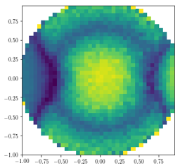

# 文書作成の技法
論文の文章には構造があり、一貫したデザイン法則がある。文書全体の体裁を統一する技術を知っておくと、書くのも楽になり、読みやすい書面を作ることもできるようになる。

## Google Docsを使う
ワープロといえばMS Wordと考えがちだが、論文執筆にはGoogle Docsのほうが便利である。おそらく、MS Wordが一般事務向けに開発されてきたのに対し、Google Docsは著述家に特化して開発が進められたのではないかと思われる。後者が優れていると思えるのは、以下の点である。
* 編集機能が少なく、余計なボタンに惑わされないシンプルなUI。
* 常時保存され、クラッシュで文章を失う心配がない。
* 編集履歴が残っていて、過去のバージョンにすぐ戻れる。
* 同時多人数で編集できる。誰かが編集すると通知される。
* 強力な文献管理(PaperPile add-on。後述)
* Word形式で出力可能。

自分一人で文章書くのだから、同時編集なんか要らない、と思うかもしれないが、論文の締切がせまってくると、いろんな人が校正にかかわってくる。同時編集できないWordで作業している場合、多人数が編集して分岐したバージョンを統一して最終稿にまとめる作業がどんどん増えてきて、校正もれが多発し、よけいな時間がかかるようになってしまう。Wordの不便さに気付いて後悔するころには、もうGoogle Docsにのりかえる時間は残っていないかもしれない。

以下の説明はGoogle Docs（英語版）向けに書く。Word向けの説明は青で区別する。</blue>

## 段落とインデントの制御
原稿用紙に文章を書く時には、段落の最初は1文字分空ける、と習うが、その目的は教わらないように思う。空白を入れるのは、段落の切れ目を見わけやすくし、読みやすくするためである。だが、それが唯一の方法ではない。例えば、新聞の「天声人語」のようなコラム記事では、段落分けに▼を使う。詰めて文章を書く場合に、段落をわかりやすくする工夫である。

ワープロで作文する場合は、段落を明示する方法がいくつかある。ひとつは、ページ上部の、ページ幅を表しているルーラ(定規)にある▭ (Wordでは▽)をスライドする方法である（スペースを入れてもよい）。もう一つは、段落前だけ改行幅を広くする方法である。これらを併用しても良い。

## スタイルの利用
題名や見出しを太字にするのに、上部メニューのBボタンやフォントの変更を使っていないだろうか?文章の部品を作る場合は、スタイルを使うべきだ。スタイルというのは、それぞれの部品ごとに、統一された体裁をあてはめる機能のことである。スタイルを使うことで、決まった書式を設定するのが簡単になり、あとで文書全体の体裁を変更する場合も、一瞬でできるようになる。また、スタイルを設定することで、ワープロにそれぞれの部品の意味を知らせることができる。例えば、ワープロにはこの情報を利用して目次を自動的に作ってくれる機能がある。

標準のスタイルは「Normal Text」となっている。これが本文のスタイルである。特に設定しなくても、文章を打ちはじめると、その部分はNormal Textになる。MS Wordの場合、「標準」スタイルが本文用のスタイルである[^1]。見出しにしたい場合は、上のStyle menuからHeading 1〜5を選ぶ。Wordの場合は見出し1〜5である。Wordには膨大なスタイルが登録されているので、目移りしないように、最低限必要なスタイルだけを使うようにするべきである。さもないと、スタイルを使っていても文章の体裁を統一できなくなってしまう。

デフォルトで設定された書式が気にいらない場合も多いだろう。フォントはゴシック体がいい、11ポイントにしたい、インデントは深めがいい、など、いろいろと変更したい場合は、その場でどんどん変更してよい。そして、最後に、書式を変えた部分を選択してからスタイルメニューの▼を押し、現在のスタイル(例えばNormal Text)の▶︎を押して、Update ‘Normal Text’ to matchを押すと、選択した部分の書式がNormal Textに反映され、文書内のすべてのNormal Textの体裁が統一される。Wordでは、書式を変えた部分を選択してからスタイルウィンドウを開き、「標準」スタイルの▼を押して、「選択箇所と一致するように更新する」と、変更した書式が「標準」に反映され、文書内のすべての「標準」の体裁が統一される。

Figure Captionのスタイルなどを作っておくと便利である。残念ながら、Google Docsには独自のスタイルを作る機能はまだない。

[^1]: 英語環境だとNormalが標準スタイル。英語環境で日本語の文書を編集すると、両方のスタイルが混在する。

## ヘッダーとフッター
ページの上と下の余白をそれぞれヘッダー、フッターと言う。余白部分をクリックすれば、これらの部分を編集できるようになる。論文の場合はヘッダーに何かを書く必要はないが、日付やバージョンなどを書くと便利なこともある。フッターにはページ番号を入れるべきである。論文の場合は、ページ番号を中央に入れる。ページ番号は上部メニューのInsertからいれることができる。Wordの場合は、フッター編集モードになると上部メニューにページ番号等の項目が現れる。

## 行間と文字のサイズ
論文の場合、行間はあまり詰めないで書く。英語の場合、ほとんどの雑誌でdouble spaceにしなさいという指定がある[^16]。日本語の場合も、1.5にしておけば、大抵は問題ない(もう少し狭い間隔でも構わない)。

[^16]:直訳すると2行分に1行ということになるが、上部メニューで行間(Line spacing)を2にすると明らかに間隔が広くなりすぎてしまう。実際には「タイプライターでdouble spaceに設定した時の間隔」を指すらしく、これはline spacing = 1.5かそれより少し狭い間隔になる。1.5にしておけば問題ない。
[^17]:紙の上で校正する場合は行間を広めにとってあると書きこみやすくて良いが、パソコン上で校正する場合は、行間は読みやすさで判断すれば良い。

文字のサイズは、10から12ポイントが標準的である。本文だけでなく、図中の文字の大きさにも気をくばる必要がある。あまり小さな文字は潰れてよく見えない。下付きや上付きの文字もはっきり見えるようにする。
## 特殊な文字の入力
物理化学の論文を書くには、いろいろな特殊な文字が必要になるだろう。たとえばH2Oの2のような下付き文字、exのxのような上付き文字を書く必要がある。Google Docsでは、これらを「⌘+カンマ」、「⌘+ピリオド」で入力できる。[^18]

ほかにも、βやδといったギリシャ文字が必要になるだろう。これには、InsertからSpecial Charactersを選び、さらにOther European scriptsのGreekを選択すればよい。また、ÅはLatin、Commonにある(MacではOption-Shift-Aで入力できる。Wordの場合は上部メニューの挿入から記号と特殊文字を選べば入力できる)。

より本格的な数式については後述する。

[^18]:このようなショートカットについては https://support.google.com/docs/answer/179738?co=GENIE.Platform%3DDesktop&hl=ja&oco=0 等を参照にすること。

## 画像の配置
論文に画像を入れる場合には、ほとんどの場合文中に埋めこむことはなく、画像だけの行と、その下にキャプションという配置にする。(講演予稿などの場合には埋め込んだほうが良い)

> **Figure 12.1** 図の例。図はインライン中央寄せとし、キャプションは1行だけなら中寄せ、2行以上にわたる場合は左寄せ、最初の行のインデントなし、2行目からのインデントはルーラで▼で調整。画像の前と、キャプションのあとには空行を入れて本文から隔離する。(これは一例である。必ずしもこうしなければいけないわけではない)

Google Docsには、矢印や丸といった画像部品を置く機能が一切ない。こみいった図を作りたい場合は、別のソフトで作っておいて、完成した一枚の画像をDocsに貼れ、という意味である。Wordでは、文書上に部品を配置してこみいった図を作れるものの、あとで文章を編集した時にレイアウトが崩壊する温床となるばかりか、運が悪いとWord自体が不安定化してクラッシュしてしまう。画像作成にはPowerPointなどを使い、賢く分業するべきである。

画像を配置する場合は、"Inline" (行内、文字と一緒に移動)を選ぶ。こうすると、画像をマウスで移動できなくなるが、センタリングなどの位置決めが文章と同じようにできるので、体裁を整えやすくなる。

最終的な原稿をWord形式で出力する場合には、画像がつぶれていないか確認しなければならない。DocsにはPDFなどのベクター画像を貼れないので、ベクター画像を貼りつけたい場合にはWord側での作業が必要である。[^19]

[^19]: Wordは貼りつけた画像の画質を勝手に劣化させることがある。

## 引用文献の管理
PaperPile AddOnを使うと、Google Docs内から文献を検索し、引用し、参考文献リストを自動生成し、論文雑誌ごとの書式で引用番号を付けてくれる。

1. DocsのメニューのAdd-OnsでGet add-onsからPaperPile AddOnをさがしだしてインストールする。
2. Add-ons→PaperPile→Manage citationsを選ぶと、文書の右側に検索窓が表示される。
3. 論文を検索し、見付けたらCiteを押すとこのようなリンクが表示される。→(Matsui et al. 2017)
4. 赤いUpdate citations & bibliographyボタンを押すと、文末に参考文献リストが作成される。

ちなみに、和文では引用番号を句読点の前に入れることが多いようだ。英文では句読点のあとに入れるのが一般的である。

Wordの場合はEndNoteを使うと便利である。ただしこれは有料で、それなりの値段がする。pdfファイルの管理もできるので、買っても損はないが、文献の数が少ないうちはまだ必要ないだろう。

## 参考文献の例
Chicagoスタイルだと以下のようになる。物理化学の論文では、ACSやJ. Chem. Phys.のスタイルも良いだろう。

Matsui, Takahiro, Masanori Hirata, Takuma Yagasaki, Masakazu Matsumoto, and Hideki Tanaka. 2017. “Communication: Hypothetical Ultralow-Density Ice Polymorphs.” The Journal of Chemical Physics 147 (9): 091101.

## 文章の共有
Google Docsを使う上での最大の利点の一つは、多人数で同時に編集できることである。他の人が自分の文章を編集できるようにするには、右上にあるShareをクリックし、そこで相手のメールアドレスを入力する。相手方は、招待メールを通じてその文章にアクセスできるようになる。

多人数で編集する場合は、誰がどこを直したか分かるようにしたほうが都合がよいだろう。編集する場合に、Suggestingモードにしておけばこれが可能になる。右上にあるペンのマークをクリックすることでモードを選択できる。自分一人で編集する場合や、最終的に編集履歴を消去する場合は、Editingモードにする。