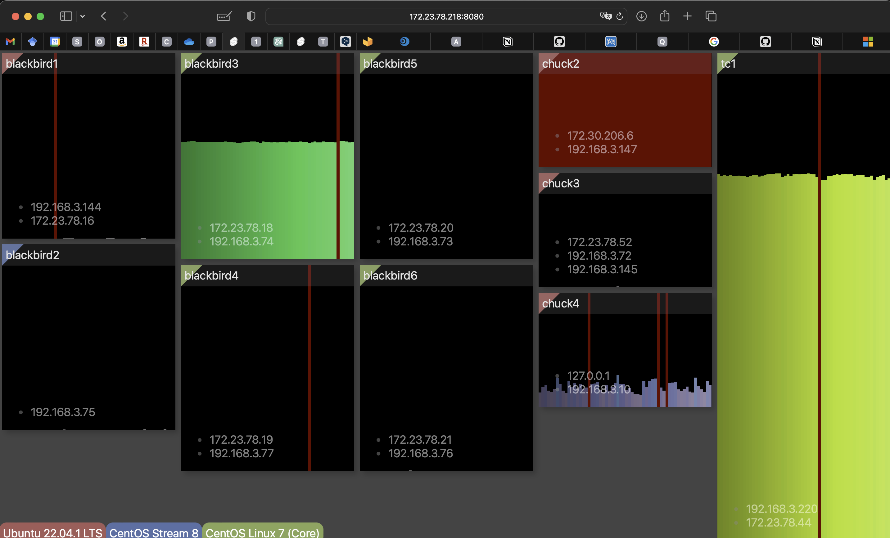
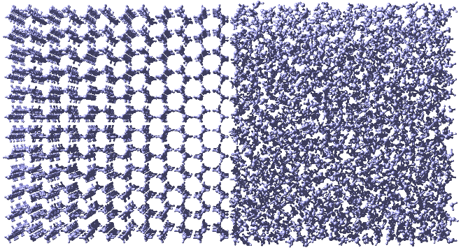

<div class="center">

<h3>学生用資料</h3>

<h2>分子シミュレーション研究の手引き</h2>

2026 年 1 月 28 日

矢ケ崎琢磨

松本正和

</div>

## バージョン情報(大きな変更のみ)

- Jan, 28, 2026. コードの分離。Jupyterの自動生成。
- Dec. 1, 2023. MarkDown に書換え。VSCode 上で閲覧する前提。
- Aug. 2, 2022. 現行のシステムにあわせた変更、および Python 化。
- Apr. 25, 2019. p. 31 に Load meter についての記述を追加。
- Apr. 3, 2019. 「MD 計算の進め方と条件設定」を 10 章として追加。
- Feb. 13, 2019. 「文章作成の技法」を統合して 12 章にする。これに合わせて章の順番を変更。ついでに 11 章のプレゼン発表について記述を増やす。
- Aug. 29, 2018. 拡散係数などダイナミクスについての説明を追加。
- Aug. 9, 2018. 重点課題 5 若手勉強会で NetworkX について話すことになったので、その内容をこの資料に入れることにした。4 年生には難しいが、院の人たちの役には立つかもしれない。
- Mar. 27, 2018. おおよそ完成。公開。

# 00-1 この文章の目的

1. 主に四年生を対象とする。Python の入門書とこの資料を勉強するだけで、卒論研究の遂行に必要な基本的な能力を身に着けられるようにする。
   - 計算機の扱いについて説明する。
   - 分子シミュレーションについての簡単な説明を行う。
   - GROMACS による氷と水の MD のチュートリアルを行う。
   - プログラミングの本の例文は、そのまま実際の解析に使えるわけではない。ファイル入出力や、パイプ、リダイレクトなど、プログラミングの本にはあまり書いていないこともある。また、例年、分布関数のプログラミングに戸惑う学生が多い。これらについて解説する。
   - 実用的な技術を詰め込んだ python スクリプトを例として挙げ、簡単な解説を行う。
   - 図のプロット、画像ファイルの作り方、スライドの作り方、論文の探し方など、卒論作成に必要な雑多の事柄についても説明する。
2. 専門書や原著論文を読む前の準備段階という位置づけで文を書く。可能な限り具体的な内容、目的、手順について記述し、抽象的な議論は専門書に譲る。
   - 研究が進んでから必要となる発展的な内容にも触れるが、それらについては初学者に必要な基礎的な部分と明確に区別して示す。
3. 一般的な内容ではなく、この研究室の現在の環境に合わせた内容とする。

## 読者のみなさんにおねがい

もし、内容がおかしいところを見付けたら、修正するか、

> この情報古い。

こんな感じでマークを入れておいて下さい。

- MacBook から CentOS にログインして研究を進める。
- pymol を使う。
- GROMACS で MD を行う。計算準備、ジョブ実行、データ処理には、python スクリプトを使う。

# 00-2 注意事項

- 最初から順番に進めていけば、研究に必要な基礎知識が得られるようになっている。ただし、タイトルの最後に\*がついている項目は、最初の段階では飛ばしても構わない。それらはいくらか発展的な内容になっている。学習と研究がある程度進んでから読めばよい。
- 学習順序は、
  1.  本稿の 01 章
  2.  Python チュートリアル([学部用](https://github.com/vitroid/PythonTutorials/tree/master/1%20For%20beginners), [院生用](https://github.com/vitroid/PythonTutorials/tree/master/2%20Advanced))
  3.  本稿の 02 章以降
  を想定している。卒業論文のための実際の研究は、本稿の学習を終了してからということになる。遅くとも、9 月には具体的な研究を始めることになる。研究テーマは春ごろに学生本人と教員で相談して決める。また、本稿では扱っていない、熱力学、統計力学、解析力学、物理数学などの勉強も進めてもらいたい。教員に相談してくれれば、適切な教科書を紹介、貸与する。
- 最後の 3 章は、シミュレーションについてではなく、文献の入手法やプレゼン、文章の書き方について解説している。これらは他の章とは独立した内容である。研究室セミナーや卒論作成の前に読んでおくこと。
- 章が変わるごとに、図番号、式番号、課題番号が 1 に戻る。
- ターミナルでの操作は、以下のように青い四角で囲んだ黒字で示す。

  ```shell
  python3 ./test.py
  ```

  手許の Mac/PC 上で実行するコマンドについては，オレンジの囲みで表す．

  ```pc
  pymol 1h.gro
  ```

- 四角に囲まれた青い文字は、プログラムコードやデータなどのファイルに書かれた文字を示す。

  ```perl
  print "Hello world \n";  # 画面に文字を出力
  ```

- <u>タイトルの最後に \* が付いている</u>部分では、発展的、応用的な内容が説明されている。最初は飛ばしても構わないが、慣れてきたら目を通すこと。

# シミュレーションを行う前に: 計算機の使い方

計算機シミュレーションの現場では、Windows ではなく、UNIX (Linux)系統の OS が使われることが多い。我々のグループでは、各個人が手元の Mac の端末から別の部屋にある Linux の計算機に遠隔ログインして作業する。どちらも UNIX 系の OS である。この章は、全くの初学者がこれら UNIX 系の OS である程度の作業をできるようになることを目指して解説を行う。よほどのことが無い限り操作ミスで計算機が壊れるということはないので、遠慮せずに、自分でいろいろと試して学習すること。

## ネットワーク設定

### 大学の Wifi

`00ouwifi`に接続時に、Wifi 接続用の、ユーザー名とパスワードを聞いてくるので、パスワードは個人のものを入力し、ユーザー名(p から始まる 8 文字の英数字?)のうしろに`@2778`を付けると、研究室 VLAN(識別番号 2778)に入る(はず)

ユーザー名を聞いていない場合は、Wifi の設定から 00ouwifi を一旦削除して接続しなおす。

IP アドレスは`172.23.78.xxx`となる。

> いろいろやってみた。

|              | iPad          | MacBook       | VLAN       |
| ------------ | ------------- | ------------- | ---------- |
| \*vitroid    | 172.23.78.217 | 172.23.78.201 | chem3(lab) |
| vitroid@2773 | 172.23.73.247 | 172.23.73.236 | RIIS       |
| vitroid@2778 | 172.23.78.217 |               | chem3(lab) |
| vitroid@1363 |               | 10.1.110.246  | 生活系     |

> \*松本の端末はデフォルトネットワークを VLAN2778 としているため。

### VPN 接続の方法

学外から接続する場合は、研究室設置の VPN(仮想プライベートネットワーク)が利用できる。Mac/Windows の VPN 機能にしかるべき設定をし、接続する。

IP アドレスは`192.168.3.xxx`となる。

### サーバ室 414 の Wifi

サーバ室 414 の近くであれば、サーバ室の Wifi が利用できる。

- 414-ac
- A129 Network

IP アドレスは`192.168.3.xxx`となる。

### 学生部屋の Wifi

- 423

IP アドレスは`172.23.78.xxx`となる。

## Mac の使い方

Mac の画面は Figure 1.1 のようになっているはずである。画面の下側に並んでいるアイコンがそれぞれ一つのアプリケーションに対応している。通常は、クリックすることでそのアプリケーションが起動される。特殊な起動をする場合や、アプリケーションを終了するときなどは、control キーを押しながらアイコンをクリックし、現れたメニューから該当の項目を選んでクリックする。「control + クリック」(トラックパッドでは二本指でクリック)は Windows における右クリックに対応している。Mac でも 2 ボタンマウスを使えば、右クリックが「control + クリック」として機能する。[^1]


> **Figure 1.1** Mac OS X のデスクトップ画面の例。アプリケーションの並び順は人によって違う。ターミナルが無い人は、初期設定の問題なので、教員か先輩に尋ねること。

Windows では、それぞれの窓の上部にメニューが表示される。一方 Mac の場合、それぞれの窓の上部には、窓の拡大、格納、消去を行うボタンがついているだけである。その代わりに、画面の一番上のバーにその時アクティブになっている窓のメニューが表示される（Figure 1 の左上のピンクの楕円）。アプリケーションを一つも起動していない場合、もしくはデスクトップの背景をクリックしてアクティブな窓が無い状態にすると、Finder というアプリケーションのメニューが表示される。これはファイルやフォルダを管理する常駐アプリケーションである。

Windows との大きな違いの一つは、窓を消してもアプリケーションが終了しないということである。アプリケーションを終了させるには、その窓をアクティブにして上部のメニューから終了を選ぶか、画面下のアイコンを「control + クリック」してから終了を選ぶ必要がある。マシンの挙動が重くなった場合は、このようにして不要なアプリケーションを終了させると直ることが多い。

デスクトップにはファイルやフォルダを置くことができる。これは Windows と同じである。ゴミ箱は画面下のアプリケーションバーの右端にある (Figure 1 の右下の緑の円)。Mac 自体の電源を落とす時は、画面上の左端にあるリンゴマークをクリックして、「システム終了」を選べばよい。基本的に、電源は落とさなくて良い。帰宅時には蓋を閉じてスリープにする。スリープさせたくない場合は、Commad-Control-Q で画面をロックしておく。

## VScode のインストール

2022 年現在、Microsoft が提供している VS code というプログラム開発ソフトウェアが無料で利用できる。https://code.visualstudio.com/download 非常に使いやすいので、これを利用してプログラムを書き、実行することを強く推奨する。

(2025) Cursor は VSCode を拡張して AI Agent 機能を追加したエディタで、大量のコードを書く人ならおすすめ。無料プランでお試しはできるが、月謝 3000 円ぐらい。

以下の VSCode 拡張機能を追加する．(VSCode 画面左端にならぶアイコンの中の，田のような品のようなアイコンを押す)

- Python
- Remote Development
- Remote - SSH
- gromacs helper
- Git Lens

ほかにも便利な拡張機能は多数あるが、闇雲にインストールすると VSCode が不安定化したり、拡張機能同士が干渉する可能性があるので、ネットで調べてエキスパートがお勧めするものをインストールするように。(よく似た別物がたくさんあります)

## ターミナルの使い方

<!-- > VSCode内のターミナルだけで十分では？ -->

コンピュータを操作する最も基本的な方法は、ターミナルでコマンドを入力する方法である (Figure 1 の赤い円)。これを起動すると一枚の窓が現れる(起動後は、ターミナルのアイコンを「control + クリック」して「新規ウィンドウ」を選ぶことで、複数の窓を出すこともできる)。キーボードからこの窓へコマンドを打ち込むことで、計算機に様々な作業をさせることができる。例えば、pwd とキーボードで打って Enter を押してみよう。[^2]

```pc
pwd
```

なにか一行の文字列が表示されたはずである。pwd は、「自分がいるディレクトリ（フォルダともいう）の名前を（最上層から省略せずに）表示する」という意味のコマンドである。ターミナルを開いた時に自分がいるディレクトリのことをホームディレクトリという。pwd によって表示されたのは、このホームディレクトリの名前である。次に

```pc
mkdir test1
```

と打ってみよう。これは「test1 という名前のディレクトリを作成する」という意味である。r と t の間にスペースがあることに注意しよう。ターミナルで文字を打ち込む場合、スペースの有無は重要である。ここで、r と t の間にスペースがないと、正しく動作しない。スペースは有るか無いかだけが問題であり、スペースが 1 以上なら、その数がいくつでも動作は変わらない。最後に

```pc
ls
```

と入力してみよう。これは「そのディレクトリにあるすべてのファイルとディレクトリを表示する」コマンドであり、実際に test1 というディレクトリが出来ていることが分かる。また、「Desktop」や「Downloads」などがホームディレクトリの一層下のディレクトリとして最初から存在していることも分かるだろう。

ここで紹介したコマンドは，Mac でも Linux でも共通である．なお，VSCode にはターミナルが内蔵されている．プログラムの開発をしながらそれを走らせてみたり，リモートの Linux と手許の Mac の間でファイルを交換したりするのに便利なので，本格的に作業を行う場合にはそちらを使うことになる．

## 研究室の計算機とそれらへの接続

手元の MacBook だけでは、研究を行うには不十分である。我々のグループは、数十台の高性能計算機を所有している（サーバ室 414 は、これらを置く専用の部屋）。Table 1.1 にこれを列挙する。プログラミングの練習や、その後の研究は、Mac Book からこれらの計算機に遠隔ログインして行う。

遠隔ログインする前に，Mac の`~/.ssh/Config`の先頭に次の行を加える．

```data
ForwardX11Timeout 2000000s
```

次に、VScode で計算サーバに接続する場合には、ウィンドウの左下の青の「<sub>></sub><sup><</sup>」ボタンを押す。すると、ウィンドウの上のほうに「Connect to host」などの選択肢が表示されるので、一番上の「Connect to host」を選ぶ。次に「+ Add New SSH Host」を押すと入力を求められるので、以下のように入力する。

```pc
ssh user@172.23.78.44
```

`user`となっている部分は自分のユーザー名と置き換える。[^3] `172.23.78.44`は計算機`tc1`の IP アドレスである。初回ログイン時のみ，OS の種類を聞いてくる．接続先は Linux なので “Linux”を選ぶ．次回以降はリストから選ぶだけでログインできる．ログインしたら、メニューの「Terminal」を押し、「New Terminal」を押して新しい Terminal を開く。(VScode のターミナルはウィンドウの下のほうに表示される。)ターミナルで「uname」というコマンドを入力してみよ。

```shell
uname
```

正しくログインできていれば、「Linux」と表示されるはずである。Table 1.1 に挙げた計算機のどれを使用しても構わないが、最初の内は`tc1`だけで十分だろう。

> **Table 1.1** 我々のグループが所有する計算機 (2025 年 9 月)。chuck[34]というのは、chuck3 と chuck4 という名前の計算機があるという意味。他の計算機についても同様。故障などにより抜けていることもある。詳しい情報は LoadMeters http://172.23.78.52:8080 または http://192.168.3.72:8080 で調べる。

| hostname        | CPU                  | Number of Cores | Performance of each Core |
| --------------- | -------------------- | --------------- | ------------------------ |
| chuck[34]       | Intel Xeon E5-2667   | 16              | High                     |
| blackbird[12]   | Intel Xeon E5-2697A  | 32              | Medium                   |
| blackbird[3456] | Intel Xeon Gold 6152 | 44              | Medium                   |
| tc              | Intel Xeon ??        | 96              | Medium                   |
| pm              | AMD EPYC 9754        | 128             | Medium                   |
| ac              | AMD Ryzen AI MAX+    | 16?             | High                     |

## ファイルの編集

以下の作業は、Table 1.1 の計算機のいずれかに遠隔ログインしていると想定して進める。何かうまくいかなかった場合は、`hostname`コマンドを使って遠隔ログインした状態になっているかどうかを確認すること。

プログラムコードなどのように、文字だけからなるファイルをテキストファイルという。VScode のファイルメニューから、「New Text File」を押して新しいテキストファイルが作れる。保存する際に、ファイル名の末尾には適切な拡張子を付けるようにする。(Python プログラムなら`.py`、ただのテキストファイルなら`.txt`、MarkDown 形式のファイルなら`.md`など)[^4] 保存先は、ssh で接続しているリモートのサーバであることに注意。

### 練習

ファイルを新たに作る。名前は`test.py`、中身は以下の通り。

```python
#!/usr/bin/env python3

print("Hello World!")
```

## ディレクトリやファイル操作

ssh でログインした時に、自分が最初に居るディレクトリのことをホームディレクトリという（Mac のホームディレクトリとログインした先のホームディレクトリは異なることに注意）。ホームディレクトリでファイルを作りすぎると見づらくなるので、適宜、新しくディレクトリを作って、そこで作業をしたほうが良い。`practice`というディレクトリを作ろう。

```shell
mkdir practice
```

このディレクトリに移動するには`cd`というコマンドを使う。

```shell
cd practice
```

<strike>「practice」から見て一つ上のディレクトリに、先ほど作った test.py というファイルがあるはずである。これを、今いるディレクトリに移動させてみよう。ファイルの移動には mv というコマンドを使う。</strike>

```shell
mv ../test.py  .
```

ここで、`../`と`.`という記号が新しく出てきた。前者が「一つ上のディレクトリ」という意味である。`../`と`test.py`をつなげて書くことで、「一つ上のディレクトリにある test.py」という意味になる。`.`は、「今いるディレクトリ」という意味である(カレントディレクトリという)。移動させてきたファイルを VSCode で開いて、先ほど保存した内容と同じであることを確認せよ。

`mv`コマンドは、ファイルを移動させるだけでなく、ファイルの名前を変える時にも使う。

```shell
mv test.py new-test.py
```

これで、ファイル名が`test.py`から`new-test.py`に変更される。
もとのファイルを残し、同じ内容の別のファイルを作るには`cp`コマンドを使う。

```shell
cp new-test.py  backup_test.py
```

<strike>ファイルを編集するには gedit を使わなければならないが、</strike>そのファイルを見るだけで良いということもよくある。その場合は、`less`コマンドを使う。

```shell
less backup_test.py
```

ターミナル内にファイルの内容が表示される。窓が現れないので、起動が速い。わずかな差だと思うかもしれないが、仕事に慣れてくるとその差が気になるようになってくるので、`less`を使う機会が多くなるだろう。`less`コマンドを終了するには、キーボードで`q`を押せばよい。
不要なファイルを消す時は`rm`コマンドを使う。

```shell
$ rm backup_test.py
```

**rm コマンドで消去されたファイルを復元することはできない。** Windows のようにゴミ箱に一時的に置かれるということはなく、システムから完全に消去されるので、<u>気を付けて使用すること。</u>[^5]他にも様々なコマンドがあるが、そのすべてを列挙することはできない。google で「linux コマンド 逆引き」といった検索キーワードを使えば、目的の操作のコマンドを探すことができるだろう。LINUX の入門書や初心者向けの web ページを見てもよい。

> 以下大幅編集が必要

## プログラムの実行

次はいよいよ、プログラムを書いて動かしてみよう。VSCode で new-test.py を開く。最初に書いた落書きが残っているはずなので、それをすべて消す。それから、以下のように書き込んで保存してみよう

```python
i=4
j=3
print(i+j)
```

これは、「変数 i に 4、変数 j に 3 を代入し、その和 k を求め、それを画面に書き出す」プログラムである。

プログラムを実行するには VSCode 内のターミナルで以下のようにする。

```shell
python3 new-test.py
```

ファイル名の最後にピリオドを付けて示される部分を拡張子という。`new-test.py`でいえば`.py`がそれである。拡張子はそのファイルの種類を示すものである。`.py`は python のスクリプトという意味である (スクリプトとは、コンパイルせずに実行できるプログラムのことである。Fortran や C などのコンパイル言語と比べ、実行速度は遅いがプログラムを書きやすいという特徴がある。後の章で、いくつかの python スクリプトを使用する)。拡張子が誤っていると、計算機上でうまく処理が行われないことがあるので、注意すること。[^ext]
　これで、プログラミングを練習する環境は整った。

[^ext]: Unix シェルは拡張子でファイル種類を判断しないが、MacOS の Finder や MSDOS 系 OS は拡張子で判断する。

## ジョブの強制終了

プログラムを間違えると、すぐに終わるはずのジョブがなかなか終わらないことがある。また、研究が始まってからも、計算条件を間違っていた等の理由でやり直したいということが起こるだろう。このような場合にはジョブを強制終了させなければならない。　　
それには、そのターミナルをアクティブにした状態でキーボードの Control を押しながら c を押せばよい(このキー操作は`^C`と表示されることが多い)。ほとんどの場合はジョブが終わり、そのターミナルで再びコマンドを打てる状態になるはずである。

## データの保存場所

Table 1.1 に示したように、計算機室には多量の計算機があるが、そのどれからも同じ記憶メディア（ハードディスク)にアクセスできるように設定されている(この仕組みを NFS という)。どの計算機にログインしても、ホームディレクトリの場所は変わらない。そのため、Table 1.1 の計算機の間でファイルを移動させる必要はない。ただし、システムは計算機ごとに異なるため、同じように動作するとは限らない。(例えば、OS のバージョンが違い、そのために Python 等のバージョンが違ったり、intel compiler がインストールされてなかったり、いろいろ違いはある)

## 計算機室のファイルシステム\*

研究室には、ホームディレクトリのある記憶メディア以外にも、複数の記憶メディアがある。Table 1.2 にそれらをまとめる。それぞれのファイルシステムには、`cd`コマンドで移動できる。例えば`/r4`に移動するには、以下のようにする。

```shell
cd  /r4
```

そこで`ls`を打てば、何人かのユーザーのアカウント名のついたディレクトリがあることが分かるだろう。今まで使ったことのないファイルシステムを使うには、最初に管理者権限で使用者のディレクトリを作らなければならない。必要になったら、教員に申請すること。

> **Table 1.2** 松本グループの大規模記憶メディア(2023 年 11 月)。

| Filesystem | Hostname | Size / TB | Used | Memo                     |
| ---------- | -------- | --------- | ---- | ------------------------ |
| r1s        | jukebox1 | 5.3       | 91 % | ホーム                   |
| u          |          |           |      | r1s の別名(移転したはず) |
| r2         | jukebox0 | 58        | 95 % | データ置き場             |
| r3         | jukebox1 | 58        | 33 % | データ置き場             |
| r4         | jukebox2 | 58        | 97 % | データ置き場             |
| r5         | jukebox4 | 52        | 90 % | データ置き場             |
| r1l        |          |           |      | r5 の別名                |
| r6         | jukebox5 | ??        | ?? % | データ置き場、ホーム     |

> 用途の違いを書く

## 計算機室と Mac book の間のデータ移動

手元の MacBook のホームディレクトリ(のあるディスク)と、Table 1.1 の計算機におけるホームディレクトリ(のあるディスク)は異なっている。そのため、これらの間では何らかの方法でファイルを移動させる必要がある。基本的には `rsync`コマンドを使えば良いだろう。`rsync`コマンドは、MacBook のターミナルから実行する(Table 1.1 の計算機にログインしていない状態で実行するという意味)。tc1 (172.23.78.44)からファイルを移動する場合は以下のようにする。

```pc
rsync  -av  user@172.23.78.44:~/practice/new-test.f90   .
```

ここで、`~/`はホームディレクトリという意味である。最後のピリオドを忘れないように。また、user の部分は自分のユーザー名にすること。逆に、例えば MacBook から`test1.py`というファイルを tc1 の`~/practice/`というディレクトリに送るには、以下のようにする。

```pc
rsync  -av  test1.py  user@172.23.78.44:~/practice/
```

`rsync`コマンドは，転送元と転送先に同じ名前のファイルがあった場合には，**転送元のファイルの内容が更新されている場合にのみ転送先を上書きする**(上書きを回避する，あるいはバックアップを残す設定も可能)．大量のファイルが入ったディレクトリごとコピーする場合には非常に安全で高速である．一方，1，2 個のプログラムなどを転送する場合には、Finder と VSCode 間でファイルをドラッグドロップするという方法も便利である．

[^1]: Mac のトラックパッドでは、マウスでは不可能なさまざまなジェスチャーが利用できる。
[^2]: 本稿では、ターミナルに打ち込む文字を、四角で囲われた黒い文字で表す。また、四角の中の各行の最後で Enter(Return)を打ち込むこということにする。行頭のプロンプト文字は人によって異なる。例えば松本の場合、`blackbird3.local:Run_MD matto$ `のようになっているが、本稿では単純に`$`で表す。プロンプト文字は入力する必要はない。
[^3]: 正しく設定されていれば、サーバログイン時にはパスワードを入力する必要がない。
[^4]: Unix ではファイルの拡張子には特別な意味はないので、自由に拡張子を付けてもかまわないし、拡張子がなくても問題はないが、一般によく使われる拡張子を付けておくと、 VScode がファイル形式を認識して便宜を計ってくれる。
[^5]: `rm` コマンドは危険で、`-f`や`-r`オプションが付くとさらに危険性が増す。例えば、`rm -rf /mydir`とするつもりで、うかつに`rm -rf / mydir`とタイプしてしまうだけで、すべてを失う。`rm`を気軽に使う癖をつけず、作業しているディレクトリに`trash/`ディレクトリを作り、消す代りにそこに投げこむといった方法をお薦めする。

# 分子シミュレーション

我々の研究室では、分子シミュレーションにより水、氷、包接水和物、水溶液などを研究している。分子シミュレーションとは、分子動力学法、構造最適化、基準振動解析、モンテカルロ法などの総称である。この章では、これらのシミュレーション技法の基礎を解説する。

## 原子間相互作用

分子シミュレーションでは、粒子間の相互作用エネルギーが計算される。化学で扱われる粒子の最小単位は核と電子である。これらの間の相互作用（核-核、核-電子、電子-電子相互作用）を計算するには、電子を波動関数として扱う必要がある。このような量子力学的な計算には、高い計算コストが要求される。そのため、現在の計算機では、粒子数の少ないシミュレーションか、短時間のシミュレーションしかできない。
一つの原子は、核と幾つかの電子からなる。原子を最小単位とし、量子力学的な扱いをしない分子シミュレーションを、古典分子シミュレーションと呼ぶ。古典シミュレーションの計算コストは低く、研究室にある計算機でも 10 万原子程度までは扱うことができる（スパコンを使えばさらに大きな系を扱うことができる）。
二つの粒子の間の相互作用を二体相互作用という。古典シミュレーションでは、原子間の二体相互作用を、点電荷同士のクーロン相互作用、Lennard-Jones (LJ) 相互作用、調和振動子で記述することが多い。クーロン相互作用は次式で表される。
$$V\left(r_{ij}\right)={1\over 4\pi\epsilon_0}{q_iq_j\over r_{ij}}\tag{2.1}$$
ここで、$q_i$と$q_j$は原子$i$と$j$の上の点電荷、$r_{ij}$は原子$i$と$j$の間の距離、$\epsilon_0$は真空の誘電率を表す。LJ 相互作用は次式で表される。
$$V\left(r_{ij}\right)=4\epsilon_{ij}\left\{\left(\sigma_{ij}\over r_{ij}\right)^{12}-\left(\sigma_{ij}\over r_{ij}\right)^6\right\}\tag{2.2}$$
$\epsilon_{ij}$と$\sigma_{ij}$は LJ エネルギーパラメータ、LJ サイズパラメータと呼ばれる。調和振動子のポテンシャル関数は次式となる。
$$V\left(r_{ij}\right)={k_{ij}\over 2}\left(r_{ij}-r_e\right)^2\tag{2.3}$$
調和振動子は、水の O-H 伸縮振動など、分子内振動を表すために用いられる。$r_e$はその振動の平衡位置、$k_{ij}$はばね定数である。三つの式に現れるパラメータ$q$、$\epsilon$、$\sigma$、$r_e$、$k$は、密度、比熱、融点、沸点、臨界点、原子間距離、拡散係数、赤外振動スペクトル、ラマン振動スペクトルなど、様々な実験データを再現するように決められる。しかしながら、量子効果を無視しているために、すべての実験データを同時に再現する古典パラメータというものは存在しない。そのため、一つの分子に対しパラメータセットを一意に決定することができない。水の場合は、数十のパラメータセットが提案されている。

真空中に孤立した水の HOH 角は 104.5 度であり、その角度から離れるとポテンシャルエネルギーが増加する。多くの場合、分子内の角度についてのポテンシャルは調和振動子で扱われる。

エタンの C-C 結合周りの回転を記述するには、H-C-C-H の二面角が適当である。エタンの場合は、二面角が 0、120、240 度の場合より 60、180、300 度の場合のほうが安定である。このような軸回りのポテンシャルエネルギーの変化は、三角関数で記述されることが多い。

水のように単純な分子の場合は、分子内の原子間距離や角度が完全に固定されていて動かないという近似をとることが多い。この近似は、分子内振動の振幅が非常に小さいという事実に基づく。これを剛体近似という。剛体近似のシミュレーションでは、分子間に働くクーロン相互作用と LJ 相互作用だけが計算される。我々のグループのシミュレーションのほとんどは、剛体近似である。長い炭化水素やタンパク質などの場合は、分子の構造変化が重要となる。このような場合には剛体近似は不適切であり、分子内伸縮や二面角などの分子内相互作用をあらわに考慮する必要がある。

## カットオフ距離

分子シミュレーションのプログラムを実行すると、二体相互作用の部分の計算に最も長い時間がかかる。粒子数が N ならば、すべての組み合わせについて二体相互作用を計算すると、$N(N-1)/2$回の計算が必要である。この計算回数を減らすために、相互作用のカットオフが行われる。
Na<sup>+</sup>イオンと Cl<sup>−</sup>イオンが一つずつ存在し、その間の距離が$r$だとしよう。この二つの粒子の間に LJ 相互作用をプロットすると Figure 2.1a のようになる。この相互作用は、近距離では大きな正の値をとり、距離が離れるほど減衰して、ある距離で極小となる。それから徐々に増加して 0 に漸近していく。Eq. 2.2 を使った LJ 相互作用の計算は、ある距離よりも近いときだけ行えばよく、それより遠い場合は 0 としてしまってよい。これがカットオフである。Figure 2.1a の場合は、1 nm くらいをカットオフ距離とすればいいだろう。なお、イオンに限らず、どのような粒子についても、LJ 相互作用は 1 nm 程度でほとんど 0 になる。


> **Figure 2.1** (a) Na+イオンと Cl− イオンの間に働く LJ 相互作用[^Joung2008]。 (b) Na+イオンと Cl− イオンの間に働く LJ 相互作用、クーロン相互作用とそれらの和。

[^Joung2008]: [I. S. Joung and T. E. Cheatham, J. Phys. Chem. B 112, 9020 (2008)]

イオン間に働くクーロン相互作用を Figure 2.1b の黒線で示す。異なる符号の電荷なので、距離が近づけば近づくほどポテンシャルエネルギーは低くなる。クーロン相互作用も、LJ 相互作用の場合と同様に、距離 r が大きくなれば 0 に漸近する。しかしながら、LJ 相互作用に比べると 0 に減衰するまでの距離が非常に長い。LJ 相互作用がほぼ 0 となる$r = 1$ nm でも、クーロン相互作用エネルギーは$−200$ kJ mol<sup>−1</sup>という大きな値となるため、カットオフを行うわけにはいかない。クーロン相互作用については、あるカットオフ距離までの相互作用の計算（実空間）と、それより遠くの粒子との相互作用の計算（逆格子）を別々に行い、それらを足し合わせる Ewald 法という技術が用いることで、相互作用の計算時間を削減する。その説明にはフーリエ変換の知識が必要であり、四年生には難しいので、ここでは割愛する。

クーロン相互作用は、イオン間だけでなく、中性分子間にも存在する。例えば水の場合、水素原子の上に$+\delta e$、酸素原子の上に$−2\delta e$の点電荷があるとして、分子間クーロン相互作用が計算される ($\delta$の値はモデルによるが、おおよそ 0.5 程度である)。中性分子間のクーロン相互作用は、イオン間のそれと比べると弱いが、水やメタノールのような極性分子の場合は、Ewald 法を用いるべきである。二酸化炭素やメタンのように極性が無い分子の場合は、クーロン相互作用がかなり弱くなるので、LJ 相互作用の場合と同様に 1 nm 程度でカットオフを行っても問題はない。

### 課題 1

式 1 と式 2 を使って、$r_{ij} = 0.4\textrm{ nm}$における Na+と Cl− の間の相互作用を計算せよ。LJ パラメータはそれぞれ$\epsilon_{ij} = 0.2809\textrm{ kJ mol}^{-1}$、$\sigma_{ij} = 0.3495\textrm{ nm}$である。

### 課題 2

$r_{ij} = 0.3\textrm{ nm}$から$20\textrm{ nm}$まで$0.01\textrm{ nm}$刻みでクーロン相互作用と LJ 相互作用を計算する Fortran プログラムを作成し、その結果を`gnuplot`で図にせよ。`gnuplot`は 7 章で解説されている。

## 水の古典的ポテンシャルモデル

我々のグループの主な研究対象は水である。前述のように、水については非常に多くのモデルが提案されている。ここではいくつかの代表的なモデルについて簡単に説明する。

水分子は一つの酸素原子と二つの水素原子からなる。これらの原子間の振動を調和振動子やモースポテンシャルで表すモデルを、flexible water モデルと総称する。FSPC モデルはその代表例である[^Toukan1985]。このモデルでは、酸素原子に$−0.82 e$の負電荷、水素原子に$+0.41 e$の正電荷が置かれる(Figure 2.2a)。電荷によるクーロン相互作用は異なる分子の間にのみ働く。酸素原子同士には LJ 相互作用が働くが、水素原子には働かない。O-H 伸縮はモースポテンシャル、H-O-H 変角は調和振動子で記述される。O-H 伸縮も調和振動子にするバージョンもある。

O-H 伸縮運動や H-O-H 変角運動のばね定数は非常に大きい。そのため、ばね定数が高い極限、すなわち O-H 長と H-O-H 角が全く変化しない剛体であると近似しても問題がないことが多い。このような剛体モデルの代表例が SPC/E モデルである[^Berendsen1987]。このモデルでも、LJ 相互作用は酸素原子同士にしか働かない (Figure 2.2b)。酸素原子に$−0.8476 e$の負電荷、水素原子に$+0.4238 e$の正電荷が置かれる。SPC/E モデルは、液体の水や超臨界水の物性をよく再現する。
点電荷は必ずしも原子の上に置かれなくても良い。水分子に質量をもたない第四の架空の原子を置き、そこに負電荷があるとするモデルがある (Figure 2.2c)。その一つが TIP4P/2005 モデルである[^Abascal2005]。TIP4P/2005 モデルは、液体の水だけでなく、氷の物性も比較的よく再現する。我々のグループで最もよく使われているモデルである。
水の酸素の不対電子を再現するために、架空の負電荷サイトを二つ置くモデルもある。TIP5P がその代表例である[^Mahoney2000]。点電荷サイトが増えた分、計算コストが高くなるので、特別な理由がない限りは使われない。

[^Toukan1985]: K. Toukan and A. Rahman, Physical Review B 31, 2643 (1985).
[^Berendsen1987]: H. J. C. Berendsen, J. R. Grigera, and T. P. Straatsma, J. Phys. Chem. 91, 6269 (1987).
[^Abascal2005]: J. L. F. Abascal and C. Vega, J. Chem. Phys. 123, 234505 (2005)
[^Mahoney2000]: M. W. Mahoney and W. L. Jorgensen, J. Chem. Phys. 112, 8910 (2000).


> **Figure 2.2** 代表的な水のポテンシャルモデル。

## 周期境界条件

液体や固体を総称して凝縮系と呼ぶ。実験では、アボガドロ数程度の粒子数で構成される凝縮系が測定対象となる。一方、シミュレーションではそのように大きな数を扱うことはできない。有限の粒子数で無限系を扱うために、周期境界条件が用いられる。まず、一つの直方体の箱（セル）があると考える（他の形もありうるが、そのような状態を考えることは稀である）。その箱の中にある数の分子が入っているとする。周期境界条件のシミュレーションでは、Figure 2.3 に示されるように、この箱が周期的に無限に並んでいるとする。この時に、箱の右端にいるある分子の相互作用について考えてみよう。この分子は、カットオフ距離$r_\textrm{cut}$以内にいるすべての分子と相互作用をする ($r_\textrm{cut}$はセルの最も短い辺の 1/2 より短くなければならない)。周期境界条件の下では、図に示すように、この分子は同じ箱の中にいる分子と相互作用するが、同時に隣の箱の中にいる粒子とも相互作用する。


> **Figure 2.3** 周期境界条の概念図。

周期境界条件では、セルが無限に並ぶため、粒子数も無限ということになるが、分子間相互作用を計算する上では、一つのセルの中の粒子だけを考慮すればよい。無限系になるとは言っても、一つのセルに含まれる粒子数があまりに少ないと、非現実的なシミュレーションとなってしまう。均一系の場合は、数百程度の分子数で十分である場合が多い。二つの相が共存する場合など、不均一な系の場合には、分子数をさらに増やす必要がある。また、結晶成長などの非平衡過程のシミュレーションを行う場合も、大きな系にする必要がある。分子数は、対象とする系、現象、利用できる計算機の数などから慎重に決定しなければならない。

## 分子動力学法

分子動力学法は、最も主要な分子シミュレーション手法の一つである。英語では Molecular Dynamics (MD)と呼ばれる。MD シミュレーションは、個々の粒子についてニュートン方程式を立て、それを数値的に解いていく方法である。

粒子 i についてのニュートン方程式は次式で表される。
$$m_i{d^2r_i\over dt^2}=F_i\tag{2.4}$$
ここで$m_i$と$r_i$はそれぞれ粒子 i の質量と座標ベクトル、$F_i$は他のすべての粒子が粒子 i に及ぼす力である。三次元空間の運動を記述するため、両辺がともにベクトルであることに注意せよ。粒子 j が粒子 i に与える力を$f_{ij}$とすると、$F_i$は以下で表される。
$$F_i=\sum_{j\ne i}f_{ij}\tag{2.5}$$
力は粒子間相互作用の座標微分で与えられる。
$$f_{ij}=-\nabla_i V_{ij}=-\left(\hat x{\partial\over\partial x_i}+\hat y{\partial\over\partial y_i}+\hat z{\partial\over\partial z_i}\right)V_{ij}\tag{2.6}$$
ここで$\hat x$、$\hat y$、$\hat z$はそれぞれ$x$、$y$、$z$方向の単位ベクトルである。
　ニュートン方程式を解く、とは、Eq. 2.4 を使って座標を時間の関数にするという意味である。粒子数が二つの場合は、時間の関数を厳密に式で表すことができる（これを解析的に解くという）。例えば、質量 m を持つ二つの粒子がどちらも x 軸の上に存在し、それらの間の相互作用が Eq. 2.3 で与えられる場合、粒子 i の座標は時間の関数として以下のように与えられる。

$$
x_i(t)=A\cos(\omega t+\theta)\\
y_i(t)=\textrm{const.}\\
z_i(t)=\textrm{const.}\tag{2.7}
$$

ここで、$\omega$は$\sqrt{k/m}$で与えられる振動数であり、振幅$A$と位相$\theta$は初期条件（速度と座標）で決まる定数である。
粒子数が 3 以上の場合は、ニュートン方程式を解析的に解くことが原理的にできない。そのため、計算機により近似的に解くという手法が用いられる。様々な方法があるが、ここでは最も単純なベルレ(Verlet)法について説明する。$\Delta t$が十分小さいとし、時刻$\Delta t$における粒子$i$の座標ベクトル$r_i(\Delta t)$をマクローリン展開すると
$$r_i(\Delta t)=r_i(0)+\Delta t{dr_i(0)\over dt}+{\Delta t^2\over 2!}{d^2r_i(0)\over dt^2}+\cdots\tag{2.8}$$
が得られる。同様に$r_i(-\Delta t)$をマクローリン展開すると
$$r_i(-\Delta t)=r_i(0)-\Delta t{dr_i(0)\over dt}+{\Delta t^2\over 2!}{d^2r_i(0)\over dt^2}+\cdots\tag{2.9}$$
となる。Eq. 8 と 9 を足し合わせると、
$$r_i(\Delta t)+r_i(-\Delta t)=2r_i(0)+\Delta t^2{d^2r_i(0)\over dt^2}+\cdots\tag{2.10}$$
となる。高次の項を無視して Eq. 4 を使うと
$$r_i(\Delta t)=2r_i(0)-r_i(-\Delta t)+\Delta t^2{F_i(0)\over m_i}+\cdots\tag{2.11}$$
Eq. 2.11 の左辺を求めるためには、右辺のすべての項が分かっていなければならない。質量は原子によって決まっている定数である。パラメータ$\Delta t$は、通常の分子シミュレーションでは 1 fs ($1 \times 10^{-15}$秒) 程度にしておけば良い。時刻 0 における座標は、初期条件として与えておく。時刻 0 における速度も初期条件として与える。初期速度$v_i(0)$から、時刻$-\Delta t$における座標$r_i(-\Delta t)$が以下のように求められる。
$$r_i(-\Delta t)=r_i(0)-v_i(0)\Delta t\tag{2.12}$$
時刻 0 における力$F_i(0)$は Eq. 2.5 により求められる (静電的な相互作用だけを考える場合は、ポテンシャルエネルギー$V_{ij}$は座標だけの関数である)。これで、右辺の全ての項がそろった。

Eq. 2.11 によって時刻における座標が得られたなら、それを使って時刻における座標を次式で得ることができる。
$$r_i(2\Delta t)=2r_i(\Delta t)-r_i(0)+\Delta t^2{F_i(\Delta t)\over m_i}\tag{2.13}$$
右辺第 1 項と第 2 項はすでに分かっているので、あとは$\Delta t$における座標から Eq. 2.5 によって$F_i(\Delta t)$を求めればよい。時刻$3\Delta t$における座標は同様に
$$r_i(3\Delta t)=2r_i(2\Delta t)-r_i(\Delta t)+\Delta t^2{F_i(2\Delta t)\over m_i}\tag{2.14}$$
となる。後はこれを繰り返すだけである。卒業研究では、100 ns ($100\times 10^{-9}$秒) 程度のシミュレーションを行うことになる。1 ステップが 1 fs の場合、100,000,000 回の時間発展を行うことになる。

ベルレ法は、ある数の粒子についてニュートン方程式を単純に解く方法である。運動がニュートン方程式に従っている場合、エネルギー保存則が成り立つ。したがって、ポテンシャルエネルギーと運動エネルギーの和は一定に保たれる。周期境界条件を用いた場合、そのセルの体積も一定である。粒子数$N$、体積$V$、エネルギー$E$が一定なこのようなシミュレーションを NVE シミュレーションと呼ぶ。三つの量、$N$、$V$、$E$はすべて示量変数である。温度$T$や圧力$P$のような示強変数は、NVE シミュレーションの計算結果として与えられる(N、V、E を与えることで T や P が求まる)。

ほとんどの場合、示量変数ではなく、示強変数を与えて計算条件を設定するほうが便利である。そのために、温度を一定にして MD を行う方法や、圧力を一定にして MD を行う方法がいくつも開発されている。粒子数、圧力、温度を一定にする NPT シミュレーションが行われることが多いが、計算の目的によっては粒子数、体積、温度を一定にする NVT シミュレーションが用いられることもある(化学ポテンシャル μ を一定にするシミュレーション技法も存在するが、特殊な目的にしか用いられない)。温度・圧力一定の MD 技法は複雑なので、本稿ではその詳細を説明しない。

四年生の間は、自分で研究用の MD プログラムを書くことはない。研究には、次の章で説明する GROMACS という高性能なソフトウェアを用いることになる。

### 課題 3

Eq. 2.2 と Eq. 2.6 を使って、粒子 j が i に及ぼす LJ 相互作用による力を数式で表せ。

### 課題 4

ベルレ法を用いて水素分子の時間発展を計算せよ。原子間相互作用は Eq. 2.3 の調和振動子で表されるとする。時刻 0 で二つの水素原子はそれぞれ$x= −0.351 \textrm \AA$と$x = +0.351 \textrm \AA$にあるとし、初速度は 0 であるとする。(Fortran または Python で)

1. 水素原子の質量、振動数、平衡距離を文献（マッカーリ・サイモン等）から見つけよ。
2. 質量と振動数から、ばね定数を求めよ。単位系は i) MKSA、ii) 何らかの係数をかけた MKSA、iii) 原子単位系のいずれかを用いると良い。ii)が使われることが多いが、iii)も便利である。
3. 課題 3 と同様に、ポテンシャルの表式から力の表式を導出せよ。
4. 以上、i-iii の値と式を用いて、10 ステップの時間発展を行い、二つの原子の座標を時間に対してプロットせよ。時間刻み$\Delta t$は 1 fs とする。正しくできていれば、周期 7.5 fs ほどの$\cos$関数になるはずである。手計算、表計算ソフト、自作プログラムのいずれを用いても良い。
5. ポテンシャルエネルギー、運動エネルギー、それらの和である全エネルギーを各ステップで求めて、プロットせよ。計算が正しければ、全エネルギーはほとんど変化しないはずである。
6. 時間刻み$\Delta t$を 2 fs にして、5 ステップの計算を行え。手計算でない場合は、$\Delta t$を 0.1 fs で 100 ステップの計算も行え。時間刻みを小さくするほど、全エネルギーがよく保存することを確認せよ（時間刻みを小さくすれば計算精度が上がるが、同じ時間を計算するために多くのステップ数が必要になる。実際の研究で行う計算では、この兼ね合いで最適な時間刻みを決める。分子内振動が有る場合は$\Delta t$= 0.2 fs、無い場合は$\Delta t$= 1 fs 程度が適切である）。

### 課題 5

水の MD を自作せよ。これは発展課題であり、四年生の間はやらなくても良い。大学院に進む人は、M1 の間に 7 まで目指せ。博士を取りたい人は、11 までできるようになっておくこと。`TheoChem/MD-Tutorial`に初心者向けの MD プログラム作成手引きがあるので、参考にすると良いだろう。なお、MD のような大規模なプログラムは、一つのファイルではなく、複数のファイルに分けて分割コンパイルするべきである。`make` (もしくは`gmake`)を利用するとよい。

1. 周期境界条件なしで、アルゴン 2 分子の MD を書け。カットオフはなしとする。
2. 周期境界条件なしで、アルゴン 256 分子の MD を書け。カットオフはなしとする。
3. 周期境界条件、立方体セルで、アルゴン 256 分子の MD を書け。カットオフ距離は、セル長の半分とする。
4. アルゴンの MD にスイッチング関数を導入せよ。全エネルギーの保存がどのように変わるか。
5. アルゴンの MD に速度スケーリングによる温度制御を導入せよ。ニュートン方程式ではなくなるので、全エネルギーは保存しなくなる。
6. 周期境界条件で、水 256 分子の MD を書け。水のモデルには FSPC を用いよ。カットオフ距離はセル長の半分とする。$\Delta t = 0.1$fs でスイッチング関数を使用した NVE 計算ならば、全エネルギーがきちんと一定になるはずである。
7. SPC/E モデルの水の MD を書け。オイラー角の方法、四元数の方法、SHAKE(RATTLE)法のどれを用いても良い（最近の汎用プログラムでは SHAKE かそれに類する方法が使われている）。
8. TIP4P/2005 モデルの水の MD を書け。
9. 水の MD に Ewald 法を実装せよ。
10. Nosé の方法など、ハミルトニアンが保存する NVT MD を作成せよ。
11. NPT MD を作成せよ。

## 構造最適化

系のポテンシャルエネルギーは、座標を入力として一意に決定される。構造最適化とは、与えられた初期構造をもとに、ポテンシャルエネルギーを最低にする粒子の座標を求めることである。optimization、energy minimization、quenching などともいう。構造最適化には様々な方法があるが、そのうち最も簡単なものが再急降下法である。この方法では、MD 計算と同様に、ステップごとに座標を変化させる。MD ではニュートン方程式を満たすように座標を変化させるが、再急降下法では力の向きに平行に座標を変化させる。
$$r_i(\Delta t)=r_i(0)+a{F_i(0)\over m_i}\tag{2.15}$$
ここで a はある定数である。この式に従って計算を続けると、ポテンシャルエネルギーは減少を続け、ある値に漸近していく。ポテンシャルエネルギーの値が変化しなくなった時の構造が、最適化構造である。
構造最適化は後述する基準振動解析の入力に用いる構造を作るために用いられる。MD 計算の結果から、温度によるゆらぎの効果を取り除くためにも用いられる (ある構造を構造最適化して得られる構造は、その系を瞬間的に 0 K よりわずかに高い温度にして、十分に長時間経過した後に得られる構造と同じである)。
四年生が研究のためにこのプログラムを書くことはない。GROMACS、ないしは教員が作成したプログラムを使うことになる。[^6]

[^6]: GROMACS には構造最適化の機能が備わっている。https://manual.gromacs.org/current/reference-manual/algorithms/energy-minimization.html 手順については別記する。

### 課題 6

水素分子の構造最適化を行え。初期配置やパラメータは課題 4 のそれと同じものを用いよ。効率よく最適化を行うには、a の値をどのようにすれば良いか。

## 基準振動解析

赤外分光やラマン分光の実験で得られるスペクトルは、状態密度 (density of states)と振動強度の積で表される（motional narrowing を無視した場合）。状態密度は「どの振動数の運動がどれだけあるのか」を示しており、振動強度は「その振動数の赤外ないしはラマン活性がどれだけあるのか」を示している。基準振動解析(規準振動解析とも書く)は、前者の状態密度を求めるシミュレーション技法であり、英語では normal mode analysis という。
温度が十分に低い場合は、原子間相互作用を調和振動子とみなしても、それほど問題ない (水素結合のように分子間に働く相互作用であっても、ポテンシャルの谷の近傍では調和振動子的になっている)。系の粒子数が N であり、粒子間相互作用が調和振動子で表される場合、すべての粒子運動を互いに独立な 3N − 6 個の調和振動子の運動の和で表すことができる。例えば、一つの水分子の場合、N = 3 なので、振動の数は 3N − 6 = 3 となる。この三つの運動は、それぞれ対称伸縮運動 (二つの O-H が同じ位相で振動)、非対称伸縮運動 (二つの O-H は逆位相で振動)、変角運動 (H-O-H 角の振動)と呼ばれる。基準振動解析を行うことで、この三つの運動におけるそれぞれの原子の変位とその振動数が求められる。より複雑な分子や、多数の分子が一つの系にある場合は、それぞれの運動も複雑になるが、同じように変位と振動数が得られる。この振動数の分布が、状態密度である。
　調和振動子の場合、そのエネルギー、エントロピー、それらの和である自由エネルギーを解析的に表すことができる。例えば、自由エネルギーは次式で表される。
$$F_v=k_BT\ln\left[2\sinh\left(h\nu\over 2k_BT\right)\right]\tag{2.16}$$
ここで、$k_B$はボルツマン因子、h はプランク定数、$\nu$が振動数である。基準振動解析を行えば、系のすべての運動の振動数が分かる。Eq. 16 により、それぞれの運動についての自由エネルギーを求め、それらを足し合わせれば、系全体の振動についての自由エネルギーを求めることができる。前述のように、調和近似は十分に低い温度でなければ成り立たない。したがって、この計算に入力として与える構造は、最適化構造でなければならない。
結晶の場合、系の自由エネルギー$A$は、Eq. 16 の振動自由エネルギー$F_v$、配置のエネルギー$U_q$、配置のエントロピー$S_c$を用いて、次式で表される。
$$A=F_v+U_q-TS_c\tag{2.17}$$
配置のエネルギー$U_q$とは最適化構造におけるポテンシャルエネルギーのことである。配置のエントロピーは 0 ないしは定数である。結晶の自由エネルギーが求まれば、それを用いて相図を描くことが可能となる。これが、我々のグループにおける基準振動解析の主な用途である。なお、この方法は固体にしか適用できない。液体や気体の自由エネルギーを求めるには、別の方法が必要である。
基準振動数解析で実際に行われる作業は、mass-weighted Hessian matrix の作成とその対角化である。どちらも 4 年生には難しいため、本稿ではその説明を行わない。研究に使う場合は、教員からプログラムが渡される。

## モンテカルロ法

モンテカルロ法とは、乱数を用いた数値計算技法の総称であるが、分子シミュレーションの分野ではそのうちのメトロポリス法のことを指すことが多い。Monte Carlo は短縮して MC 法とも呼ばれる。2000 年以前は頻繁に使われていたが、近年では一部の系でしか用いられていないため、本稿では割愛する (MC は Ewald 法との相性が悪いために使われなくなった)。

## 参考文献

### 分子動力学シミュレーション、モンテカルロ法、原子間相互作用、周期境界条件

1. 岡崎進、吉井範行、「コンピュータ・シミュレーションの基礎」
2. 上田顕、「分子シミュレーション」
3. M. P. Allen, D. J. Tildesley, “Computer simulation of liquids”.

### 構造最適化

1. W. H. Press, S. A. Teukolsky, W. T. Vetterling, B. P. Flannery, “Numerical recipes in C”. (日本語版あり)

### 基準振動解析

1. 和達三樹、「物理のための数学」
2. 近藤保編、「大学院講義物理化学」
3. T. Nakamura, M. Matsumoto, T. Yagasaki, and H. Tanaka, J. Phys. Chem. B 120, 1843 (2016).

# GROMACS による氷と水の MD シミュレーション

GROMACS とは、MD 計算を行うためのフリーのソフトウェアである。様々な計算技法に対応しており、かつ高機能であるため、本グループでは標準的なソフトウェアとして利用している。この章は、GROMACS による氷と水の MD シミュレーションのチュートリアルであり、手順通りに進めれば、計算の流れを理解できるはずである。また、実際の研究のためのシミュレーションを行う際の注意事項についても触れる。

GROMACS そのものについては、最低限の説明しか行わない。詳細を知りたい人はマニュアルを見ること(https://manual.gromacs.org/current/index.html)。
計算の流れは以下の通りである。

1. `gro`ファイル (初期構造)を用意する。
2. `top`ファイル (相互作用)を用意する。
3. `mdp`ファイル (md の計算条件)を用意する。
4. `grompp`コマンドで、`gro`、`top`、`mdp`の 3 つのファイルから`tpr`ファイルを作成する。
5. `tpr`ファイルを `mdrun`コマンドに読ませて MD を実行する。
6. 計算を延長する。`mdp`や`top`を変更する場合とそうでない場合で方法が異なる。
7. 計算結果を解析する。

## GROMACS のインストール

研究室の計算サーバの OS(CentOS7)では，`gromacs`が標準で(`yum`コマンドで簡単にインストールできる状態で)提供されている[^7]．CentOS6 では利用できない．

[^7]: ただし，これは単精度版といって，実数を 4 バイト実数(精度 6 桁程度)で表現するもので，計算対象によっては十分な精度が得られない場合がある．昔から分子シミュレーションにたずさわっている人にとっては、単精度での計算はどうにも不安がある。(ただし、現代の分子動力学法では、温度制御や圧力制御をするのが当然になっており、数値誤差は熱浴や圧力浴に吸収されるので、問題がないと考えている人も多い。)また、倍精度計算の場合、GPU による加速ができないのも弱点である。倍精度版のインストール方法については，Scrapbox の記事を参照。https://scrapbox.io/theochem-kb/Gromacs5 以下のようにコマンドの別名を作っておく。(OS で標準で提供される，単精度版を使う場合は不要) `alias gmx ~/gromacs-5.1.5/build/bin/gmx_d`

## 計算の準備

VScode で、計算サーバのいずれかに接続する[^8]。次に、ウィンドウ中央付近にある「Open...」を押して、作業フォルダーをひらく。最初は、ホームディレクトリである/u/user (user はあなたのユーザ名)を開けばよい。すると、ウィンドウの左側のファイルブラウザに、計算サーバのホームディレクトリにあるファイルのリストが表示される。

[^8]: あらかじめ Remote Development 拡張機能を VSCode にインストールしておく．VSCode のウィンドウの左下隅の「><」アイコンを押すと，リモートサーバ上のファイルを編集できる．初期設定については別記．

次に、Mac の Finder などで Google Drive の`TheoChem/gromacs2022/Tutorial/`というフォルダにある`Tutorial_A`フォルダーをマウスで選び、それを VScode のファイルブラウザに投げ込む(ドラッグしてファイルブラウザにもっていく)。これで`Tutorial_A`は計算サーバにコピーされる。

ファイルブラウザで右クリック(トラックパッドを使っている場合は二本指クリック)して New Folder を選んで新しいフォルダー GMX-test を作り、その中に`Tutorial_A`を動かす。

VScode 内で Terminal→New Terminal をメニューで選んでターミナルを開き、GMX-test フォルダーに移動する。

```shell
cd  GMX-test/
```

これにより、`~/GMX-test/Tutorial_A`というディレクトリができたはずである。以上の作業は最初に一度だけ行えばよい。 初めからやり直す場合は、別の名前のディレクトリ（`GMX-test2`など）を作って、改めて`Tutorial_A`のコピーを行えばよい。

## 初期構造の作成

実際に計算を行うディレクトリに移動する。ターミナルパネル内で`GenIce`ツールを使い、氷の構造を生成する。

```shell
cd GMX-test/Tutorial_A/Run_MD
genice2 1h -w tip4p -r 3 3 3 > 4P2005.gro
```

`pymol`で表示してみよう。`pymol`は手許の Mac(/Windows)でしか動かないので，VSCode でファイル名を右クリックして Download する．

```pc
pymol 4P2005.gro
```

## 計算の実行

ディレクトリ`Run_MD/`には計算に必要なファイルがすでにある程度用意されている。 そのうちの一つが`4P2005.top`である。このファイルの中には、分子同士にどのような相互作用が働くかが記述されている。始めのうちは、`top`ファイルを自分で作成する必要はなく、与えられたものを使用すれば良い。ただし、分子の数に関する部分だけは必要に応じて自分で変えること。分子数は`top`ファイルの最後に書かれている。`less`で開いて、432 になっていることを確認すること。
次に以下の三つの処理を行う。

- `mdp`ファイル (md の計算条件)を用意する.
- `grompp`コマンドで`tpr`ファイルを作成する。
- `tpr`ファイルを `gmx mdrun` というコマンドに読ませて MD を実行する。

`mdp`ファイル内で重要なのは以下の部分である。

```data
N_thread  = 8    	# 並列計算で使用するcore数
job_name  = 4P2005	# ジョブの名前。topファイル、groファイルと同じ名前にする。
dt        = 0.002 	# MD計算のΔt。
nsteps    = 5000	# MDのステップ数。
nstxout   = 500		# 座標がnstxoutステップに一度出力される。
nstvout   = 5000 	# 速度がnstvout ステップに一度出力される。
nstlog    = 50		# logに情報が書き込まれる頻度。
nstenergy = 50		# エネルギーがnstenergyステップに一度出力される。
tcoupl    = Berendsen	# 温度制御の方法。
ref_t     = 200.0 	# 系の温度。単位はK。
Pcoupl    = no		# 圧力制御の方法。 noの場合は定積の計算になる。
ref_p     = 1.0 	# 系の圧力。単位はbar。 Pcoupl = noの場合は無効。
```

卒業研究に使う場合は、これらの設定を目的に応じて変える必要がある。この時に、セミコロン`;`やダブルクォーテーション`"`などを消さないように気をつけること。

初期配置から MD を開始する場合の`mdp`ファイル`initial.mdp`はあらかじめ準備してある。中を見て、何が設定されているのかをよく確認してほしい。

GROMACS の中核となるプログラム`mdrun`は、バイナリデータしか読めない(らしい)ので、ここまで準備してきたいろんなパラメータファイルをまとめて、一旦バイナリデータ`tpr`ファイルを生成する必要がある。`tpr`を生成して MD を実行する一連の手順は`run.py`に書いてある。

MD 計算を実行するには以下のようにする。

```shell
python3 run.py 4P2005 initial.mdp
```

> Python スクリプトを実行する場合，通常であれば`python program.py`のように python インタプリタの後ろにスクリプト名を書くが，スクリプトファイルに実行パーミッションが付与されている場合には，インタプリタを省略できる．この時，スクリプトの先頭に書かれている，`#!`からはじまる行がインタプリタと解釈される．Python インタプリタで実行したいスクリプトの場合には，次のように書く:[^env]
> `#!/usr/bin/env python3`
>
> 実行パーミッションは`chmod`コマンドで付与できる．
> `chmod +x script.py`
> 計算サーバに転送したファイルは，実行パーミッションが消えてしまっているので，各自で設定しなおしておくこと．

[^env]: この代わりに`#!/usr/bin/python3`と書いてあるスクリプトも多数あるが，こちらの書き方だと，所定のディレクトリに python3 インタプリタがインストールされていない場合にはこのスクリプトは走らないので，プログラムがポータブル(別の環境でも動くこと)でなくなってしまう．

エラーが出た時は，`00001.grompp.log`などのログファイルにエラーの理由が書かれているので，それをよく読む．例えば，以下のようなエラーが記録されていた場合は，`gmx_d`コマンドがみあたらないと言っている．

```data
sh: /Users/matto/work/gromacs-2022.2/build/bin/gmx_d: No such file or directory
```

`gmx_d`がないらしい．ターミナルで`gmx`と入力して，メッセージが表示されるなら，単精度版`gmx`はインストールされており，パスを指定しなくても実行できる状態なので，こちらを使うことにしよう．エラーを起こしたスクリプトをざっと見て，`gmx_d`を指定している`run.py`の 16 行目を次のように書きかえる．

```data
GMX = "gmx"
```

そして再挑戦．

```shell
python3 run.py 4P2005 initial.mdp
```

計算が終了すれば、`00001.cpt`などのファイルが出力されているはずである。 `00001`というのはジョブの番号である。各ファイルの簡単な解説は以下の通り。
|Filename|Content|
|--|--|
|`00001.gentpr.log`|`grompp`のログ。何らかの理由で計算が始まらない場合、このファイルの中にその原因が書かれている。|
|`00001.tpr`|`mdrun`の入力ファイル。|
|`00001.cpt`|次の計算に必要な最終構造の座標や速度。|
|`00001.edr`|エネルギーや圧力などの計算結果が入っているファイル。|
|`00001.trr`|座標や速度がで出力されているファイル（精度は full precision)。|
|`00001-last.gro`|最終構造。|
|`00001.log`|簡単な MD のログ。 計算が不正終了した場合は、このファイルにその原因が書かれていることが多い（メッセージなしに落ちることもある）。|
|`00001.stderr.log`|標準エラー出力の内容をおさめたファイル。|

計算後の解析に必要な情報は`edr`ファイルと`trr`にファイルに保存されている。しかし、これらのファイルは、ファイルサイズを減らすために、人間には読めない圧縮された形式になっている。このようなファイルをバイナリファイルという。普通にエディタや`less`で読めるファイルはテキストファイル、もしくはアスキーファイルと呼ぶ。`edr`ファイルをアスキー形式のタブ区切りファイル[^10]に変えるにはターミナルで次のようにする。
[^10]: データとデータがタブ文字で区切られたテキストファイル。Excel で簡単に編集できる。

```shell
gmx dump -e 00001.edr | python3 undump.py > 00001.mdinfo
```

これは、「`gmx dump`コマンドで`00001.edr`の内容をテキストに変換して書き出し、その出力を一つ上のディレクトリの下にある、`bin`というディレクトリの中に置いてある`undump.py`に渡し、その結果を`00001.mdinfo`に保存する」という意味である。

`00001.mdinfo`ファイルを`less`で開いてほしい。 非常に横に長い形式になっており、各列にいろいろな量が並んでいる。左から時刻、 その時刻における Total Energy、Potential Energy、Kinetic Energy、temperature、pressure、density、PV、x 方向の box 長...となっている。`00001.mdinfo`の内容を`gnuplot`でグラフにする。まずターミナルで`gnuplot`を起動する。

```shell
gnuplot
```

時刻が 1 列目、温度が 5 列目にある。これをそれぞれ x、y 軸にしたグラフを出力するには

```gnuplot
gnuplot> p "00001.mdinfo" u 1:5 w l
```

と打つ。初期条件でそれぞれの原子の速度を 0 にしてあるため、最初の温度は 0 K である。しかし、計算条件の温度を 200 K としたために 5 ps 程度で速やかに目的の温度に変わっていることが見えるはずである。次にポテンシャルをプロットする。ポテンシャルは 2 列目なので

```gnuplot
gnuplot> p "00001.mdinfo" u 1:2 w l
```

と打つ。温度の変化に合わせて、ポテンシャルエネルギーが変化していることが分かるはずである。`gnuplot`を終了するには `q` を打てばよい。

次に`trr`ファイルをアスキー形式に変換する。これを行うにはターミナルで

```shell
gmx trjconv -f 00001.trr -s 00001.tpr -o 00001-0.gro
```

とする。(Group を聞かれたら 0 を入力してリターンを押す[^11])これにより、`00001-0.gro`が生成する。<strike>後者は mdview で開くことができる。</strike>これを見るには
[^11]: これが面倒なら，次のように入力を省く．`echo 0 | gmx trjconv -f 00001.trr -s 00001.tpr -o 00001-0.gro`

```pc
pymol  00001-0.gro
```

とする。`pymol`ではムービーを見ることもできる（`pymol`の窓の右下の部分で操作）。分子が熱振動している様子が見えるだろう。

## make による作業の自動化

このあと`00002`番や`00003`番のデータに対しても、上とよく似た手順が何度もでてくる。そのたびに、

```shell
gmx trjconv -f 00001.trr -s 00001.tpr -o 00001-0.gro
```

のような長いコマンドを打ちなおすのは辟易する。そこで、`make`コマンドをはやいうちに覚えてしまおう。
`make`は、`Makefile`という設定ファイルに書かれた作業手順をもとに、適切なコマンドを半自動的に選んで実行してくれる。例えば、上のコマンドは、`.trr`という拡張子を持つファイルと、`.tpr`という拡張子を持つファイルをインプットとし、それらから`.gro`ファイルを生成する方法を示している。`00001`の部分は`00002`に変わっても手順そのものは変化しない。このような手順は、`Makefile`の中に次のように書いておく。

```makefile
%-0.gro: %.trr %.tpr
	gmx trjconv -f $*.trr -s $*.tpr -o $*-0.gro
```

2 行目の `gmx`の前の空白はタブスペースであることに注意。
そして、次のコマンドを実行する。

```shell
make 00001-0.gro
```

すると、`make`コマンドは「ああ、この人は`00001-0.gro`を作ってほしいのだな。`00001.gro`を生成するには、`00001.trr`と`00001.tpr`が必要で、その変換手順は`gmx trjconv -f $*.trr -s $*.tpr -o $*-0.gro`だな」と理解し、

```shell
gmx trjconv -f 00001.trr -s 00001.tpr -o 00001-0.gro
```

を実行するか、あるいは「ああ、この人は`00001.gro`を作ってほしいと言うけど、もう`00001-0.gro`はあるじゃないか。じゃあ、何もしなくてもいいな」と理解し、

```data
00001-0.gro: Up to date
```

とだけ表示して何もしないかを、自動的に判断してくれる。
Makefile に書いた内容は「ルール」と呼ばれる。ルールの書き方は、以下の通りである。

```makefile
product: reactant
	reaction1
	reaction2
	…
```

Product とは、最終的に作りたいファイルであり、reactant はそれを作るのに必要な入力ファイル、そして reaction1…は product を作る手順を示す。Product と reactant の名前に%が含まれる場合は、その部分が任意の文字列にマッチする。例えば、次のルールは`test.f`から`test.o`を作る場合にも、`example.f`から`example.o`を作る場合にも適用される。

```makefile
%.o: %.f
```

そして、マッチした文字列を reaction で利用する時には`$*`と書く。

`make`は、最終生成物がすでにあれば何もしないことは上に書いたが、実はさらに賢い機能を持っている。`make`は product と reactant のファイルの編集時刻を常にチェックしていて、もし reactant のいずれかのファイルよりも product のほうが編集時刻が古い場合にしか reaction を実行しない。`make`を何度連打しても、`make`は最初の一回以外は何もしないが、reactant のいずれかのファイルが編集されたあとに`make`を行うと、product が更新される。

`make`と同じように、ファイルの日付と依存関係を考慮した、データ変換プロセスを設計して自分でスクリプトを書くのはかなり難しい。そして、そのために自作スクリプトで作業をすると無駄な、重複した作業を何度も行うことになる。`make`ファイルを使いこなすと、何十ものプロセスをへるデータ解析作業をほぼ全自動化できる上、解析の途中手順が変更になった場合にも、必要な部分だけ中間データをアップデートすることが可能になる。

## 計算の延長(計算条件を変更しながら平衡化を行う場合)

MD 計算は、目的の温度、圧力で実行しなければならない。しかし、ほとんどの場合、その温度、圧力から離れた状態の初期構造しか用意することができない（例えば、300 K、1 bar の液体の水の中で、酸素原子間距離がどれくらい離れているか、ということは自明ではない。それは計算して初めてわかることであり、最初から用意できるものではない）。先程の計算でも、目的の 200 K になるまでに 5 ps ほどの時間が必要だった。目的の熱力学状態の平衡状態にするための計算を平衡化という。
初期構造と目的の状態があまりに異なる場合は、MD 計算が破綻してジョブが不正終了することもある。この場合は、目的の状態になるように段階的に計算条件を変えていかなければならない。これを行うための入力パラメータファイル(`mdp`ファイル)が`continue.mdp`である。このファイルの中も必要に応じて変更するのだが、`initial.mdp`と一カ所違いがある。`initial.mdp`では

```data
Pcoupl   = no
```

であった。これは体積一定の計算という意味である。 `continue.mdp`ではこれが

```data
Pcoupl          = Berendsen
```

となっている。これは Berendsen の方法で圧力一定の計算を行うという意味である。また、`nsteps` の値が倍の 10000 になっている。
次に`continue.mdp`を用いて計算を行う。

```shell
python3 run.py 4P2005 continue.mdp 2
```

これにより、`00002`に各種の拡張子のついたファイルが作成される。なお、`continue.mdp`の設定を用いてさらに計算を続けたい場合は、次のように番号を指定する。以下の例では、ジョブ`00002`の結果を用いてジョブ`00003`が実行される。

```shell
python3 run.py 4P2005 continue.mdp 3
```

データの処理は`00001`と同様に行う。エネルギー等を見るには

```shell
gmx dump -e 00002.edr | python3 undump.py > 00002.mdinfo
```

とする。 これも`Makefile`に次のように書いておく。

```makefile
%.mdinfo: %.edr
	gmx dump -e $*.edr | python3 undump.py > $*.mdinfo
```

これで、次のようにタイプするだけで、`00002.mdinfo`が生成される。

```shell
make 00002.mdinfo
```

`00002.mdinfo`の温度を gnuplot でプロットしてみる。 `gnuplot`では `rep` (`replot`の省略形)を使うことで、複数のグラフを重ねることができる。

```gnuplot
gnuplot> p "00001.mdinfo" u 1:5 w l
gnuplot> rep "00002.mdinfo" u 1:5 w l
```

`00001`の最後の状態の続きなので、`00002`は最初から 200 K になっている。また、ステップ数が倍になっていることも確認してほしい。つづいて密度をプロットする。密度は 7 番目である。

```gnuplot
gnuplot> p "00002.mdinfo" u 1:7 w l
```

グラフの表示範囲がおかしくなってしまった場合は，次のコマンドで縦横軸を再調整する．

```gnuplot
gnuplot> set auto xy
```

初期構造は 900 kg/m<sup>3</sup>であり、`00001`は定積の計算だったので、`00002`の最初の時点では密度が 900 となっているが、その後、平衡値である 925 に緩和している。 なお、定積である`00001`の計算の密度は定数なので出力されていないことに注意せよ(値は 0 になっている)。

3 番目の計算では、温度制御の方法を変更してみよう。まず`continue.mdp`をコピーして`00003.mdp`とし、エディタで`00003.mdp`を編集する。パラメータファイル内で`tcoupl`を定義している部分を探し、以下のように書き換える.

```data
	tcoupl = nose-hoover
```

それから、改めて`run.py`を実行する。

```shell
python3 run.py 4P2005 00003.mdp 3
```

この計算の`edr`を`mdinfo`に変換する。

```shell
make 00003.mdinfo
```

`gnuplot`を起動して、次のように打ち込む。

```gnuplot
gnuplot> p "00002.mdinfo" u 1:5 w l
gnuplot> rep "00003.mdinfo" u 1:5 w l
```

どちらもほとんど同じに見えるが、揺らぎの様子がわずかに異なる。`00001`と`00002`で使った`v-rescale`(速度スケーリング法)という方法は、設定温度を急激に変えても安定して MD が走るという利点があるため、平衡化の初期段階に使うと良い。一方、`00003`で使用した`nose-hoover`（能勢・フーバー法）は、温度変化が大きい場合に MD 計算が破綻することがある。しかしながら、こちらの方法は正しいカノニカルアンサンブルになることが保証されている。そのため、平衡化の最終段階と本計算にはこちらの方法を使うべきである。

ここで、平衡化についての一般的な注意をいくつか述べておく。系が平衡状態に達したかどうかは、ポテンシャルエネルギーや密度などの熱力学量の時間変化を見る。これらが、ある一定の値の周りの揺らぐようになったら平衡状態になっているとしてよい。平衡状態に至る時間は事前にわからないことが多いので、結果を見ながら平衡化計算を延長していく。また、平衡化過程では`pymol`で構造を随時チェックすることを忘れないこと。 固体の計算のつもりが、平衡化の途中で融解してしまっている、というようなこともしばしば起こる。

圧力制御は温度制御よりも破綻しやすい。平衡化の最初の段階では、まず`Pcoupl  = no`の定積計算を短く行うべきである。その後 `Pcoupl = Berendsen`にして目的の圧力にする。 計算の安定性を重視するならば、本計算でも Berendsen を使ってよい。一方、アンサンブルの正確さを重視するならば、平衡化の最終段階と本計算で`Pcoupl = Parrinello-Rahman`を使用するとよい。

平衡状態ではなく、非平衡過程を対象とする研究も多い。すなわち、平衡化の過程自体を研究対象とするのである。この場合も、その非平衡過程のための適切な初期状態にする計算が必要である。

## バックグラウンドジョブ

コマンド実行時に、最後に`&`を付けると、そのコマンドはバックグラウンドジョブとして実行される。

```shell
python3 run.py 4P2005 00003.mdp 3 &
```

バックグラウンドジョブにすると、そのジョブを実行しながらターミナルを使うことができる。フォアグラウンドジョブで長時間ジョブを走らせている最中にうかつにキー操作をすると、思わぬ動作をする場合がある(例えば`^C`を押してしまうと止まる)バックグラウンドジョブは操作の影響を受けないので、長い時間のかかるプログラムを実行する場合はバックグラウンドにするべきである (研究が始まると何日も止まらないプログラムを走らせるようになる)。

バックグラウンドジョブの一覧は`jobs`コマンドで見られる。`jobs`コマンドでバックグラウンドジョブを表示すると、それぞれのジョブに番号がついているのがわかる。1 番のジョブを止めるのに`kill %1`と入力すればジョブは停止する。これは、バックグラウンドジョブを一旦フォアグラウンドにしてから`^C`を入力するのと同じ効力がある。

## 計算の延長(平衡化の後の本計算)

目的の温度・圧力への平衡化が終われば、いよいよ本計算である。GROMACS の仕様上、`run.py`は本計算には使えない。このスクリプトで条件を変えないまま計算を続ければ良いように思えるが、この場合、ジョブの番号が切り替わるところで熱浴と圧力浴の変数が読み込まれず、初期化されてしまう。これを避けるため、`extend.py`を用いる。これは、前の計算(今の場合は`00003`)と同じ条件で計算が延長する本計算専用のスクリプトである。次のように、延長時間(単位はピコ秒)だけを指定する。

```shell
python3 extend.py 10.0 4
```

`.mdp`ファイルのなかで、$\Delta t = 0.002$ ps としているので、この場合は 10/0.002 = 5000 ステップの計算が行われる。`extend.py`は、一つあたり 10 ピコ秒の計算を複数連続で実行することもできる。これは以下の変数で指定する。

```shell
python3 extend.py 10.0 4 6
```

これは、`00004`から`00006`のジョブを行うという意味である。これにより、`00004`、`00005`、`00006`の出力ファイルが生成される。

おなじ条件の計算を、`00004`、`00005`、`00006`と複数のジョブに分割するより、一つにまとめておけば良いと思うかもしれないが、それはいくつかの理由で不便である。

1. たいていの場合、どれくらいの長さの本計算が必要なのかは事前に分からない。計算が終わった後、その結果を見てから、必要ならば延長するということになる。結局、結果を一つにまとめておくことはできないので、最初から分けておいたのと変わらない。
2. あまりに一つのジョブが長いと、何からの事情でそのジョブが途中で停止してしまうということが起こりやすくなる。雷による停電やマシンの故障は珍しいことではない。
3. 一つのジョブが長いと、出力される個々のファイルの大きさが巨大になってしまう。

分割した個々のジョブの「適切な長さ」はケースごとに考える必要がある。一つの実用的な目安は、個々のジョブが数日程度で終わるようにする、というものである。また、ジョブごとに出力される trr ファイルの大きさを 100 MB から 1 GB 程度にする、ということも考慮すべきである(ファイルサイズの確認は`ls  -sh`)。trr ファイルのサイズは、計算のステップ数と、結果の出力頻度に依存する。ステップ数は`run.py`ならば`nsteps`、`extend.py`ならばコマンドライン引数で指定され、座標の出力頻度は`nstxout`で指定される。どの値も慎重に決定すること。特に、出力頻度`nstxout`があまり小さな値にならないように注意すること。例えば`dt = 0.002` ps とし、`nstxout = 10`とすると、`trr`に収められる配置同士の時間間隔は 0.02 ps ということになる。興味を持っている現象の時間スケールが 1 ps 程度ならばこの程度の値は妥当である。もし研究対象が 100 ns 程度の現象だとしたら、0.02 ps という間隔は短すぎる。100 ns の現象ならば、データ間隔は 0.1 ns = 100 ps 程度で十分だろう。

## 液体の水の MD 計算

計算条件を変えることで、液体の水の MD にすることができる。目的の異なる計算は、異なるディレクトリで行うべきである。ディレクトリ`Run_MD`から一つ上に戻って、そこに`Run_MD-liquid`という別のディレクトリを作って移動しよう。

```shell
cd  ../
mkdir Run_MD-liquid
cd  Run_MD-liquid
```

氷の計算に使ったインプットファイルと実行スクリプトをコピーしてこよう。

```shell
cp  ../Run_MD/4P*  ./
cp  ../Run_MD/*.py  ./
cp  ../Run_MD/*.mdp  ./
cp  ../Run_MD/Makefile  ./
```

ここで、「4P\*」は「4P から始まるすべてのファイル」という意味である。アスタリスクはワイルドカードと呼ばれる。
氷を液体にするには、温度を上げればよい。温度が高ければ高いほど、融解が速くなる。`initial.mdp`を編集して、温度を 600 K にしてみる。

```data
ref_t = 600.0
```

`run.py`を実行し、結果を`pymol`で見て液体になっていることを確認しよう。

```shell
python3 run.py 4P2005 initial.mdp
```

このあとの計算条件は、298 K、1 bar とする。`continue.mdp`の、`ref_t`、`tcoupl`などを適切に設定して`run.py`で平衡化を行い、それから`extend.py`で本計算を行う。要領は、氷の場合と同じである。

> 注意! この練習は Ih を初期構造としているために、セルが直方体になっている。練習の場合はこれでよいが、研究で液体を扱うならば立方体のセルを用いるべきである。後述の課題 1 を行うこと

> 注意 2! 固体を熱して融解させるのは容易だが、液体を結晶化させるのは困難である。一般に、エントロピーが減少する過程は増加する過程よりも時間がかかる。結晶のシミュレーションを行う場合は、液体を冷やすのではなく、最初から結晶の構造を用意しなければならない

## データの解析

本計算が終われば、後はデータの解析である。よく行われるのは、いろいろな温度や圧力の MD 計算を行い、それぞれの状態における熱力学量を解析するというものである。これには、`undump.py`で出力される`mdinfo`ファイルを使用すれば良い。`mdinfo`ファイルから、ポテンシャルや密度の平均値、さらには比熱やポテンシャルの時間相関関数などを計算することができる。 また構造やダイナミクスの解析も重要である。これには`gro`ファイルを用いる。後続の章で、具体的なデータ処理と解析手法について説明する。

## 並列計算

GROMACS の演算は、基本的に複数のコアを並列に使って行われる。使用するコアの数は`run.py`, `extend.py`の中の`N_thread`で指定される。コア数が多ければ多いほど計算は速くなるが、粒子数に対してコア数が多くなりすぎると速度が頭打ちになる。だいたい、500 原子で 1 コアという設定にすればちょうどよい。それぞれの計算機のコア数は Table 1 に載っている。計算機のコア数より`N_thread`の値を小さくすること（大きくても計算は走るが、あまり意味はない）。

## 長時間計算の心得と LoadMeters

卒論研究には、Table 1.1 のどの計算機を使っても良い。Chrome、Safari などのブラウザで「http://172.23.78.218:8080」(2023-11現在)を開くとFigure 3.1 のような画面が表示される。これは、研究室の計算機の使用状況を各人が確認できる LoadMeters というアプリである。パネルの高さがそれぞれの計算機の性能を表しており、棒グラフで現在の使用状況がわかるようになっている。パネルの上部にマウスを乗せると、コア数などの詳細な情報が表示される。同時並列で利用するコア数は、各計算機のコア数を越えるべきではない。100%を超えて計算を入れることも可能ではあるが、一つ一つの計算の速度が著しく低下してしまう。他に空いている計算機がある場合は、100%以上にならないように計算を投入しなければならない。各パネルの IP アドレスをクリックすると、その計算機に入るターミナルが表示される。



> **Figure 3.1** Load meter の表示画面。

すでにログインした計算機の使用状況を調べるには`htop`コマンドを使えばよい。`htop`を終わるには`q`を打つ。`htop`コマンドでは、メモリの使用量も表示される。大きなメモリを必要とする計算を行う場合はそちらにも留意すること(MD 計算はあまりメモリを使用しないが、基準振動解析などには大きなメモリを必要とする)。

四年生だけでなく、教員を含めたメンバー全員が使う計算機である。無駄な計算とならないように、計算の意義や計算条件をしっかりと考えてジョブを投入すること。とはいえ、計算をしなければ何も始まらない。失敗も付き物である。あまり遠慮をせず、積極的に計算を走らせてほしい。計算機が空いている場合などは、全く遠慮はいらない。ただし、ディスクの使用量には常に留意すること。卒論研究全体での使用量は 5 TB 以下を目安にする。それ以上のディスク資源が必要な場合は、教員に相談すること。カレントディレクトリより下のすべてのファイルサイズの合計を調べるには`du -h`というコマンドを使えばよい。

実行中のジョブは、MacBook をスリープにする、MacBook とログイン先の計算機の間の通信が切れる、ターミナルを閉じる、などの場合にその時点で終了してしまう。`screen`コマンドを利用することで、いかなる状況でもジョブが継続するようにできる。`screen`については別記する。その計算が終わっているかどうかは、出力されたファイルのサイズを見る、`log`ファイルを見る、などにより確認できる。

## バックグラウンドジョブの強制終了

`htop`コマンドを実行すると、現在そのコンピュータ上で走っているすべてのプログラムが表示される。強制終了させたいプログラムをカーソルで選び、k を押し、15 番の`SIGTERM`シグナルを送ると、プログラムを止めることができる。これは、フォアグラウンドジョブに対して`^C`を押すのと同じ働きをする。

それでも止まらないジョブに対しては、同じ手順で 9 番の`SIGKILL`シグナルを送る。

スクリプトの書き間違いなどのせいで、プロセスが増殖し、上のようにひとつひとつ`kill`していてはらちが開かない場合は、`killall`コマンドを使う。

```shell
killall gmx
```

で、コンピュータで実行中の、すべての`gmx`コマンドに`SIGTERM`シグナルが送られる。`SIGKILL`を送りたい場合は、

```shell
killall -9 gmx
```

と入力する。(他人のジョブは`kill`できない)
`htop`は、CPU やメモリーの使用状況を確認するのにも有用である。

## 初期構造の自作と`gro`ファイル形式

ここまでの計算では、あらかじめ用意されていたスクリプトで初期構造を作っていた。実際の研究では、自分の系の初期構造を自作しなければならない。以下では、初期構造作りにおける注意点を解説する。

GROMACS の初期構造ファイルは、固定フォーマットの`gro`ないしは`pdb`ファイルである。

GROMACS のテキスト形式の座標データは`.gro`という拡張子を持ち、中身は次のようになっている。(https://manual.gromacs.org/archive/5.0.3/online/gro.html )

- 1 行目: タイトル行(無視される)
- 2 行目: 原子数
- 3 行目〜: 1 行につき 1 原子の情報。(後述)
- 最後の行: シミュレーションセルの形状に関する情報。

原子毎の情報は、全部で 10 カラム(速度情報を含まない場合は 7 カラム)で、固定長形式である。ドキュメントによれば、10 カラムの内容は、

- 第 1 カラム: 残基番号(1 からはじまる通し番号)5 文字
- 第 2 カラム: 残基名 5 文字右寄せ
- 第 3 カラム: 原子名 5 文字左寄せ
- 第 4 カラム: 原子番号(1 から始まる通し番号)5 文字右寄せ
- 第 5〜7 カラム: 座標(単位は nm)各 8 桁
- 第 8〜10 カラム: 速度(単位は km/s)各 8 桁
  また、これを読み書きするための Fortran の format 文が公開されている。

```data
(i5,2a5,i5,3f8.3,3f8.4)
```

原子に関する行以外は自由形式(数字の桁数が決まっていない)。

第 1 カラムと第 4 カラムの数字は、Gromacs が読みこむ時には無視されるので、`99999`としても構わない。また、第 2 カラムの残基名も参照されないので、`DUMMY`などとして構わない。

第 3 カラムの原子名は現実のものである必要は無い。例えば、同じ酸素原子でも水の酸素と二酸化炭素の酸素の相互作用は異なっており、それらを原子名で区別する必要がある。サンプルでは water の W を O、H、M のそれぞれにつけて OW、HW1、HW2、MW という原子名としていた。

Gromacs では、座標は分子ごとにまとめて書かなければならない。したがって、たとえば 3 サイトモデルの水 2 分子の場合、次のような書き方は不正である。

```data
Gromacs Data
  6
99999DUMMY Ow  99999   2.148   2.379   2.559
99999DUMMY Ow  99999   6.443   4.858   4.312
99999DUMMY Hw  99999   0.717   3.282   3.197
99999DUMMY Hw  99999   6.443   4.936   6.119
99999DUMMY Hw  99999   3.578   3.282   3.197
99999DUMMY Hw  99999   6.443   6.588   3.783
8.0 8.0 16.0
```

この書き方では、どの原子がどの分子に属すか分からないために、GROMACS がうまく認識してくれない。次も悪い例である.

```data
Gromacs Data
  6
99999DUMMY Ow  99999   2.148   2.379   2.559
99999DUMMY Hw  99999   0.717   3.282   3.197
99999DUMMY Hw  99999   6.443   4.936   6.119
99999DUMMY Hw  99999   3.578   3.282   3.197
99999DUMMY Ow  99999   6.443   4.858   4.312
99999DUMMY Hw  99999   6.443   6.588   3.783
8.0 8.0 16.0
```

この例では、一つ目の分子は OHH，二つ目の分子は HOH の順に書かれている。原子の順番はすべて統一しなければならない。どの順にするかは自由であるが、それは**top ファイルの順番と一致していなければならない。**

### 課題 1

NaCl 結晶の構造を作れ。合計の粒子数 1000 の立方体セルで、イオン間距離は 2.82 Å とする。できたら、pymol で確認せよ。(作例あり)

### 課題 2

水 1000 分子を含んだ立方体セルの初期構造を作れ。密度は 0.7 g cm<sup>−3</sup>で、分子はランダムに配置せよ。この課題は発展課題ではないが、この時点では難しいかもしれない。その場合は、先に 4 章を読むとよい。

1. 初期密度からセルの辺の長さ$L$を求める。
2. 一つ目の酸素原子の座標を乱数で決める。0 から 1 までの 3 つの乱数、$R_1$、$R_2$、$R_3$を生成し、$(L R_1, L R_2, L R_3)$を酸素の座標とする。
3. 同様に 1000 個目まで酸素原子の座標を乱数で決める。新しく生成した座標が、すでに生成された酸素原子のどれとも 2.6 Å 以上離れている時はアクセプト、そうでないならリジェクト、という処理を加えると良い（初期密度が低い場合は、この処理が無くても問題ない）。
4. それぞれの酸素原子に二つの水素原子を付ける。O-H 距離は 1 Å、H-O-H 角は 109 度とする。水素の向きも乱数で決めるようにすると良いが、面倒ならすべての水の向きを同じにしても構わない(水の向きが同じ場合は、高温で長めの平衡化計算を行う必要がある)。
5. <strike>mdv 形式でファイルを出力する。原子の順番は OHHOHHOHH とする。</strike>

6. <strike>`~/GMX-test/i_conf/add_W_Msites.pl`を使って M-site を付ける。</strike>
7. <strike>`~/GMX-test/i_conf/ mdv2gro_for_init_Run.pl`を使って mdv ファイルを gro ファイルに変換する。</strike>
8. GROMACS で MD 計算を行う。`top`ファイルの分子数の編集を忘れないこと。

## GenIce\*

冷凍庫にある氷は、氷 Ih という。温度と圧力を変えると、これとは異なる結晶構造の氷ができる。これらの氷の多形の構造は複雑なものが多い。また、包接水和物の結晶構造も非常に複雑である。これらを卒論のテーマとする人は多いだろうが、その構造を四年生が用意する必要はない。本研究室で開発された GenIce というツールを使えば、どのような氷構造も容易に作ることができる。`GenIce`はコマンドとして Table 1 の各マシンに実装されている。使い方は `GenIce  github`を Google 検索して出てくるウェブページを参照すること。

## 初期構造を作る場合のその他の注意点\*

クラスレートハイドレートや NaCl 水溶液などの多成分系の計算をする場合は、それぞれの成分の座標をひとまとめにしなければならない。例えば水、メタン、水というような順番にするとエラーになってしまう。また、構造ファイルの中の成分の順番は、`top`ファイルの`[ molecules ]`セクションで指定した順番と同じにしなければならない。

周期境界の場合も注意が必要である。GROMACS は周期境界を `charge group` ごとに処理する。水の場合は、個々の分子が一つの`charge group`になる[^1]。インプットの`gro`ファイルで、一つの`charge group`に属する原子の距離が離れているとエラーになってジョブが走らない。

[^1]: Gromacs2022 では group から verlet に変更になったが、何がどう違うのかを理解していない。

## 非等方的な系\*

MD 計算では、シミュレーションセルの体積を変えることによって圧力を制御する。目的の圧力よりも系の内圧が高ければシミュレーションセルを膨張させ、内圧が低ければシミュレーションセルを収縮させる。等方的な液体や固体の計算では、この膨張・収縮も等方的に行えばよい。この場合、`mdp`ファイルの圧力に関する部分は以下のようにする。

```data
    pcoupltype      = isotropic
    tau_p           = 1.0
    compressibility = 4.5e-5
    ref_p           = 1.0
```

目的によっては、非等方的な系を扱うことがある。例えば、氷の成長を調べるには、Figure 3.2 のように、直方体のセルに液体と固体が共存する条件にする。設定した温度が氷の融点よりも低ければ、時間とともに結晶が成長する。このような非等方的な系の場合は、界面に平行な向きと垂直な向きのセル長を独立に変化させなければならない。GROMACS では、三つの方向の内の一つが特別な場合、特別な向きを z 方向するという決まりがある。今の場合、界面に平行な向きを xy、垂直な向きを z 方向にする。セル長を独立に変化させるには、`mdp`ファイルの圧力に関する部分を以下のようにする。

```data
    pcoupltype      = semiisotropic
    tau_p           = 1.0      1.0
    compressibility = 4.5e-5  4.5e-5
    ref_p           = 1.0     1.0
```



> **Figure 3.2** 氷と水の二相共存系。

Figure 3.2 のような固-液共存状態の構造を作るには、系の一部を拘束するという機能を使う。この機能を使えば、固体を初期状態とし、系の半分を固定して高温の MD を行うことで、半分が固体，残りが液体という状態を作ることができる。この手順を説明する。
始めに`make_ndx`というコマンドで`ndx`ファイルを作成する必要がある。これを行う前に`gro`ファイルを作成しておく必要がある。 gro ファイルの名前が`00003-last.gro`だとしたら、以下のコマンドを打てばよい。

```shell
gmx make_ndx -f 00003-last.gro -o 00003fix.ndx
```

それから、拘束する粒子を選ぶ。1 番目と 15 番目の原子を選択する場合は、

```data
a  1  15
```

1 番目から 15 番目の原子を選択する場合は、

```data
a  1-15
```

とする。リターンだけを叩けば、定義済みのグループの一覧が出てくる。大抵の場合、新たに選択したグループは 3 番目になっているはずである。このグループに `FIX` という名前を付けるには

```data
name 3  FIX
```

とする。最後に `q` を打って終了する。
つぎに、`mdp`ファイルを編集する。まず，`continue.mdp`をコピーして`fix.mdp`として保存する．

```shell
cp continue.mdp fix.mdp
```

拘束を有効にするには、

```data
Pcoupl     = no
freezegrps = FIX
freezedim  = Y Y Y
```

とする。(`Y`=yes, `N`=no, どの軸方向の運動を拘束するかを指定する。上の場合全方向を拘束(たぶん)) 拘束ありの計算は必ず定積条件にしなければならない。
`run.py`を使う時には，次のように`-n`オプションで`.ndx`ファイルを指定する．(オプションは`run.py`の直後に書き加える．) (`00004`から計算を継続する場合)

```shell
python3 run.py -n 00003fix.ndx 4P2005 fix.mdp 4
```

# シミュレーションデータの解析

Fortran の文法書の内容と、MD 計算のデータ解析の実際との間には、幾らかの乖離がある。この章の目的は、この乖離を埋めることである。また、データ処理に役立つ幾つかの技術についても解説する。

## ファイルを開いてデータを読み込む

解析を行うには、まずプログラム内で MD の計算結果のファイルを開いて読み込まなければならない。3 章の氷の計算結果である`00006-0.gro`を入力ファイルとしよう。

GROMACS のテキスト形式の座標データ`.gro`の中身の構造については 3 章で説明した。これをもとに、Python で読みこんでみよう。

> **Source code 4.1** read_gro.py

```python
#!/usr/bin/env python

import sys

title = sys.stdin.readline()
n_atom = int(sys.stdin.readline())
for i in range(n_atom):
    line = sys.stdin.readline()
    residue_id = int(line[0:5])
    residue = line[5:10].strip()
    atom = line[10:15].strip()
    atom_id = int(line[15:20])
    x = float(line[20:28])
    y = float(line[28:36])
    z = float(line[36:44])
    # 速度は省略
    print(f"{atom_id} {x} {y} {z}")

cell = [float(x) for x in sys.stdin.readline().split()]
print(cell)
# strip()関数は，文字列の先頭と末尾の空白をとりのぞく．
```

このプログラムを、`read_gro.py`という名前で保存し、そのまま実行できるように、実行パーミッションを設定する。

```shell
chmod +rx read_gro.py
```

試しに、ファイルリストを表示してみると、`read_gro.py`には他と異なるフラグが設定されているのがわかる。

```shell
ls -al
…
-rw-r--r--@  1 matto  staff   8192  7 29 16:51 mdout.mdp
-rwxr-xr-x@  1 matto  staff    529  7 29 20:21 read_gro.py*
…
```

プログラムはただのテキストファイルだが、実行パーミッションが設定された場合には、プログラムとみなされ、適切なインタプリタ(解釈プログラム)によって実行される。

gromacs の実行結果(例えば`00003.gro`)を読みこませてみよう。

```shell
python3 read_gro.py < 00003.gro
```

プログラム中の`sys.stdin`は、標準入力と呼ばれ、コマンド実行時に `< filename`の形で読みこませたファイルが標準入力に接続される。`readline()`は文字通り 1 行読みこむ関数。文字列として読みこんだファイルの内容を、用途に応じて整数`int`や実数`float`に変換して利用している。固定長形式なので、文字列を固定文字数で分割して、それぞれに処理を行っている。`strip()`関数は文字列の前後の空白をとりのぞく。

セルサイズの情報は自由フォーマットなので、行を`split()`関数を使って空白で分割し、それらを`float`に読みかえている。

このプログラムでは、デモンストレーションとして、読みこんだ行を逐一`print`しているだけなので、データを何も蓄えていない(読んだ端から忘れていく)が、通常はデータは何かの処理を行うために読みこむので、次の処理をしやすい形でデータをまとめておくと便利である。そこで、上のプログラムを、列ごとに別々の配列(numpy array)として保管するように書きかえる。

> **Source code 4.2** read_gro2.py

```python
#!/usr/bin/env python

import sys
from collections import defaultdict
import numpy as np


def read_gro(file):
    """
    gromacsの.groファイルを読みこむ。

    あとで出力する場合にそなえ、できるだけデータをそのままの形で保持する。
    """

    frame = {"resi_id": [], "residue": [], "atom": [], "atom_id": [], "position": []}

    title = file.readline()
    # 終了判定。1文字も読めない時はファイルの終わり。
    if len(title) == 0:
        return
    n_atom = int(file.readline())
    for i in range(n_atom):
        line = file.readline()
        residue_id = int(line[0:5])
        residue = line[5:10].strip()
        atom = line[10:15].strip()
        atom_id = int(line[15:20])
        x = float(line[20:28])
        y = float(line[28:36])
        z = float(line[36:44])
        # 速度は省略

        frame["resi_id"].append(residue_id)
        frame["residue"].append(residue)
        frame["atom"].append(atom)
        frame["atom_id"].append(atom_id)
        frame["position"].append([x, y, z])

    cell = [float(x) for x in file.readline().split()]

    # numpy形式に変換しておく。
    frame["resi_id"] = np.array(frame["resi_id"])
    frame["residue"] = np.array(frame["residue"])
    frame["atom"] = np.array(frame["atom"])
    frame["atom_id"] = np.array(frame["atom_id"])
    frame["position"] = np.array(frame["position"])

    # cellは行列の形にしておく。
    if len(cell) == 3:
        # 直方体セルの場合
        cell = np.diag(cell)
    else:
        # 9パラメータで指定される場合は、順番がややこしい。
        # v1(x) v2(y) v3(z) v1(y) v1(z) v2(x) v2(z) v3(x) v3(y)
        x = [cell[0], cell[5], cell[7]]
        y = [cell[3], cell[1], cell[8]]
        z = [cell[4], cell[6], cell[2]]
        cell = np.array([x, y, z])

    frame["cell"] = cell
    return frame


# 以下は単独で利用する場合に呼びだされる部分。
# モジュールとして再利用する場合には無視される。
if __name__ == "__main__":
    frame = read_gro(sys.stdin)
    print(frame)
```

このように関数を定義しておくと、再利用がしやすくなる。

実際には、1 つの`gro`ファイルに何フレームかの座標データが連続して入っている場合がある。あらかじめいくつのフレームが含まれているかがわかっていれば、その数だけ読みこみを繰りかえせば良い。しかし、データ数がわかっていない場合もありえるので、データの終わりが来るまで繰りかえすようにプログラムを書いておくのが親切である。このために、上のプログラムをすこしだけ書きかえる。

> **Source code 4.3** read_gro3.py

```python
#!/usr/bin/env python

import sys
from collections import defaultdict
import numpy as np


def read_gro(file):
    """
    gromacsの.groファイルを読みこむ。

    あとで出力する場合にそなえ、できるだけデータをそのままの形で保持する。
    """

    # 無限ループ
    while True:
        frame = {
            "resi_id": [],
            "residue": [],
            "atom": [],
            "atom_id": [],
            "position": [],
        }

        title = file.readline()
        # 終了判定。1文字も読めない時はファイルの終わり。
        if len(title) == 0:
            return
        n_atom = int(file.readline())
        for i in range(n_atom):
            line = file.readline()
            residue_id = int(line[0:5])
            residue = line[5:10].strip()
            atom = line[10:15].strip()
            atom_id = int(line[15:20])
            x = float(line[20:28])
            y = float(line[28:36])
            z = float(line[36:44])
            # 速度は省略

            frame["resi_id"].append(residue_id)
            frame["residue"].append(residue)
            frame["atom"].append(atom)
            frame["atom_id"].append(atom_id)
            frame["position"].append([x, y, z])

        cell = [float(x) for x in file.readline().split()]

        # numpy形式に変換しておく。
        frame["resi_id"] = np.array(frame["resi_id"])
        frame["residue"] = np.array(frame["residue"])
        frame["atom"] = np.array(frame["atom"])
        frame["atom_id"] = np.array(frame["atom_id"])
        frame["position"] = np.array(frame["position"])

        # cellは行列の形にしておく。
        if len(cell) == 3:
            # 直方体セルの場合
            cell = np.diag(cell)
        else:
            # 9パラメータで指定される場合は、順番がややこしい。
            # v1(x) v2(y) v3(z) v1(y) v1(z) v2(x) v2(z) v3(x) v3(y)
            x = [cell[0], cell[5], cell[7]]
            y = [cell[3], cell[1], cell[8]]
            z = [cell[4], cell[6], cell[2]]
            cell = np.array([x, y, z])

        frame["cell"] = cell
        # returnの代わりにyieldを使うと、繰り返し(iterator)にできる。
        yield frame


# 以下は単独で利用する場合に呼びだされる部分。
# モジュールとして再利用する場合には無視される。
if __name__ == "__main__":
    for frame in read_gro(sys.stdin):
        print(frame)
```

## gromacs 形式で書き出す

`read_gro3.py`で読みこんだ 1 フレームを，そのまま`.gro`ファイルに戻す関数も準備しておこう．

課題 3-1 で書いた，NaCl 結晶の構造を`.gro`ファイルに出力するコードを思いだしながら，frame の中身を書きだすのはそう難しくはない．

`write_gro`関数は，引数に`frame`と出力先にファイル(ファイルハンドル)を指定する．オプションで，最初の行のメッセージも書きこめるようにする．

```python
def write_gro(frame, file, remark="Written by write_gro"):
    """
    fileにframeを書きだす。
    """

    # frameを解体する
    residue_id = frame["resi_id"]
    residue = frame["residue"]
    atom = frame["atom"]
    atom_id = frame["atom_id"]
    positions = frame["position"]

    # 1行目はメッセージ行
    print(remark, file=file)
    # 2行目は原子数
    Natom = len(positions)
    print(Natom, file=file)
    # 原子もそのまま
    for i in range(Natom):
        ri = residue_id[i]
        r = residue[i]
        a = atom[i]
        ai = atom_id[i]
        pos = positions[i]
        print(f"{ri:5d}{r:5s}{a:5s}{ai:5d}{pos[0]:8.3f}"
f"{pos[1]:8.3f}{pos[2]:8.3f}", file=file)
    # セルは、直方体とそれ以外で書き方が違う
    cell = frame["cell"]
    if cell[1,0] == 0:
        print(cell[0,0], cell[1,1], cell[2,2], file=file)
    else:
        print(
            cell[0,0], cell[1,1], cell[2,2],
            cell[1,0], cell[2,0], cell[0,1],
            cell[2,1], cell[0,2], cell[1,2],  file=file)
```

確認のために，`gro`ファイルをただ読んで書きだすだけのプログラムを書いてみる．

> **Source code 4.4** read_write.py

```python
#!/usr/bin/env python3

from read_gro3 import read_gro
from write_gro import write_gro
import sys

for frame in read_gro(sys.stdin):
    write_gro(frame, file=sys.stdout, remark="Test")
```

次のようにして実行して，入力ファイル`00006-last.gro`と出力ファイル`out.gro`の中身が一致していることを確認せよ．

```shell
python3 read_write.py < 00006-last.gro > out.gro
```

ここまでの例では原子の速度情報を省略してしまったが，速度も frame に含まれていれば，出力されるように拡張しておくと，使い道がひろがるかもしれない．

## データとプログラムを別の場所に置く

解析の対象となるファイルに合わせて、毎回プログラムを書いてコンパイルするよりも、汎用的なプログラムを書いて、それを使いまわすほうが好ましい(前節で`gro`ファイル名などを read するようにしたのは、汎用化の一例である)。汎用プログラムの実行ファイルは一つだけあればよく、それは解析の対象となるファイルのあるディレクトリとは別の場所に置かれるだろう。ホームディレクトリの直下に`code`というディレクトリを新たに作って、そこで解析プログラムを開発することにしてみよう。3 章のチュートリアルでは、`~/GMX-test/Tutorial_A/Run_MD`というディレクトリで MD 計算が行われ、`00006-0.gro`もここにある。このデータを処理するには、`~/GMX-test/Tutorial_A/Run_MD`にいる状態で

```shell
 python3 ../../code/read_gro3.py
```

とするか、

```shell
 python3 ~/code/read_gro3.py
```

とすればよい．前者は今いるディレクトリからの相対的な場所指定になっており、一方、後者はホームディレクトリ`~/`を基準とした場所の指定となっている。

`~/code/`というのは、あくまで練習用のディレクトリである。実際の研究を進める時には、適切な場所に適切なディレクトリを作成して、プログラムコードを管理すること。いろいろなことに使える汎用的なプログラムはホーム直下のフォルダーに置いておくと良いが、ある特定の系のために作ったプログラムならば、そのデータのすぐ近くに置いておくとわかりやすいだろう。

頻繁に使用する実行プログラムについては、ログイン時に読み込まれる設定ファイル(`~/.bashrc`、`~/.bash_profile`など。)の中でその実行プログラムのエイリアス（別名）を登録すると便利である。他に、実行ファイルのあるディレクトリにパスを通す、という方法もある。

## 原子間の距離を計算する

MD シミュレーションの解析の多くで、原子間の距離を計算する必要がある。`00006.gro`の最初の水の酸素原子と、それ以外の全ての酸素原子との間の距離を計算するプログラム、`dist_OO.py`を書いてみよう。

すでに`gro`ファイルを読みこむ関数は`read_gro`で定義したので、これを再利用したい。そこで、`read_gro3.py`を python モジュールに変換する。といっても、特にすることはない。`read_gro3.py`は単独で実行すると、標準入力から`gro`ファイルを読みこみ、それを`print`する。これらの処理は module として利用する場合には必要ないので、単に削除するか、あるいは最後の 2 行を次のように書きかえておこう。[^13]

```python
if __name__ == "__main__":
    for frame in read_gro(sys.stdin):
        print(frame)
```

[^13]: `if __name__ == "__main__":`という書き方は、ひとつの Python ファイルをモジュールとしても単独の実行プログラムとしても利用したい、という場合によく使う「おまじない」です。最終的にはモジュールとして使う予定だけど、単独で動かせばテスト(バグが生じないかいろいろ試してみる)が実行できるようにしておく、という使い道があります。

こうしておくことで、`read_gro3.py`はひきつづき単独のプログラムとして利用することもできる(その場合は、上で修正した 2 行が実行される)一方、モジュールとして利用する場合には上の 2 行は無視される。

`dist_OO.py`の中で`read_gro`関数を利用したいので、最初に`import`する。そして、原子の座標情報とセルの情報を標準入力から読みこむ。

```python
from read_gro3 import read_gro
for frame in read_gro(sys.stdin):
```

`frame`には，`gro`ファイルの 1 フレーム分のいろんな情報がまざっているので，そのなかから，次の処理に使う 3 つの要素をとりだす．

```python
cell = frame["cell"]
positions = frame["position"]
atoms = frame["atom"]
```

さらに，numpy の fancy index を使って，酸素原子の座標だけを抽出する．

```python
oxygens = positions[atoms=="OW"]
```

i 番目の酸素原子の座標は oxygens[i]に入っている。最初の酸素原子と、すべての酸素原子の相対位置ベクトルは、numpy のベクトル演算により次のように書ける。

```python
d = oxygens - oxygens[0]
```

また、ベクトルの大きさは、単純に二乗和を計算するか、

```python
L=(d[0]**2+d[1]**2+d[2]**2)**0.5
```

自分自身との内積をとるか、

```python
L=(d @ d)**0.5
```

あるいは numpy の`linalg.norm`関数で計算できる。例えば、a が 3 次元のベクトル(numpy の 3 要素の array)であれば、

```python
L=np.linalg.norm(a)
```

はベクトルの大きさを計算する。`atoms["O"]`は n 行 3 列(n は酸素原子の数)の行列で、距離は列方向の二乗和の平方根をとればいい。Python では行方向が第 0 次元、列方向が第 1 次元なので、

```python
L = np.linalg.norm(d, axis=1)
```

で一気にすべての行のベクトルの大きさを計算できる。これらをまとめると次のようになる。

> **Source code 4.5** dist_OO.py

```python
#!/usr/bin/env python
import sys
import numpy as np
from read_gro3 import read_gro

for frame in read_gro(sys.stdin):
    cell = frame["cell"]
    positions = frame["position"]
    atoms = frame["atom"]
    oxygens = positions[atoms=="OW"]
    celli = np.linalg.inv(cell)
    d = oxygens - oxygens[0]
    L = np.linalg.norm(d, axis=1)
    for r in L:
        print(r)
```

これを`dist_OO.py`という名前で保存し、実行パーミッションを与えて実行してみよう。

```shell
chmod +rx dist_OO.py
python3 dist_OO.py < 00006.gro > 00006.dist
```

正しくできていれば、`00006.dist`の中に、432×21 = 9072 行の数字が出力されているはずである．`gnuplot`を起動して次のように打ってみよう。

```gnuplot
gnuplot> p "00006.dis" w p
```

Figure 4.1a のようになるはずである。縦軸が計算された距離である。氷中では分子の並進運動がないため、21 個の配置に関する計算結果は、互いにほとんど変わらない。その結果として、周期的なパターンが見えている。


> **Figure 4.1** 酸素原子間の距離計算の結果。(a)周期境界条件を考慮しない場合、(b)考慮した場合。

## 周期境界条件を考慮した距離の計算

ここまでに作ったプログラムには、実は誤りがある。この MD シミュレーションは周期境界条件のもとで行われているが、それが距離の計算に考慮されていない。Figure 4.2 の左下のセルにいる赤い粒子について考えてみる。周期境界条件のために、この粒子と青い粒子との距離が 4 種類もある。2 章で説明したように、通常、セル長の半分の距離より離れた場合は、粒子間の相互作用はないとみなされる。この図では、左下のセルの赤い粒子は右下のセルの青い粒子としか相互作用しない。したがって、原子間距離を求める場合は、図中の距離 1 を求めなければならない。ところが、これまで書いたプログラムでは、同じセルの中の粒子間距離、すなわち距離 2 が計算されてしまっている。


> **Figure 4.2** 周期境界条件における原子間距離。

例えば、0 番目の酸素と 1 番目の酸素の単純な相対位置ベクトルは python では次の式で計算できる。

```python
d = oxygens[0] - oxygens[1]
```

これに周期境界条件による補正を加えるには、こんな風に書く。

1. シミュレーションセルを表す行列の逆行列を作る。(cell は、単位胞の a, b, c 軸をそれぞれ行ベクトルとして積みあげた形の行列。)
   ```python
   celli = np.linalg.inv(cell)
   ```
   それぞれの原子の座標を、セルの形に対する相対位置に換算する。`r0`のベクトルの要素はどれも 0〜1 の範囲となる。`@`はベクトルの内積や、ベクトルと行列の積が計算できる便利な演算子。
   ```python
   r0 = oxygens[0] @ celli
   r1 = oxygens[1] @ celli
   ```
2. 2 つの原子の相対位置ベクトルを計算する。

   ```python
   d = r0 – r1
   ```

   相対位置ベクトルの数値が[-0.5, 0.5)になるように「丸める」。`floor(x)`は実数`x`よりも小さい最大の整数を返す関数で、`floor(x+0.5)`は四捨五入と等価である[^floor]。`x`から、`x`を四捨五入したものを引くと、[-0.5, 0.5)の数値が得られる。

   [^floor]: 四捨五入する関数`round()`を呼べばいいじゃないかと思うかもしれないが、恐しい罠があるので使わないことをお勧めする。

   ```python
   d -= np.floor(d+0.5)
   ```

   ふたたびセル行列をかけて、実寸のベクトルに戻す。

   ```python
   v = d @ cell
   ```

3. ベクトルの大きさを計算する。
   ```python
   L = np.linalg.norm(v)
   ```

セルが直方体でなく、cell に非対角要素が含まれている場合も、まったくこのまま適用できるのがこの方法の長所である。

上の手順をコンパクトに書くと、以下のようになる。

```python
celli = np.linalg.inv(cell)
d = (oxygens - oxygens[0]) @ celli
d -= np.floor(d+0.5)
L = np.linalg.norm(d @ cell, axis=1)
```

そして、`dist_OO.py`にこの変更を適用すると以下のようになる。

> **Source code 4.3** dist_OO2.py

```python
#!/usr/bin/env python
import sys
import numpy as np
from read_gro3 import read_gro

for frame in read_gro(sys.stdin):
    cell = frame["cell"]
    positions = frame["position"]
    atoms = frame["atom"]
    oxygens = positions[atoms == "OW"]
    celli = np.linalg.inv(cell)
    d = (oxygens - oxygens[0]) @ celli
    d -= np.floor(d + 0.5)
    L = np.linalg.norm(d @ cell, axis=1)
    for r in L:
        print(r)
```

上のプログラムでは、`d`はベクトルではなくベクトルのリスト(n 行 3 列の array)であることに注意。Numpy のベクトル演算を利用している。

上のプログラムは、すべての酸素原子の、酸素原子 0 からの距離を計算し表示しているが、最も近い分子の番号と，その距離だけを表示したい場合は、`numpy.min`関数を使う。

> **Source code 4.4** nearest.py

```python
#!/usr/bin/env python
import sys
import numpy as np
from read_gro3 import read_gro

for frame in read_gro(sys.stdin):
    cell = frame["cell"]
    positions = frame["position"]
    atoms = frame["atom"]
    oxygens = positions[atoms == "OW"]
    celli = np.linalg.inv(cell)
    d = (oxygens - oxygens[0]) @ celli
    d -= np.floor(d + 0.5)
    L = np.linalg.norm(d @ cell, axis=1)
    print(np.min(L[L > 0]), np.argmin(L[L > 0]))
```

fancy index を使って、距離 0 の要素を除外している。(そうしないと、原子 0 から一番近い原子は 0 自身で、その距離は 0 となってしまう)また、`numpy.argmin`は、最小値の代わりに、最小値となる配列要素の番号を返す。(最初の酸素が 0 番)

## 解析結果を pymol で見る

1 番目と最近接の酸素原子がどれなのかを、pymol で見て分かるようにしてみよう。これを行うには、1 番目と最近接の酸素原子の名前を Ow 以外にした`gro`ファイルを作ればよい．

`nearest.py`に`write_gro`を組みあわせる．また，見分けたい酸素を N(窒素)に置きかえることで表示されかたを変えてみよう．

`nearest.py`では，酸素原子の座標だけを`oxygens`に抽出し，一番近い酸素をさがした．しかし，この方法では，一番近い酸素が，もとの`frame`の中で何番目の原子の番号かがわからない．そこで，速度は遅いが，ループにより最も近い酸素原子を割り出すことにする．

> **Source code 4.5** nearest2.py

```python
#!/usr/bin/env python

import sys
import numpy as np
from read_gro3 import read_gro
from write_gro import write_gro

for frame in read_gro(sys.stdin):
    cell = frame["cell"]
    positions = frame["position"]
    atoms = frame["atom"]
    celli = np.linalg.inv(cell)
    # argwhereは、与えられた条件を満足する要素の番号を返す。
    O_index = np.argwhere(atoms=="OW")
    # oxygen0は、最初の酸素原子のインデックス(frameの全原子のなかでの)
    oxygen0 = O_index[0]

    Natom = len(atoms)
    nearest = -1
    Lmin = 1e10
    for i in range(Natom):
        if atoms[i] == "OW":
            d = (positions[i] - positions[oxygen0]) @ celli
            d -= np.floor(d+0.5)
            L = np.linalg.norm(d @ cell)
            if 0 < L < Lmin:
                Lmin = L
                nearest = i
    atoms[nearest] = "N" # Nitrogenize
    atoms[oxygen0] = "N"
    write_gro(frame, sys.stdout)
```

ターミナルで次のように入力して，得られた`out.gro`をダウンロードして`pymol`で表示してみよう．窒素におきかえられた水分子は青く表示されるはずだ．

```shell
python3 nearest2.py < 00006-0.gro > out.gro
```

### 課題 1

`nearest2.py`は最初の酸素原子と，それに一番近い酸素原子だけを抽出する．これを，任意の酸素原子と，それに近い順に 4 番目までの酸素原子を抽出するように書きかえよ．(作例あり)

## 局所体積

数密度はある体積に含まれる分子や原子の数を、体積で割ったもので、その逆数は1つの原子や分子が占める空間の平均的な大きさを表す。

それぞれの分子が占める空間をうまく切りわけてやることができれば、究極的には1分子が占める体積が計算でき、その逆数は1分子の密度となる。

このような分子単位の物理量が計算できると、相転移などの巨視的な現象を微視的に理解する手助けとなる。

以下のコードでは、`.gro`ファイルから水の酸素原子位置を読みこみ、空間をVoronoi分割してそれぞれの水分子が占める体積を直接計算する。

Voronoi分割を行うpythonモジュールは以下のようにインストールしておく。

```shell
pip install git+https://github.com/vitroid/pyvoro.git
```

> **Source code 4.6** voronoi.py

```python
import sys
import numpy as np
import pyvoro
from codes.read_gro3 import read_gro
from codes.utils import is_diagonal


for frame in read_gro(sys.stdin):
    # シミュレーションセル（対角行列を仮定）
    box = frame["cell"]
    assert is_diagonal(box), "シミュレーションセルは直方体である必要があります"

    # 酸素原子の座標
    oxygens = frame["position"][frame["atom"] == "OW", :]

    # 直方体セルのサイズ
    Lx, Ly, Lz = box[0, 0], box[1, 1], box[2, 2]

    # pyvoro による周期 Voronoi 解析
    # limits: 各次元の最小値と最大値
    # dispersion: ブロックサイズ（隣接する可能性のある点間の最大距離）
    # periodic: 各次元の周期性
    cells = pyvoro.compute_voronoi(
        oxygens.tolist(),
        limits=[[0, Lx], [0, Ly], [0, Lz]],
        dispersion=max(Lx, Ly, Lz) / 3.0,  # 適切なブロックサイズ
        periodic=[True, True, True],
    )

    # 各 Voronoi セルの面数と体積を出力
    for i, cell in enumerate(cells):
        nfaces = len(cell["faces"])
        volume = cell["volume"]
        print(f"Cell {i} has {nfaces} faces and a volume of {volume}")
```


## yaplot を使う\*

`pymol`は原子と結合を描くことに適したソフトウェアである。これとは別に、空間内の線、円、多角形を描くことに適した`yaplot`というソフトウェアがある。これらを利用して、三次元空間の構造的特徴やネットワークを視覚化すると、物理現象の理解の助けとなるだろう。

# 分布関数

分子動力学シミュレーションのデータの解釈には、分布関数が非常に役立つ。分子間相互作用エネルギー、粒子間距離、四面体パラメータなど、様々な物理量の分布関数を計算することで、系の状態を理解することが可能となる。この章では、分布関数を求める基本的なアルゴリズムについて解説する。

なお、学習目的でヒストグラムの作り方を詳解しているが、単純なヒストグラムを作るだけなら`numpy.histogram`などを用いればよい。

## ヒストグラム

分布関数に限らず、計算機上では基本的に関数を離散的な値のセット、すなわち配列として扱う。したがって、分布関数を計算するということは、ヒストグラム（度数分布）を作成することと同じである。具体的な例として、ある一つの学級における男子生徒の身長の分布について考えよう。身体測定の結果、次のようなデータが得られたとする。

> **Table 5.1** ある学級の男子生徒の身長

| 出席番号 | 身長 / cm |
| -------- | --------- |
| 1        | 172.0     |
| 2        | 173.4     |
| 3        | 152.3     |
| 4        | 186.9     |
| 5        | 164.2     |
| 6        | 168.7     |
| 7        | 171.3     |
| 8        | 175.7     |
| 9        | 181.2     |
| 10       | 163.9     |
| 11       | 169.8     |
| 12       | 177.5     |
| 13       | 174.1     |
| 14       | 169.3     |
| 15       | 171.8     |

このデータについてヒストグラムを作る。プログラムを作る前に、まずは手作業でヒストグラムを描いてほしい。横軸の間隔は 4 cm とし、150 < x ≤ 154、154 < x ≤ 158、158 < x ≤ 162、162 < x ≤ 166、166 < x ≤ 170、170 < x ≤ 174、174 < x ≤ 178、178 < x ≤ 182、182 < x ≤ 186、186 < x ≤ 190 のそれぞれの範囲（これをビンという）に入る人数を数え上げて、棒グラフを描く。 Figure 5.1a のようになるはずである。


> **Figure 5.1** 異なる bin_width の値で計算された身長のヒストグラム。

人数が 15 人くらいならば手作業で図を描けるが、15000 人とでもなれば絶望的である。計算機を使わなければならない。プログラム上では、ヒストグラムを一つの 1 次元配列で表す。はじめに、その配列のサイズ（ビンの数）を定義しなければならない。そのためには、配列で扱う値の最小値と最大値を指定する必要がある。これらの値は、扱うデータのすべてが収まるように決めるべきである。手作業の場合と同様に、最小値を 150 cm、最大値を 190 cm とする。

```python
value_min = 150.0
value_max = 190.0
```

横軸の間隔も、同じく 4 cm ということにする。

```python
bin_width = 4.0
```

これらの値から、配列サイズ（ビンの数）は次のように求められる。

```python
n_bin = int((value_max - value_min)/bin_width)
```

40 cm の範囲を 4 cm ごとに区切るので、この値は 10 となる。配列サイズは整数でなければならないので、int 関数を作用させる。このサイズの配列`int_hist`を定義し、そのすべての要素の値を 0 にしておく.

```python
import numpy as np
hist = np.zeros(n_bin)
```

配列 hist の 10 個の要素が 10 個のビンを表す。一つ目のビン、`hist[0]`は 150 cm から 154 cm の身長の人を数え上げるためのビンである。同様に `hist[1]`が 154 cm から 158 cm、...、`hist[9]`が 186 cm から 190 cm の範囲のためのビンである。ある身長の値が、0 番から 9 番のどのビンに対応するかを判定しなければならない。これは次のように行う。

```python
bin = int((value_1 - value_min)/bin_width)
```

ここで、`value_1`が身長の値を示す。例として、これに 155.2 を入れてみよう。狙い通り、`int_value`の値、すなわちビンの番号は 1 となる。
表のデータが`data.txt`というファイルに収まっているとしよう。プログラム内で、このファイルを標準入力から読みこむ。

```python
import sys
for line in sys.stdin.readlines():
    values = line.split()
    value_1 = float(values[1])
    bin = int((value_1 - value_min)/bin_width)
    hist[bin]+=1
```

後は、この配列`int_hist`を出力するだけである。この配列は`n_bin`の要素からなるので、for ループで出力する。また、ビンの番号 i を身長の値に戻さなければならない。

```python
for i, height in enumerate(hist):
    r = (i+0.5)*bin_width + value_min
    print(r, height)
```

ぜんぶつなぐと次のようになる。

> **Source code 5.1** hist.py

```python
#!/usr/bin/env python

# importはプログラムの先頭に集約する。
import sys
import numpy as np

# 値の範囲。読みこむデータがこの範囲外だとエラーになる。
value_min = 150.0
value_max = 190.0
# binの幅
bin_width = 4.0

# binの個数
n_bin = int((value_max - value_min)/bin_width)

# 配列の初期化
hist = np.zeros(n_bin)

# データは標準入力sys.stdinから1行ずつ読まれる
for line in sys.stdin.readlines():

   # カラムに分割
   values = line.split()

   # 統計をとりたいデータは第1カラム、実数に変換
   value_1 = float(values[1])

   bin = int((value_1 - value_min)/bin_width)
   hist[bin]+=1

# 配列histの内容が順にheightに入る。iはbinの番号(0〜9)
for i, height in enumerate(hist):
    # bin番号を、区間の中値に換算する。
    r = (i+0.5)*bin_width + value_min
    print(r, height)
```

上のプログラムを`hist.py`という名前で保存し、以下のように実行する。`sample.txt`には Table 5.1 の内容が入っているものとする。

```shell
chmod +x hist.py
python3 hist.py < sample.txt > sample.hist
```

出力結果`sample.hist`をプロットしたものが Figure 5.1a である。

```shell
gnuplot
gnuplot> plot "sample.hist" w boxes
```

ヒストグラムを描く上で、横軸の間隔`bin_width`の値が重要である。同じ入力データで、間隔を 10 cm とした結果が Figure 5.1b である。Figure 5.1a と比べると情報の解像度が落ちている。間隔は狭いほど解像度が上がるが、それぞれのビンの統計的な精度が下がっていく。間隔を 0.4 cm と極端に短くした結果が Figure 5.1c である。分布としての意味がなくなってしまっている。サンプル数が 15 人ではなく、例えばその数万倍の大きな数ならば、間隔 0.4 cm でも意味のある結果が得られるはずである。この議論から明らかなように、横軸の間隔`bin_width`はあらかじめ決められる値ではない。解像度と統計的精度を両立する最適な値を、データを処理しながら自分で見出さなければならない。どうしても両立できない場合は、サンプル数を増やすか、解析手法そのものを見直す必要がある。

## 確率密度

分子シミュレーションの解析では、非常に大きなサンプル数のデータを扱うことが多いため、横軸の間隔をかなり狭くすることができる。例として、液体の水のエンタルピーの分布を扱ってみよう。10 ns のシミュレーションを行い、0.1 ps ごとにデータを保存すれば、それだけで 100,000 個のサンプルとなる (エンタルピーは`edr`に出力されるので、その出力頻度は`mdr`ファイルの`nstenergy`で設定される)。この場合のヒストグラムを Figure 5.2a、Figure 5.2b に示す。これらの図にはそれぞれ異なる横軸方向の間隔、$\Delta H = 0.24$ kJ mol<sup>-1</sup>と$\Delta H = 0.08$ kJ mol<sup>-1</sup>が用いられている。もともとのサンプル数が多いため、間隔の狭い Figure 5.2b の場合でも、統計的に信頼できる結果になっている。間隔が十分に狭くなったのなら、それは連続的な関数とみなしてよいだろう。これを分布関数と呼ぶ。この場合は、棒グラフではなく、線でプロットすべきである。これを行ったものが Figure 5.2c である。$\Delta H= 0.24$ kJ mol<sup>-1</sup>についてはまだ幾らか線が滑らかでないが、ΔH= 0.08 kJ mol-1 の線は十分に滑らかであり、連続的な関数とみなして問題ないことが分かる。


> **Figure 5.2** 液体の水(298 K、1 bar)のエンタルピーの分布。(a)と(b)は異なる二つの横軸の間隔で計算されたヒストグラム。(c)はそれらを関数として線でプロットしたもの。(d)はさらに規格化を行い確率密度としたもの。

Figure 5.2c の分布関数には一つの問題がある。黒線も赤線もエンタルピーの分布という物理的に同じものでありながら、そのピークの高さが異なっており、比較が難しい。同様の問題は、サンプル数が変わった場合にも生じる。元のサンプル数を倍の 200,000 にしたら、ピークの高さも倍になるだろう。どのような横軸の間隔、サンプル数でも似た結果となるようにすることが望ましい。多くの場合、この問題は次の式を満たすように分布関数$f(H)$に係数$C$をかけることで解決する。
$$C\int_{-\infty}^\infty f(H)dH=1\tag{5.1}$$
離散化されている場合は次式となる.
$$C\sum_{i=1}^N f(H_i)\Delta H=1\tag{5.2}$$
前節のプログラムの変数名と対応させると、$n$が`n_bin`、$f$が`int_hist`、$\Delta H$が`bin_width`となっている。得られた関数、$p(H) = Cf(H)$を Figure 5.2d にプロットする。このように規格化された分布関数を確率密度と呼ぶ。分布関数の規格化の方法はこれだけに限らない。例えば、次節で解説する動径分布関数は、無限遠で値が 1 になるように規格化される。目的に応じて適切な方法で規格化するべきであるが、確率密度にしておけば大抵は問題ない.

Figure 5.2d のピークの位置は、分子当たりのエンタルピーのおおよその平均値を表す (分布が完全な対称でないので厳密な平均値ではない)。一方、ピークの幅は定圧比熱を表している.
$$\left<\left(H-\left<H\right>\right)^2\right>=k_BT^2C_p\tag{5.3}$$
この関係は、統計力学の等温等圧アンサンブルの式で H と H2 の平均、$\left<H\right>$と$\left<H^2\right>$を表し、$\left<H^2\right>-\left<H\right>^2$と比熱の定義である$C_p=\partial\left<H\right>/\partial T$を比較することで得られる。

### 課題 1

水の NPT MD 計算を行って、mdinfo ファイルからエンタルピー、ポテンシャルエネルギー、密度の確率密度を求めよ。(298 K, 1 bar)と(640 K, 146 bar)の計算を行い比較せよ。後者は TIP4P/2005 モデルの臨界点である。シミュレーションの長さ、データの出力頻度、確率密度のビンの間隔などは、滑らかな確率密度が得られるように自分で工夫すること。(作例あり)

### 課題 2\*

定圧比熱を求めよ。常温と臨界点でどのように変わるか。比熱の計算法は二つある。一つは Eq. 5.3 を使ってエンタルピーのゆらぎから求める方法、もう一つは、目的の温度と、それより少し高い温度でエンタルピーを求め、$C_p=\partial\left<H\right>/\partial T\sim\left(H(T+\Delta T\right)-T\left(T\right)/\Delta T$を使うという方法である。実際には、Eq. 5.3 を使う方法はうまく行かないことが多い。このような揺らぎに関係する量は、熱浴や圧力浴の種類やパラメータに大きく依存するためである。Nose-Hoover 熱浴と Berendsen 熱浴で結果を比較してみよ。数値微分を使う方法ならば、熱浴に依存しないということも確認せよ。同様の問題は、等温圧縮率や膨張率など、他の熱力学的応答関数を計算する場合にも顕著となる。熱力学的応答関数とは示量変数を示強変数で微分した物理量のことであり、これらはすべてその示量変数の揺らぎとして表すことができる。

## 動径分布関数

動径分布関数 g(r)とは、ある注目した粒子の周りに、他の粒子がどのくらい存在するかを表す分布関数である。これ自身が重要な情報であり、また、その後の解析のための基礎データともなる。プログラムの流れは以下のようになる。

> **Source code 5.2** hist2.py

```python
#!/usr/bin/env python

# importはプログラムの先頭に集約する。
import sys
import numpy as np
from read_gro3 import read_gro
import itertools as it

# 値の範囲。読みこむデータがこの範囲外だとエラーになる。
value_min = 0.2
value_max = 1.2
# binの幅
bin_width = 0.1
# binの個数
n_bin = int((value_max - value_min)/bin_width)

# 配列の初期化
hist = np.zeros(n_bin)

for frame in read_gro(sys.stdin):
    cell = frame["cell"]
    atoms = frame["atom"]
    positions = frame["position"]
    celli = np.linalg.inv(cell)

    oxygens = positions[atom=="OW"]

    # oxygensには酸素原子の座標が入っている。
    # その中から2つ選ぶ組みあわせについて
    for a, b in it.combinations(oxygens, 2):
        # 座標の差をとり、
        d = a - b
        # 周期境界条件を施し、
        d -= np.floor(d @ celli + 0.5) @ cell
        # ヒストグラムを作る。
        ...

    # 配列histの内容が順にheightに入る。iはbinの番号
    for i, height in enumerate(hist):
        # bin番号を、区間の中値に換算する。
        r = (i+0.5)*bin_width + value_min
        # ヒストグラムから動径分布関数への換算
        ...
```

規格化の因子については、岡崎進、吉井範行、「コンピュータ・シミュレーションの基礎」を参考にすること。無限遠で$g(r) = 1$になるように定義されている。

### 課題 3

液体の水の MD 計算を行い、その結果を使って動径分布関数を求めよ。水の場合は、O-O、O-H、H-H を区別して動径分布関数を計算しなければならない。これを考慮してプログラムを書くこと。

298 K、1 bar の水の O-O 動径分布関数は Figure 5.3 となる。議論する上でまず重要になるのは、第一ピークの位置である。Figure 5.3 では、これは 2.82 Å である。次に重要なのは配位数、すなわち第一ピークに含まれる水分子の数である。これは次式で与えられる。
$$N=\int_0^{r_\textrm{min}}4\pi r^2\rho g(r)dr\tag{5.4}$$
ここで、$r_\textrm{min}$は$g(r)$の最初の極小値の位置、$\rho$は数密度を表す。Figure 5.3 のデータだと、$r_\textrm{min} = 3.38 \mathrm{\AA}$、配位数$N$は 5.6 となる。扱う系や現象によっては、第二、第三ピークが重要となることもある。


> **Figure 5.3** 水の O-O 動径分布関数。温度は 298 K、圧力は 1 bar。

### 課題 4

水の配位数を求めるプログラムを書け。これは、動径分布関数を求めるプログラムの出力部分を少し書き換えるだけで出来る。動径分布関数を先に計算し、それを元に Eq. 5.4 から求めるという方法もある。液体の水、氷、超臨界水でどのような違いがあるか。

# gnuplot の使い方

gnuplot は多機能なグラフ表示ソフトである。この章では、研究や発表に役立つ gnuplot の使い方を紹介する。

## ファイルの形式と基本的な使い方

gnuplot のインプットファイルは次のような形式である。

```data
1  0.2  1.00e+02  -800.0
2  0.4  3.80e+02     0.000
3  0.6  9.50e+02  1200.0
4  0.8  1.62e+03    2100.5
5  1.0  2.40e+03  2980
```

それぞれの行の値はスペース(またはタブ)で区切る． `E`を使った表示(`6.022E+23`など)も許される。このインプットファイルを`test.data`としよう。

このデータをプロットしてみよう。まずは gnuplot をターミナルで起動する。

```shell
 gnuplot
```

こうすると、バージョン情報などのメッセージが表示され、キーボードからの入力待ち状態になる。`test.data`の 2 列目を横軸、3 列目の縦軸としてプロットするには次のように打つ。

```gnuplot
gnuplot> p  "test.data"  u 2:3  w  lp
```

ここで`w  lp`は線と点でプロットする(`with linespoints`の省略形)という意味である。`w  l`とすると線だけ、`w  p`とすると点だけでプロットされる。gnuplot を終了するには、`q` (`quit`の省略形) と入力すればよい。

## 線や点の種類を変える

線の色を変えるには次のようにする。

```gnuplot
gnuplot>  p  "test.data"  u 2:3  w  lp  lc 2
```

ここで `lc  2`の数字を変えていくと、線の色が変わっていく。以下を入力すると色のパターンが変わる。

```gnuplot
gnuplot> set  colors  classic
```

線の太さ、線の種類、点のサイズ、点の形を変えるには`lw` `dt` `ps` `pt`を使う。例えば次のようにすると、線は少し太い破線、点は大きな三角になる。

```gnuplot
gnuplot> p  "test.data"  u 2:3 w lp  lw 3 dt 2 pt 9 ps 5
```

色々と数字を変えて試してみよ。

## RGB や HSV で色を指定する\*

上記の方法では、いくつかのあらかじめ指定された色しか選べない。次のようにすることで、自分の好きな色を RGB で指定することができる。

```gnuplot
gnuplot> p  "test.data"  u 2:3  w  lp  lc rgb "#009900"
```

バージョン 5.0 以降の gnuplot ならば HSV(色相、彩度、明度で色を指定する方法)で色を指定することもできる。

```gnuplot
gnuplot>  p  "test.data"  u 2:3  w  lp  lc rgb hsv2rgb(0.5,1,1)
```

`hsv2rgb`の引数の範囲が[0:1]であることに注意せよ。自分で色を調整する場合は、RGB より HSV のほうが便利だろう。

## グラフを重ねて書く

今あるグラフに別のグラフを重ねて書くには`rep`を使う。2 列目を横軸、4 列目を縦軸とするグラフを重ねて書くには次のようにする。

```gnuplot
gnuplot> rep "test.data" u 2:4 w l
```

## 値を処理してプロットする

インプットファイルの値を処理してプロットすることもできる。例えば 1 列目の値を 10 倍にしたものを横軸、3 列目の値の二乗根を縦軸にプロットするには、次のようにする。

```gnuplot
gnuplot> p  "test.data"  u ($1*10):(sqrt($3))  w  lp
```

`sqrt`以外にも、`log`、`exp`、`sin`などの三角関数など、いくつかの関数を使うことができる。
1 列目に対して 3 列目と 4 列目の和をプロットするなら以下のようにする。

```gnuplot
gnuplot> p  "test.data"  u ($1):($3+$4)  w  lp
```

和だけでなく、差、積、商、累乗、各種関数、それらの組み合わせなど、大抵のことはできる。

## 出力範囲を調整する

グラフに出力する値の範囲を指定することができる。例えば横軸の値の範囲を −10 から 5.2 にするなら、以下のようにする。

```gnuplot
gnuplot> set xr [-10:5.2]
```

`xr`(`xrange`の省略形)を yr にすれば、縦軸の値の範囲を指定できる。最小値は指定するが最大値は指定しないという場合には次のようにする。

```gnuplot
gnuplot> set xr [-10:*]
```

## 関数 fitting

gnuplot には便利なフィッティングの機能が付いている。`test.data`の 3 列目を 2 列目の 5 倍に対してプロットする。

```gnuplot
gnuplot> p "test.data"  u ($2*5):($3)  w  p ps 3
```

これを二次関数にフィットして結果をプロットするには次のようにする。

```gnuplot
gnuplot> f(x) = a*x**2 + b*x + c
gnuplot> fit f(x) "test.data"  u ($2*5):($3)  via a,b,c,
gnuplot> f(x)
```

得られた係数 a、b、c は、ターミナルの画面に表示されている。また、`fit.log`というファイルが自動的に生成され、そこにもフィッティングの結果が出力される。

## 画像ファイルを出力する

グラフを Word や PowerPoint に貼るには、何らかの画像形式のファイルを作らなければならない。`gnuplot`は幾つかの形式で出力することができるが、ここでは`eps` [^eps]という形式で出力することにする。MD の計算結果である、密度の時間変化をプロットすることにしよう。

[^eps]: Encapsulated Postscript. PDF や SVG が出現する前の、ベクトルデータの標準ファイル形式。

まずは、画像にするグラフをプロットする。

```gnuplot
gnuplot> p "00006-0.mdinfo" u ($1):($7/1000) w l
```

グラフの右上に凡例が付いているが、これは邪魔なので消す。

```gnuplot
gnuplot> unset key
gnuplot> rep
```

`rep`と打つことで、変更が反映される。
図の横軸と縦軸が何を意味しているかを必ず書かなくてはならない。これは次のように行う。

```gnuplot
gnuplot> set xlabel "Time / ps"
gnuplot> set ylabel "Density / g cm^{-3}"
```

ハット`^`を使うことで上付き文字を書くことができる。下付き文字を書くにはアンダースコア`_`を使う。
横軸や縦軸のメモリの頻度を変えたほうが良いこともある。例えば、縦軸のメモリを 0.001 刻みにするには以下のようにする。

```gnuplot
gnuplot> set ytics 0.001
```

`rep`をたたいて、目的通りの図になっていることを確認したら、以下を入力する。

```gnuplot
gnuplot> set term post color eps enhanced "Helvetica" 32
```

最後の`32`が、最終的な文字サイズになる。これは必要に応じて変更すること。他の部分は基本的に変える必要はない。次に出力ファイル名を指定する。

```gnuplot
gnuplot> set out "figure-density.eps"
```

ファイル名は何でもよいが、拡張子は必ず`eps`にすること。最後にもう一度`rep`を叩くと、このファイルに画像データが出力される。

```gnuplot
gnuplot> rep
```

`gnuplot`を実行したディレクトリに作成したファイルがあるはずである。`rsync`コマンドなどを使って、これを MacBook に転送する。このファイルを Word や PowerPoint に貼るには、「挿入」→「写真」→「図をファイルから挿入」とすればよい。

Office のバージョンや環境によっては、`eps`ファイルを貼ることができないかもしれない。その場合は、まず MacBook に転送したファイルをダブルクリックか open コマンドで開く。プレビューというアプリケーションで画像が開かれるはずなので、そのメニューから「ファイル」→「書き出す」を選び、現れたパネルの「場所」の所を「デスクトップ」、「フォーマット」の所を`PNG`にして「保存」をクリックする。デスクトップに`png`形式のファイルが出力される。このファイルは、どのような環境でも Word や PowerPoint に貼ることができる。

PowerPoint に貼るグラフを作るときは、線の太さ、点の大きさ、字の大きさを、かなり大きめにしたほうが良い。また、ディスプレイに映る色とプロジェクターに映る色がかなり異なることにも注意せよ。プロジェクターでは、黄色や明るい緑などがはっきりと見えなくなる。

## gnuplot スクリプト

gnuplot では、スクリプトを書いてまとめて処理をすることもできる。次のようなファイルを作ってみよう。

```gnuplot
unset key
set colors classic

set xlabel "{/Helvetica-Oblique t} / ps"     # 斜体を出力することもできる。
set ylabel "{/Helvetica-Oblique d} / g cm^{-3}"

set ytics 0.001
set yr [0.9258:0.9298]

p   "00005.mdinfo" every 2 u 1:($7/1000) w l lw 2 lc 3  # everyでデータを間引く
rep "00006.mdinfo" every 2 u 1:($7/1000) w l lw 2 lc 3
pause -1     # Enterが押されるまで待機

set term post color  eps enhanced  "Helvetica" 32
set out "density-5-6.eps"
rep
```

このファイルの名前を`make_eps.plt`とし、`00005.mdinfo`と`00006.mdinfo`があるディレクトリに置いてあるとする。該当のディレクトリで、ターミナルから次のように入力する。

```shell
gnuplot make_eps.plt
```

こうすると、スクリプトの`pause  -1`まで処理が進む。`gnuplot`を起動したターミナルで Enter(Return)を押せば、その後の処理が進む。同じような設定で多数の図を描画する場合は、このようにスクリプトにしてしまうと楽になる。

## gnuplot の他の機能\*

gnuplot では、紹介した以外にも様々な設定を変更することができる。また、通常のグラフだけでなく、3 次元プロットを行うこともできる。Google で検索すれば、いろいろな応用例が見つかるだろう。

# 発展的な解析手法 1. 運動の解析

この章では、MD による運動（ダイナミクス）の解析の基礎を説明する。

## 平衡状態に内在する運動

系の状態は平衡状態と非平衡状態に分類される。平衡状態とは、詳細釣り合いが成り立つ状態である。具体的に言うならば、あらゆる物理量が、それぞれある値の周りを揺らぎ、その値も揺らぎの大きさも時間とともに変化しない状態をさす。MD 計算では、ポテンシャルエネルギーや密度の時間変化を見ることで、系が平衡に達しているかどうかが判断される。

平衡状態の運動は、i)量子的な運動、ii)古典的な振動、iii)拡散の三つに分類される。i)の具体例は、ゼロ点振動である。これは量子的な振動固有状態の運動であり、核座標の期待値は時間とともに変化しない。したがって、この運動は如何なる古典的な運動とも対応しない。量子的な確率密度の染み出しと解釈されるトンネル現象に対応する古典運動もない。通常の MD の研究では、このような量子的な運動は完全に無視される。そのため、本章ではこれらについての説明は行わない。

ii)の古典的な振動とは、粒子が時間とともに周期的に（三角関数的に）運動する状態を指す。分子内自由度のあるモデルを用いた MD 計算では、共有結合に相当する振動運動、例えば 3300 cm<sup>–1</sup>の水の OH 伸縮などを扱うことができる。剛体モデルであっても振動運動は存在する。水の場合は、500 cm<sup>–1</sup>を中心とした広い分布をもつ秤動(もしくは衡振)運動、200 cm<sup>–1</sup>の O-O 振動、60 cm<sup>–1</sup>の O-O-O 変角運動が存在する。秤動運動は、水素結合により束縛された状態の水分子の周期的な振り子運動であり、束縛回転運動とも呼ばれる。O-O 振動と O-O-O 変角運動は、束縛状態における分子の並進運動である。なお、古典的な振動運動は、量子力学的には振動固有状態の足し合わせで表される。この場合、座標や運動量の期待値が時間とともに周期的に変化する。振動固有状態の純状態である i)のゼロ点振動とは全く異なることに注意せよ。

液体や気体の中の一つの分子に注目しよう。数 100 フェムト秒程度の時間スケールでみると、その分子の重心座標は振動的に動いているように見える。水ならば、その振動数は前述の 200 cm<sup>–1</sup>と 60 cm<sup>–1</sup>である。このような速い振動を無視して、10 ピコ秒くらいのもっと遅い時間スケールで分子の重心運動を見てみると、そこには全く周期性はない。粒子は系の中をランダムに動いている。このような運動が iii)の拡散である。液体の中の分子拡散の速さは、化学反応や結晶化など多くの動的過程の時定数を決定づける重要な量である。結晶中には、基本的に分子拡散は存在しない。しかしながら、本来あるべき場所に分子がある、ないしは余計な分子が存在するといった点欠陥は結晶の中で拡散する。また、多結晶の境界である結晶粒界の分子も拡散する。これらは、結晶の機械的な安定性や電気的な性質に大きな影響を及ぼしている。

## 自己拡散係数

拡散係数とは、その名の通り、拡散の速さを特徴づける量である。水に絵の具を一滴垂らした状態を考えよう。絵の具は時間とともに広がっていく。この広がる速さが拡散係数である。水と絵の具は異なる物質なので、この場合は相互拡散係数となる。同じ物質、例えば、水の中の水の拡散の速さを表すものが自己拡散係数である。同じ水なので、絵の具のように区別できないと思うかもしれないが、軽水中の重水分子に注目することによって、実験的に測定することができる。

シミュレーションでは、平均二乗変位(mean squared displacement, MSD)から拡散係数が求められる。入力に用いるファイルには、$N$個の粒子の$N_t$個のスナップショットが入っているとしよう。簡単のため、Ar のような単原子系を想定する(水のような多原子分子の場合は、その重心座標に対して同様の計算を行えばよい)。スナップショット間の時間間隔を$\Delta t$とする。MSD は時間$\tau$の関数であり、次式で与えられる。
$$MSD(\tau)=\left<\left(r(\tau)-r(0)\right)\right>={1\over NN_t}\sum_{j=1}^{N_t-N_\tau}\sum_{i=1}^N\left(r_i\left(t_j+\tau\right)-r_i\left(t_j\right)\right)^2\tag{7.1}$$
ここで、$r_i(t)$は$i$番目の粒子の時刻 t における座標ベクトルである。また$N_\tau$は次式で与えられる。
$$N_\tau=\tau_\textrm{max}/\Delta t\tag{7.2}$$
ここで、$\tau_\textrm{max}$は$\tau$の最大値である。後述するように、適切な$\tau_\textrm{max}$は系の相互作用や温度によって決まる。

均一系では、粒子ごとに違いはない。そのため、$i$について和を取って平均を取る。平衡系では、時間の原点に意味はない。そこで、時間原点$t_j$についての平均が取られる。MSD は$\tau$の関数であり、0 から$\tau_\textrm{max}$までの全ての$\tau$についての計算が行われる。したがって、合計 3 つ、すなわち、$i$について、$j$について、そして$\tau$についての for ループがプログラム内で必要となる。

MD 計算で扱われる系には、通常、周期境界条件が課されている。この場合、時間$\tau$の間の変位を$r_i\left(t_j+\tau\right)$と$r_i\left(t_j\right)$だけから求めることはできない。Figure 12 にあるように、赤から黒への粒子移動が、点線を経たのか、それとも実線を経たのかを区別することができないためである。これは、$\tau$の値が大きい時に深刻な問題となる。プログラム内で何らかの工夫が必要である。


> **Figure 7.1** 周期境界条件における変位。

以上を踏まえたプログラムの流れを以下に示す。

> **Source code 7.1** msd.py

```python
#!/usr/bin/env python

import sys

import numpy as np

from read_gro3 import read_gro

# 酸素の座標だけを抽出。
# 周期境界条件の取り扱いを簡単にするために、cellの逆行列をかけてfractional coordinateにしておく。
rpos = []
cells = []
for frame in read_gro(sys.stdin):
    cell = frame["cell"]
    celli = np.linalg.inv(cell)
    cells.append(cell)
    positions = frame["position"]
    atoms = frame["atom"]
    oxygens = positions[atoms=="OW"]
    rpos.append(oxygens @ celli)

# 平均二乗変位を記録する最長の時間(フレーム数)
n_tau = 30
n_mol = rpos[0].shape[0]
n_frame = len(rpos)

msd = np.zeros(n_tau)
accum = np.zeros(n_tau)
accum[0] = 1

# headフレームを、時刻の原点とする。
for head, cell in enumerate(cells):
    displace = np.zeros([n_mol, 3])
    for cur in range(head+1, min(n_frame, head+n_tau)):
        # 直前のフレームからの変位 (全原子まとめて計算)
        delta = rpos[cur] - rpos[cur-1]
        # fractional coordinateにおける周期境界条件
        delta -= np.floor(delta+0.5)
        # 時刻headでの位置を原点とした時の、時刻curでの移動後の位置
        displace += delta
        # セルサイズをかけて実寸(nm)に戻す。
        pos = displace @ cell
        # 原点からの二乗変位の合計
        msd[cur-head] += np.sum(pos**2)
        # サンプル数 (あとで割って平均する)
        accum[cur-head] += n_mol

msd /= accum
for i, v in enumerate(msd):
    print(i, v)
```

上のプログラムを`msd.py`という名前で保存し、実行する。

```shell
chmod +x msd.py
make 00004-0.gro
python3 msd.py < 00004-0.gro > 00004.msd
```

うまく動くことがわかったら、`gro`ファイルから`msd`ファイルを生成する手順も`Makefile`に書きくわえておく。

```makefile
%.msd: %-0.gro
	python3 msd.py < $*-0.gro > $*.msd
```

すると、`make 00004.msd`と入力するだけで、`00004.tpr`ファイルから`00004-0.gro`を経て自動的に`00004.msd`が生成する。

Figure 7.2 に水の MSD を示す。通常の液体では、ある程度$\tau$が大きくなると、それから先は MSD が線形に増加するようになる。図のデータの場合は、$\tau$ > 2 ps の領域は十分に直線的であるとみなして良いだろう。3 次元系の自己拡散拡散係数は、次式で与えられる。
$$D={1\over 6\tau}MSD(\tau)\tag{7.3}$$
すなわち、MSD の直線領域の傾きを求め、6 で割れば D となる。図の$\tau$ > 2 ps の領域の傾きは 1.28 Å<sup>2</sup> ps<sup>-1</sup>である (傾きは gnuplot の fitting 機能で求めるとよい)。これを 6 で割って単位変換をすると 2.1 × 10–9 m<sup>2</sup> sec<sup>-1</sup>となり、これは文献値とよく一致している [^JCP2005]。なお、拡散係数の値はシミュレーションセルの形やサイズに依存する[^JCPB2004]。図の計算は 1000 分子の立方体セルで行われている。

[^JCP2005]: J. Chem. Phys. 123, 234505 (2005).
[^JCPB2004]: I.-C. Yeh and G. Hummer, J. Phys. Chem. B 108, 15873 (2004).


> **Figure 7.2** 298 K, 1 bar における TIP4P/2005 水モデルの MSD.

$\tau_\textrm{max}$の値は、MSD が完全に直線となる領域を十分に長く含むようにとる必要がある。しかしながら、分子の種類や温度によって直線となる$\tau$は異なり、これを事前に知ることはできない。また、積算量($N$と$N_t$)が不十分な場合も直線にならない。適切な$\tau_\textrm{max}$、$N$、ならびに$N_t$の値は、予備計算を進めながら自分で決定する必要がある。

### 課題 1\*

300, 320, 340, 360 K で水の拡散係数を計算し、それをアレニウスプロットすることで拡散の活性化エネルギーを求めよ。水素結合に換算して、何本のエネルギーとなっているか。

## 速度相関関数\*

MSD は遅い拡散過程の解析に適しているが、振動運動をはっきりと見ることができない。速い振動運動の解析には、速度相関関数が適している。
$$C(\tau)={\left<v(\tau)\cdot v(0)\right>\over \left<v(0)\cdot v(0)\right>}\tag{7.4}$$
ここで、$v(\tau)$は時刻$\tau$における原子の速度ベクトルを表す。相関関数の計算方法は、MSD のそれとよく似ている。MSD で二つの座標ベクトルから変位を求めた部分を、速度ベクトルの内積に置き換えるだけである。これをフーリエコサイン変換すると、振動状態密度(Vibrational density of tates, vibrational DOS)が得られる(Power spectrum とも呼ばれる)。これは、系の振動状態に関する最も基本的で重要な量である。なお振動状態密度は、2 章で触れた基準振動数解析という全く異なる方法でも得ることができる。

### 課題 2\*

298 K, 1 bar の水の MD 計算を行い、水の酸素原子、水素原子、重心座標のそれぞれについて速度相関関数を求めよ。さらに、それらをフーリエコサイン変換して状態密度にせよ。なお GROMACS では原子の速度ベクトルは`gro`ファイルに出力されている(各原子について最後の 3 つの数字)。フーリエ変換には Fortran, perl, Python などのライブラリを使うと便利である。勉強のために自作してもよい。

## その他の相関関数\*

速度相関関数は、時間相関関数の一例にすぎない。一般には、以下の形で表される。
$$C_{AB}(\tau)={\left<A(\tau)\cdot B(0)\right>\over \left<A(0)\cdot B(0)\right>}\tag{7.5}$$

A と B は何らかの物理量を表す。A と B がスカラーなら$\left<\cdots\right>$の中は積であり、ベクトルなら内積となる。$C(t)$は$t=0$で 1、$t\gt 0$では一般に 1 よりも小さくなる。A と B が同じ物理量の場合は自己相関関数という。相関関数は線形応答理論により様々な実験と結び付けられる。例えば、A を系の双極子モーメント、B をその時間微分とし、それをフーリエ変換すれば赤外分光実験で測定される複素感受率となる(B が A の時間微分の場合は応答関数と呼ばれる)。また、A と B をどちらも電流ベクトルとした相関関数をフーリエ変換すると振動数依存の電気伝導度となる。 　水や水溶液の MD 計算の解析には、結合相関関数が非常に有用である。これは次式で与えられる。
$$C(\tau)={\left<h(\tau)\cdot h(0)\right>\over \left<h(0)\cdot h(0)\right>}\tag{7.6}$$
ここで$h(\tau)$は、時刻$\tau$で水素結合が形成されていたら 1、そうでないなら 0 となる関数である。詳細については[^Rapaport]を見よ。この相関関数が$1/e$まで減衰する時間を水素結合の寿命とみなすことができる。この方法は、水素結合だけでなく、イオン結合など如何なる種類の結合についても適用することができる。

[^Rapaport]: D. C. Rapaport, Mol. Phys. 50, 1151 (1983)や A. Luzar and D. Chandler, Nature 379, 55 (1996)

### 課題 3\*

298 K, 1bar の水の水素結合の寿命を求めよ。

## 非平衡過程\*

この章では平衡状態に内在する運動について考えてきたが、それ以外の運動もある。200 K の氷があるとする。系の温度を 350 K にしたとすると、氷は融けて液体となるだろう。氷が完全に水となるまで、ポテンシャルエネルギーは増加を続ける。この過程には分子座標の変化を伴うが、これは明らかに平衡揺らぎではない運動である。他の例を考えよう。水に振動数 3300 cm<sup>–1</sup>の赤外光を瞬間的に照射し、すぐに止めたとしよう。赤外光により、OH 伸縮運動が励起され、そのエネルギーはより低い振動数の運動に徐々に伝わる。OH 振動の振幅は光の照射により増加し、その後、元の値へと戻っていく（古典的に描写したならば）。これも平衡揺らぎではない。

例に挙げたような非平衡過程を MD で研究する場合には、二つの方法がある。一つは、実際の現象を模した非平衡状態のシミュレーションを行うことである。この方法は、大きな系や長い計算時間が必要となることが多いこと、構造解析などを工夫しないと適切な情報が得られないこと、望む非平衡現象を再現する初期状態の設定が難しいことなどの短所がある。しかしながら、もしこれらの問題を解決したならば、直接的で、実験と比較しやすく、視覚的にも理解しやすい結果が得られるという魅力がある。

もう一つは、非平衡過程と平衡状態の物理量を関係づける理論をもとに、平衡 MD 計算から必要な情報を取り出すという方法である。この場合は、大規模なシミュレーションを必要としないことが多い。また、基本的には、拡散係数や相関関数など、計算方法がすでに確立している物理量を計算するだけで済む。非平衡現象と平衡物理量にどのような関係があるかは、現象によって異なる。例えば、非平衡過程である溶液中の結晶成長速度は、多くの場合に Wilson-Frenkel の式で良く記述されるが、この式には拡散係数や液体と結晶のエンタルピー差といった平衡物理量が含まれている。また、揺動散逸理論によって、様々な非平衡現象と平衡揺らぎを関係づけることもできる。しかしながら、緩和過程と平衡物理量を結びつける理論が必ずしも成り立つとは限らない。可能ならば、非平衡シミュレーションと平衡シミュレーションの双方を行うことが望ましい。

# 発展的な解析手法 2. NetworkX の使い方\*

NetworkX とはグラフ(ネットワーク)を扱うための Python のパッケージ(ライブラリ)である。これを用いることで、Fortran などを使うととても手間のかかる処理を手軽に行えるようになることがある。この章では、グラフの基本、NetworkX の使い方の基礎、MD のデータ解析へのいくつかの応用について説明する。なお、この章はすべて発展的な内容である。核生成をテーマとしている人は必ず読むべきだが、それ以外の人は学習と研究がある程度進んだ段階で、参考として読めば良い。

## グラフ

この章で扱う"グラフ"とは、一般的な図表を意味するのではなく、グラフ理論が対象とするものに限られる。グラフ理論とは、物のつながりに関する様々な性質を探求する分野である。シミュレーションのデータ解析に利用するだけならその詳細な知識はおそらく必要ない(矢ケ崎は入門書を 1 冊斜め読みしただけである)。一つのグラフは、点(node ないしは vertex)と、点の間を繋ぐ線(edge)からなる。Figure 8.1 にグラフの例を示す。このグラフは 0 から 9 の 10 個の node からなる。この図では単純に数字で node を表しているが、必ずしもそうする必要はない。例えば、それぞれの node を都市の名前とすれば、グラフは交通網を表す図となる。一つの node が原子を表せば、分子をグラフで表すことができる。


> **Figure 8.1** 単純無向グラフの例。10 個の node と 13 本の edge からなる。

Figure 8.1 では、それぞれの edge に向きが定義されていない。すなわち、0 と 1 は互いに繋がっているが、0 から 1 と 1 から 0 の間に区別はない。このようなグラフを無向グラフという。

node を都市だとした場合、0 から 1 へは通れるが、逆側には通行規制が敷かれて通れないという状態を考えることができる。この場合は、edge を線ではなく矢印で表すほうがふさわしい。このようなグラフを有向グラフという。シミュレーションデータの解析の場合、大抵は無向グラフで十分だが、ice rule のように水素結合の向きが重要になる問題では、有向グラフが必要になることもある。本章では無向グラフのみを扱うこととする。

二つの node の間に複数の edge (multiple edge)がある状態を考えることもできる。また、一つの node から出た線が、他の node を通らずに同じ node に戻る loop もありうる。Networkx はこれらも扱うことができるが、分子シミュレーションのデータ解析にはおそらく必要ないだろう。multiple edge や loop を含まないグラフを単純グラフという。

node に名前以外の属性を持たせることができる。edge にも、重みやその他の属性をつけることができる。本章ではこれらは扱わないこととする。

## NetworkX の基本的な使い方

Python の対話モードで、実際に NetworkX を使ってみる。すでに、Python と NetworkX の両方がインストールされているものとする。まずはターミナルで Python を起動する(この章では Python そのものについての解説は行わない)。

```shell
python
```

次に、以下を入力する。

```python
>>> import networkx as nx
```

これで NetworkX を使えるようになった。まず最初に空のグラフ G を用意する。

```python
>>> G = nx.Graph()
```

このグラフに node や edge を追加していくには、次のようにする。

```python
>>> G.add_node(7)
>>> G.add_node("alpha")
>>> G.add_edge(0,3)
>>> G.add_edge("alpha",2)
>>> G.add_edge(2,1)
>>> G.add_edge(1,4)
>>> G.add_edge(2,4)
```

node は数字でも文字列でも良い。edge を定義すると、自動的にそれを構成する node も G に含まれる。定義した node や edge を消去することもできる。

```python
>>> G.remove_node(2)
>>> G.remove_edge(0,3)
```

グラフを完全に初期化するには以下のようにする。

```python
>>> G.clear()
```

リスト(配列)に含まれた複数の node や edge をまとめて定義することもできる。

```python
>>> G.add_nodes_from([0,3,5])
>>> G.add_edges_from([(0,1),(1,2),(9,1),(5,9),(3,4),(4,5),(4,"aaa")])
```

Matplotlib がインストールされていれば、グラフを図にすることができる。

```python
>>> import matplotlib.pyplot as plt
>>> nx.draw(G,with_labels=True)
>>> plt.show()
```

Figure 8.2 のような図が表示されるはずである。


> **Figure 8.2** 数字と文字列が混在するグラフの例。

NetworkX では、グラフから様々な情報を抜き出すことができる。以下に簡単な例を示す。

```python
>>> G.nodes()
>>> G.edges()
>>> G.number_of_nodes()
>>> G.number_of_edges()
```

上から、構成する全ての node のリスト、すべての edge のリスト、node の数、edge の数が表示される。

## 二面角を構成する粒子を抜き出す

ここからは、具体的な応用例を示す。構造解析の基本の一つは、結合の定義であろう。

これには pairlist モジュールが有用である。

```python
# 周期境界条件でない場合
import pairlist as pl

positions = # ノードの位置が格納された(N,3)のnp.array

for i, j, d in pl.pairs_iter(positions, maxdist=1.0):
    # ノードi, j間の距離dは1以下
    ...
```

```python
# 周期境界条件の場合は、第3引数でセルの形状を渡す(3x3 matrix)。
# また、positionsがfractional coordinate(セル相対座標)かどうかを指示する。
for i, j, d in pl.pairs_iter(positions, 1.0, cell, fractional=False):
    # ノードi, j間の距離dは1以下
    ...
```

NetworkX を利用すると、結合の情報のみから、繋がった 4 点の組み合わせの全てを容易に抜き出すことができる。以下はそれを行うプログラムの例である。この書き方だと、4 点相関でありながら、ループは 3 重で済む。Fortran では、どう書いたとしても、このサンプルよりはるかに長くなるだろう。

> **Source code 8.1** dihed.py

```python
#!/usr/bin/env python

import networkx as nx

G = nx.Graph()
G.add_edges_from([(0,1),(0,2),(0,3),(0,4),(4,5)])

for edge in G.edges():
    neighbors =  G.neighbors(edge[0])
    neighbors_0 = []
    for node in neighbors:
        if node != edge[1]:
            neighbors_0.append(node)

    neighbors =  G.neighbors(edge[1])
    neighbors_1 = []
    for node in neighbors:
        if node != edge[0]:
            neighbors_1.append(node)

    if len(neighbors_0) == 0:
        continue
    if len(neighbors_1) == 0:
        continue

    for node_0 in neighbors_0:
        for node_1 in neighbors_1:
            print(node_0,edge[0],edge[1],node_1)
            # 二面角の計算
```

二面角の計算を Python スクリプト内部で行うなら、原子座標のデータも読み込む必要がある。スクリプトで二面角を構成する 4 点の組み合わせを出力して、それを入力として他のプログラムで二面角を計算しても良い。

## 閉じた環を探す

水や氷の水素結合ネットワークには閉じた環が存在する。最も安定な水素結合ネットワークの環構造は 6 員環であり、実際に氷 Ih の内部では全ての分子が 6 員環を形成している。液体中や氷 VI などの高圧氷、さらにはクラスレートハイドレートの中には、6 員環以外の環構造が存在する。このような環構造を探すプログラムを Fortran で書くのは難しい。ネットワークの中から、6 員環以下のすべてのリングを探し出して表示するプログラムを示す。それなりに長いが、他の言語を使うともっと恐ろしいことになる。`nx.all_simple_paths`のおかげで、非常に楽になっている。また、python の集合のデータ型(set)や for の仕様にもかなり助けられている。

> **Source code 8.2** cycle.py

```python
#!/usr/bin/env python

import networkx as nx

G = nx.Graph()
G.add_edges_from(
    [(0, 1), (1, 2), (2, 3), (3, 4), (4, 1), (0, 5), (5, 7), (7, 8), (8, 4), (5, 8)]
)

max_ring_size = 6
# Count the number of 2,3,4,...,max_ring_size-membered rings.
all_rings = []
for node in G:
    for neighbor in G.neighbors(node):
        if node < neighbor:
            paths = nx.all_simple_paths(
                G, source=node, target=neighbor, cutoff=max_ring_size - 1
            )
            for path in paths:
                path.sort()
                all_rings.append(path)

# Remove overlap.
uniq_all_rings_0 = []
for path in all_rings:
    if not path in uniq_all_rings_0:
        uniq_all_rings_0.append(path)

# Remove paths of len(path) == 2 because they are not "rings" but edges.
uniq_all_rings_1 = []
for path in uniq_all_rings_0:
    length = len(path)
    if length > 2:
        uniq_all_rings_1.append(path)

# Romove rings that completely include other ring(s).
tobe_removed = []
for ring_i in uniq_all_rings_1:
    n_size_i = len(ring_i)
    set_i = set(ring_i)
    j = 0
    for ring_j in uniq_all_rings_1:
        n_size_j = len(ring_j)
        if n_size_i < n_size_j:
            set_j = set(ring_j)
            and_set = set_i & set_j
            num_overlap = len(list(and_set))
            if num_overlap == n_size_i:
                tobe_removed.append(j)
        j = j + 1
```

環を数えるアルゴリズムは、`cycless`モジュールで提供されている。これを用いると、環の探索は次のように簡潔に書ける。

```python
from cycless import cycles

g = nx.Graph()
# グラフgの中身をここで定義
...

for cycle in cycles.cycles_iter(g, 6):
    # cycleには6員環以下の環のノードのラベルが列挙される。
    ...
```

`.gro`ファイルを標準入力から読みこみ、水素結合のグラフを作り、環を数えるコードはこんな感じ。

> **Source code 8.3** ring_analysis.py

```python
#!/usr/bin/env python
# groファイルを読みこみ、HBをつないでリングの統計をとる。
# この部分はMolSimTutorialsからそのままもってきた

from codes.read_gro3 import read_gro

import networkx as nx

# 松本作: 周期境界条件のもとで近接点対をリストする
import pairlist as pl

# 松本作: グラフの中にサイクルをさがす
from cycless import cycles

for frame in read_gro(sys.stdin):
    # シミュレーションセル
    cell = frame["cell"]

    # シミュレーションセルの逆行列
    celli = np.linalg.inv(cell)

    # 酸素原子の座標
    oxygens = frame["position"][frame["atom"] == "OW", :]
    # 水素原子1の座標
    hydrogens1 = frame["position"][frame["atom"] == "HW1", :]
    # 水素原子2の座標
    hydrogens2 = frame["position"][frame["atom"] == "HW1", :]
    # 酸素原子の座標をセルの逆行列をかけてfractional coordinateに変換
    rO = oxygens @ celli
    # 水素原子1の座標をセルの逆行列をかけてfractional coordinateに変換
    rH1 = hydrogens1 @ celli
    # 水素原子2の座標をセルの逆行列をかけてfractional coordinateに変換
    rH2 = hydrogens2 @ celli

    # グラフを作成
    g = nx.Graph()
    # 酸素原子と水素原子1の距離が0.245以下の場合
    for o, h1, d in pl.pairs_iter(rO, 0.245, cell, pos2=rH1):
        # 距離が0.1以下の場合は、グラフに追加しない(共有結合)
        if d > 0.1:
            g.add_edge(o, h1)
    for o, h2, d in pl.pairs_iter(rO, 0.245, cell, pos2=rH2):
        if d > 0.1:
            g.add_edge(o, h2)
    for cycle in cycles.cycles_iter(g, 10):
        # 環のサイズが10以下の場合は、環のサイズを出力
        print(len(cycle))
```

## クラスターの数と構成要素

過冷却溶液における結晶の均一核生成を考えよう。この過程では、液体の中で小さな結晶のクラスターが現れては消えていく。そのうち、少数のクラスターが臨界サイズを超え、消えることなく成長していく。過飽和蒸気における液滴の生成や、過飽和水溶液からの溶質結晶の析出なども同様の現象である。このような核生成過程の解析では、ある瞬間構造の中にクラスターは何個あるのか、それらのサイズはどの程度なのか、といった量が必要となる。

ある粒子がクラスターを構成する一員か否かは判定できているとしよう。液滴の場合なら全ての粒子がそうであるし、結晶生成なら動きの遅い粒子やポテンシャルの低い粒子がそうである。また、これらの粒子の間の結合も粒子間距離などから定義できるとしよう。グラフを使わずに、これらの情報からクラスターを定義することもできるが、力技のコードでは効率が悪く、また可読性も低くなる。

NetworkX を利用すると以下のようになる。このサンプルでは、粒子数が 3 より大きなクラスターの数、並びにそれらのサイズが出力される。このスクリプトでポイントとなるのは、`nx.connected_components(G)`である。これはグラフ内のすべてのクラスターの要素のリストを返してくれるメソッドである。

> **Source code 8.3** cluster.py

```python
#!/usr/bin/env python

import networkx as nx

G = nx.Graph()
G.add_edges_from([(0, 1), (1, 2), (3, 4), (4, 5), (5, 6), (6, 3), (7, 8)])
G.add_nodes_from([9, 10])

n_cluster_size_threshold = 2

# Generate connected components (i.e., clusters)
all_components = []
for component in nx.connected_components(G):
    tmp_nodes = []
    for node in component:
        tmp_nodes.append(int(node))
    tmp_nodes.sort()
    if len(tmp_nodes) > n_cluster_size_threshold:
        all_components.append(tmp_nodes)

# Sort so that larger component becomes earlier
all_components.sort(key=lambda x: len(x), reverse=True)

n_components = len(all_components)
print("number of clusters:", n_components)
print("cluster size: ", end="")
for component in all_components:
    print(len(component), end=" ")
print()
```

# MD 計算の進め方と条件設定

MD シミュレーションのプログラムが正しく動き、解析のプログラムが正しく書けていても、その結果が“正しくない”ことがある。正しい結果を得るためには、MD シミュレーションをどのように行うかが重要である。また、データは正しいが無駄が多いということも初心者にはよく見られる。3 章で簡単に説明したが、適切なデータの取り方についてこの章ではより詳しく解説する。

## 液体の平衡化

MD 計算では、初めに系を目的の熱力学的条件の平衡状態にしなければならない。ここでは、液体の水の物性の温度依存性を計算したい場合を考える。分子数は 1000、圧力は 1 bar とする。計算のために初期構造を用意する必要がある。液体なので、その構造が乱雑であることは明らかである。しかしながら、与えられた温度におけるエントロピーを事前に知ることはできないし、仮にわかっていたとしても、それに対応する一つの構造を作ることはできない。何らかの乱雑な構造を作り、それを目的の温度で平衡化しなければならない。

液体の計算では、シミュレーションセルの内部にランダムに分子を配置して初期構造とすれば良い。完全にランダムに状態を作ると、場所によって原子間距離がかなり近いところができてしまう。この状態から MD 計算を始めると、強い原子間反発によりシミュレーションの 1 ステップの時間$\Delta t$の間に原子が大きく移動する(2 章 11 式の Fi がとても大きな値になるため)。GROMACS では、$\Delta t$の間にあまりに大きく原子が移動するとエラーとなって計算が不正終了する。これを避けるために、初期構造を作る場合は、完全なランダムでなく、原子間距離がある値よりも大きくなるような制限をつけなければならない。また、できるだけ原子間距離が近づかないようにするために、目的の条件より少し小さな密度にする(3 章課題 2 はそのように設定されている)。

原子間距離に制限が付いていたとしても、乱数で生成された初期構造は現実のそれよりも不安定である。その結果として、初期配置から計算される圧力は非常に高くなってしまう。この状態で等圧 MD 計算を行うと、シミュレーションセルが$\Delta t$の間に大きく変化してしまい、これまたエラーとなってしまう。これを避けるために、シミュレーションの最初は`Pcoupl = no`として NVT MD にするべきである。また、温度も非常に大きく揺らぐので、アルゴリズムとして安定な`tcoupl =  v-rescale`を使う。この設定で 300 K の MD 計算を行った場合の水 1 分子あたりのポテンシャルエネルギーを Figure 9.1a に示す。密度は 0.7 g cm<sup>-3</sup>である。ポテンシャルエネルギーが 15 ps 程度で速やかに −45 kJ mol<sup>-1</sup>程度に変化していることがわかる。これは主に、分子配向(分子の向き)による緩和である。Figure 9.1b に温度変化を示す。初期状態で反発的な構造だった分子の向きが急激に変化するため、一時的に温度が 850 K となっている。v-rescale 熱浴が付いているために、このような状態からでもわずか 10 ps 程度で目的の温度に達する。Figure 9.1c は圧力の時間変化である。これまた反発的な相互作用のために、初期状態では 12000 bar という莫大な値になっている。もし等圧計算を行っていたならば、これを反映してセル長が急激に増大し、エラーとなっていただろう。


> **Figure 9.1** ランダムな初期構造からの NVT 計算による平衡化。密度は 0.7 g cm<sup>-3</sup>、温度は 300 K。TIP4P/2005 モデルを使用。

初期構造が悪いと MD 計算が動かない。あまりに悪い場合は初期構造を作りなおさなければならないが、そうでないなら、$\Delta t$を小さな値にすることで MD が走るようになることもある。小さな$\Delta t$でしばらく NVT MD を行い、ポテンシャルエネルギーがある程度の値まで下がったら$\Delta t$ = 0.002 ps に戻せば良い。

NVT 計算が終わったら、次に密度を緩和させる。圧力浴の設定を`Pcoupl = Berendsen`もしくは`Pcoupl = Parrinello-Rahman`にしてセル長が変化できるようにする。前者の方がアルゴリズムとして安定だが、後者の方が統計アンサンブルとして正確である。実際には、どちらを選んでも同じような結果になることが多い。今回は安定性を重視して Berendsen を使うことにする。Figure 9.1b が示すように、温度の緩和が終わっているので、熱浴の設定を`tcoupl = nose-hoover`に変える。この方法は`v-rescale`よりアルゴリズムとして少し不安定だが、統計アンサンブルとして正確で、系の揺らぎをより正しく計算できる。Figure 9.1 の最後の状態から、この条件で計算を行った場合の密度とポテンシャルエネルギーの時間変化を Figure 9.2 に示す。密度は 20 ps 程度で 1.0 g cm<sup>-3</sup>に近づき、また、これに伴いポテンシャルエネルギーが減少している。密度にもポテンシャルエネルギーにも、それから後に大きな変化が見られないため、この状態で平衡に至っていると解釈できる。このデータの場合は、少し余裕をもって、t > 50 ps を本計算の領域として解析に用いるのが妥当であろう。


> **Figure 9.2** 密度 0.7 g cm<sup>-3</sup>から 1 bar の平衡状態への緩和。温度は 300 K。

Figure 9.2 の最終構造を元に、より低い温度への平衡化を行う。240 K と 200 K に温度を変えた時のポテンシャルエネルギー変化を Figure 9.3 に示す。 240 K への緩和は数百ピコ秒程度で終わっている。 t ~ 200 ps の振る舞いが緩和なのか揺らぎなのか判断できないが、余裕を持って t > 500 ps を平衡状態とすれば問題はないだろう。これに対し、200 K ではポテンシャルが減少を続けており、2500 ps の段階でも平衡化が終わっていない。この温度の平衡化のためには、さらに計算を延長しなければならない。


> **Figure 9.3** 300 K から 240 K(red)、ならびに 200 K(black)への水の緩和。圧力は 1 bar。

系の平衡化に必要な時間は、分子の配置や配向の変化が遅いほど長くなる。そのため、Figure 9.3 に示すように、低い温度では長い時間を要する。一般に、計算を行う前に平衡化に必要な時間を予想することは難しい。したがって、いかなる場合にも、目的の物理量が明らかに一定値になったと判断できるまで計算を延長し、十分に平衡化されていることを確認する手間を惜しんではならない。

## サンプリングの長さ

平衡化が終われば、その後のトラジェクトリから目的の物理量を求めることができる。だが、その計算にどのくらいの長さのデータを使えば良いのだろうか？

Figure 9.3 に示すように、240 K のトラジェクトリの t > 500 ps の領域は平衡状態にある。この MD 計算では 0.1 ps ごとにポテンシャルエネルギーを保存していた。そのため、500 ps から 2500 ps の 2 ns の範囲について 20000 点のサンプルがある。これを$t_\textrm{window}$ = 10 ps ごと(100 点ごと)に分割し、それぞれの分割領域のポテンシャルエネルギーの平均値を求めた結果が Figure 9.4a の黒い三角で示されている。値は −52.15 kJ mol<sup>-1</sup>から −51.75 kJ mol<sup>-1</sup>の範囲は散らばっている。したがって、10 ps の積算で得られる平均値の信頼性は最初の 2 桁に満たないということになる。同様に、$t_\textrm{window}$  = 100 ps (1000 点)ごと、$t_\textrm{window}$ = 1000 ps (10000 点)ごとに分割して得られた平均値が緑の丸と青い四角になる。平均を求めるのに用いた時間範囲が長くなると、平均値がある値に収束していく様子が見て取れる。500 ps < t < 1500 ps の時間領域の平均値である左の四角は −51.916 kJ mol<sup>-1</sup>、1500 ps < t < 2500 ps の平均値である右の四角は −51.926 kJ mol<sup>-1</sup>である。したがって、$t_\textrm{window}$ = 1000 ps (10000 点)の値の信頼性は 3 から 4 桁あるということになる。同様の計算を 300 K のデータに対して行った結果が Figure 9.4b である。300 K では値のばらつきが小さい。これは、240 K の場合よりもいくらか小さな$t_\textrm{window}$で同程度の信頼性のある平均値を得ることができることを意味する。


> **Figure 9.4** ポテンシャルエネルギーのデータを$t_\textrm{window}$ = 10 ps (black triangle)、100 ps (green circle)、1000 ps (blue square)の幅の領域に分割し、それぞれについて取った平均値。

## サンプルの数

Figure 9.4 の 青の四角の値が十分に収束していたのは、$t_\textrm{window}$ が長いからなのか、それともサンプル数が多いからなのか。前者が主要因ならば、トラジェクトリからサンプルを保存する間隔を 0.1 ps より長くしても良いということになる。これにより、シミュレーション時間は同じでも、使用するハードディスクの容量を減らすことができる。逆に、サンプルの数が重要ならば、サンプルを保存する間隔を 0.1 ps より狭くすることで、ディスクの容量は変わらないが、シミュレーション時間を短くすることができる。

どちらが重要かを確かめるべく、$t_\textrm{window}$ = 1000 ps のデータから均等に N 点のサンプルを取り出して平均値を求めた。Figure 9.5 に示す。サンプル数がおよそ 100 点もあれば、10000 点全てを使った場合とほとんど同じ結果となっていることがわかる。これに対し、$t_\textrm{window}$ = 10 ps で平均を取った Figure 9.4 の黒の三角は、同じ 100 点のサンプル数にも関わらず、ばらつきが大きい。この比較から、重要なのはサンプルの数ではなく、十分な長さの$t_\textrm{window}$ であることがわかる。


> **Figure 9.5** サンプル数による平均値の違い。240 K のポテンシャルエネルギー。赤は 500 ps < t < 1500 ps、黄色は 1500 ps < t < 2500 ps のデータ。どちらの場合も、N = 100 の値と N = 10000 の値がそれほど変わらない。

$t_\textrm{window}$ が短いままサンプルの数を増やしても平均値の精度がよくならないのは、サンプル同士の独立性が低くなるためである。極端なケースとして、サンプル同士の時間間隔が 0.1 fs 程度の場合を考えてみよう。実際に MD 計算をしてみて pymol で確認すればすぐにわかるが、このような時間間隔では分子はほとんど動かない。したがって原子座標から計算される物理量もほとんど変化しない。このように互いによく似たサンプルをいくら集めても、統計的に無意味である。

Figure 9.5 は、240 K のポテンシャルエネルギーの平均値を求めるには 100 から 1000 程度のサンプル数で十分なことを示している。他の大抵の物理量も、サンプル同士が十分に独立ならば、1000 程度のサンプル数で十分な結果が得られることが多い。

サンプル同士が独立となる時間間隔は、実際に計算してみないとわからない。平衡化の場合と同じく、基本的には分子の配置や配向の変化の速さに依存する。分子があまり動かない低温では、サンプル間の時間間隔を長めにしておけば、少ないディスク使用量で済ませることができる。

## 計算条件の設定方針

以上を踏まえた適切な計算条件の設定方針について解説する。ここでいう計算条件とは、計算のステップ数(`nsteps`)、座標を保存する頻度(`nstxout`)、速度を保存する頻度(`nstvout`)、エネルギーを保存する頻度(`nstenergy`)、並列計算のコア数(`N_thread`)などのことである。MD の 1 ステップの時間は$\Delta t$ = 0.002 ps とする。

計算機とハードディスクが無限にあるならば、計算条件について考えることなどない。MD の各ステップで座標とエネルギーを保存し、ステップ数をひたすら大きくしていけば、計算結果の精度はいくらでも上がる。しかしながら、前述の通り、短い時間間隔でサンプルを保存しても統計的に無意味でディスクの無駄となる。また、必要な精度に達したのならば、それ以上のステップ数の計算を行っても意味がない。自分が利用できる計算機資源の量を把握し、その範囲内でできる限り精度の高い結果を得られる計算条件を摸索しなければならない。以下では、計算の段取りの例を示す。人によって計算する対象が異なるので、全く同じように進める必要はないが、どのようなことに留意しながら進めていけば良いか、感じを掴んで欲しい。

計算すべき系が決まったら、まずは`nsteps` = 5000 ステップ(10 ps)程度の短い NVT MD シミュレーションを行い、その系の計算コストを見積もる。コア数`N_thread`は 4、8、16 のどれかにしておくとよい(素数だとうまく動かないことがある)。200-500 原子あたり 1 コアくらいになるようにコア数を選ぶ。`nstxout`は 500 とする。計算が終了してから、出力の一つである`00001.log`の最後の部分を見てみよう。次のようになっているはずである(違っていたのなら、それは何らかの理由で不正終了していたということである。大抵は、 i) 原子間距離が近すぎる、ii) top file の分子数が間違っている、iii) セル長の設定が間違っている、のどれかである)。

```data
              Core t (s)   Wall t (s)        (%)
       Time:       38.510        2.419     1592.0
                 (ns/day)    (hour/ns)
Performance:      357.259        0.067
Finished mdrun on node 0 Thu Mar 28 15:59:43 2019
```

これは、計算時間の情報である。左下の数字だけ見ておけばよい。1 日に 357.259 ns のシミュレーションが進むという意味である。

次に`gmx trjconv`で`gro`ファイルを作り、pymol で確認する。10 コマのデータになっているはずである。この段階で`du -h`とコマンドを叩いてみよう。出てきた数字が、10 個のサンプルを出力した場合に使用したディスク容量である。水 1000 分子の場合は 1.5 MB となる。

自分の計算に必要な計算時間とディスク容量を確認できたら、続けて NPT による平衡化を行う。Figure 9.1 と Figure 9.2 に示されるように、目的の温度と圧力によって必要な時間が変わるので、データを見ながら、計算を延長していくことになる。だいたい 10 分くらいかかるような計算を走らせて様子を見てみる。今の条件だと、$357/(24\times 6)  = 2.5$ ns くらいの計算を走らせることになる。ここでは、キリのよい 2 ns (`nsteps` = 1,000,000)にしてみる。この段階では座標を保存する必要はないので、`nstxout`は`nsteps`の 1/10 くらいで良い。原子速度は全く必要ないので、`nstvout`は`nsteps`と同じとする。平衡化しているかどうかを判断するために、エネルギーはきちんと出力する。エネルギーのファイル(`edr`ファイル)は座標ファイル(`trr`)よりだいぶサイズが小さいので、高めの頻度で出力しても問題ない。`nstenergy` = 500 (1 ps)くらいにしておけば、2 ns のデータで 2000 点得られるので、十分に傾向をみることができる。計算が終わったらポテンシャルエネルギーと密度をチェックする。Figure 9.2 の 240 K のような結果が得られたなら、平衡化は終わりである。200 K のような結果ならば平衡化を続ける。あと少しで平衡になりそうならば、同じくらいの`nsteps`で計算を続ける。まだまだ平衡になりそうになければ、1 ～ 24 時間くらいの計算を流しておく。この場合は、新しい`nsteps`に対して`nstxout`は`nsteps`の 1/10、ならびに`nstvout`は`nsteps`と同じに設定し直す事を忘れないように。例えば 12 時間の計算を行うとしよう。357/2 ~ 180 ns の計算である。最初に行った 10 分の計算では`nstxout` = 100,000 = 0.2 ns だった。この`nstxout`で 180 ns の計算をすると 180/0.2 = 900 もの座標が出力される。したがって、本来なら 1.5 MB 程度で十分だった所に、900/10 \* 1.5 = 135 MB ものディスクを使用することになってしまう。このテストは水 1000 分子という小さな系なので大したサイズにはならないが、10000 分子なら 1.35 GB なので馬鹿にならない。なお、エネルギーのファイルのサイズはそれほど大きくならないので、こちらは元と同じ`nstenergy` = 500 のままで良い。

何日も計算しても平衡に達しないことがあるかもしれない。卒論なり、修論なりの締め切りに間に合わなかったら元も子もない。こういう場合は、4 点か 5 点、高い温度の計算をやってみると良い。それぞれの平衡に達した時間(teq)を温度に対してプロットすれば、目的の温度の平衡化にどれだけ時間がかかるか、見積もることができる (Arrhenius 式か、Vogel-Tammann-Fulcher 式で温度依存性を近似できることが多い)。あまりに時間がかかりそうならば、諦めて別のことをしたほうが良い。

平衡化が終わったら本計算に移る。必要な本計算の長さは物理量によるので、やってみないとわからない。どのような物理量を計算するにしても、とりあえず平衡化にかかった時間 teq の 10 倍くらいを本計算の長さとすれば良いだろう。この 10 teq の間にだいたい 1000 点くらいの座標が出力されるように`nstxout`を設定しておくと良い。ディスクに余裕があるならば 10000 点くらいとっても良い。原子速度を解析に使うことは稀である。したがって、`nstvout`は非常に大きな値にしておいて、速度をほとんど出力しないようにしておく。

本計算が終わったら、目的の物理量を計算する。Figure 9.4 で行ったように、データを分割してそれぞれの領域の平均値を求める。大抵は、本計算の前半と後半に 2 分割して、それぞれの結果を比較するだけで十分である。前半と後半の結果が（自分の議論に必要な範囲で）十分に似ているならば、計算は終わりである。前半と後半の両方を使った平均値を最終結果とすれば良い。もし計算が足りないのなら、本計算の長さを倍にする。新しく得られた範囲の結果が前の結果と似ていれば終了、そうでないならさらに延長する。

様々な温度の結果を比較する場合は、それぞれの条件で平衡化や本計算に必要なシミュレーション時間が異なってくる。あまり温度範囲が広くないならば、最も緩和の遅い低温の条件に揃えて、他の温度の計算を行う。緩和速度があまりに異なる場合は、温度領域ごとにシミュレーション時間を変えても良い。いずれにせよ、論文にする場合は平衡化時間や本計算の時間をはっきりと明示しなければならない。

## 非平衡計算

非平衡シミュレーションでは、不安定な状態から平衡状態に至る緩和過程そのものが研究対象となる。様々な非平衡過程が存在するが、我々のグループでは、不安定な相から最安定な相へ至る相転移過程を研究対象とすることが多い。3 章の Figure 6 に示した水と氷の二相共存状態を考えよう。もしシミュレーションの温度が氷の融点よりも低ければ、液体部分が不安定な相ということになる。したがって、この条件でシミュレーションを行うと、時間とともに結晶成長が進んで液体領域が減っていく。これに伴い、ポテンシャルエネルギーは減少を続ける。したがって、この章のこれまでの部分で説明したような「平衡化してから物理量を計算する」という流れではなく、「物理量の時間変化そのものの解析」を行うことになる。時間を横軸に取った図を描く場合、少なくとも 100 ~ 1000 点くらいのデータがないと、図が荒くなってしまう。これを考慮して座標出力頻度を決定する必要がある。

核生成、結晶成長、相分離など、相転移の非平衡シミュレーションの厄介なところは、現象によって速さが大きく変わるということである。場合によっては、年単位でシミュレーションを行っても相転移が観察できないということもある。常圧の水の結晶核生成がまさにその例である。研究室配属されてから修士を取るまで計算機を回し続けても氷はできない。逆に、たかだか 10000 step 程度のシミュレーションで核生成が観察される系もある。あまりに遅い現象の場合は、計算条件や、場合によってはテーマそのものを考え直す必要がある。

## 初期配置の数

通常の液体の MD 計算の場合、平衡に達してから十分に長いシミュレーションを行うことで、様々な構造がサンプルされる。そのため、初期配置は一つで良い。

液体の温度を下げていくと、ガラス(アモルファス)化する。アモルファスになってしまうと分子は動かないので、シミュレーション時間を長くしても得られる結果が変わらない。アモルファスの物理量を求める場合は、異なる液体構造から温度を下げて複数のアモルファス構造を作り、その平均や分布を議論しなければならない。

結晶の場合は、与えられた温度と圧力に対して、構造が一意に決定される。例えば常圧の NaCl の結晶は B1 と呼ばれる構造であり、全てのイオンの位置が決まっている。そのため、シミュレーションの初期構造は一つで良い。しかしながら、我々の主な研究対象である氷は例外的にこの扱いができない。常圧の氷である氷 Ih の中の酸素の配置は一意に決定されるが、水素の位置については秩序がない。氷 III、VI、VII なども同様である。このような氷を proton-disordered ice あるいは水素無秩序氷と呼ぶ。これらについては、複数のプロトン配置の構造を作り、それらの計算結果の平均を取らなくてはならない。氷 II や IX のように、水素の位置も完全に決まっている氷もある。これらを proton-ordered ice と呼ぶ。この場合は、初期配置は一つで良い。

非平衡計算の場合は、液体の場合でも、複数の初期配置のシミュレーションを行った方が良い。相転移現象の多くは、何らかの自由エネルギー障壁を超える過程である。この場合、障壁を超える時間は同じ温度、圧力であっても異なることが多い。Figure 9.6 に、ある高圧氷が核生成するシミュレーションにおけるポテンシャルエネルギーの時間変化を示す。温度と圧力は全て同じ 260 K、3.3 GPa だが、核形成によりポテンシャルエネルギーが下がり始める時刻は 30 ns から 90 ns という広い範囲に及んでいる。これらの平均が、この温度、圧力における核生成の待機時間ということになる。


> **Figure 9.6** 温度 260 K、圧力 3.3 GPa の TIP4P/2005 のポテンシャルエネルギーの時間変化。初期状態は液体。Ice T2 と呼ばれる結晶の核生成のためにポテンシャルエネルギーが減少する。[^JPC2018]

[^JPC2018]: J. Phys. Chem. B 122, 7718 (2018).

## 系の大きさ

分子数が多くなると、計算時間は遅くなり、ディスク使用量大きくなる。できるだけ小さくしたい所だが、あまりに小さいと正しい結果が得られなくなる。極端なケースとして、水分子が 2 つか 3 つしかない状態を考えてみよう。たとえ周期境界条件を課していたとしても、これでは液体や結晶の水を表すことができないことは明らかである。

対象となる物理量や現象によって、必要な系の大きさは異なる。最低でもシミュレーションセルの大きさが 3 nm × 3 nm × 3 nm 程度になるようにしておくべきだろう。水の場合は、だいたい 1000 分子くらいである。核形成などを見たいときは、もっと大きな系にしないとその様子がよくわからない。また、臨界点近傍などの揺らぎが大きな場合も、大きな系が必要になることがある。

実際に研究を進める時には、まず、小さめの系でデータを集めて、必要なシミュレーションの長さやサンプル数などを調べておく。それから、シミュレーションセルを 1.5 倍か 2 倍に大きくした計算を行う。小さな系と同じ結果になるのなら、以降の計算は全て小さな系で進めてよい。もし明らかに値が異なるなら、値が変わらなくなる系の大きさを見出す、もしくは値のサイズ依存性が明らかになるまで系を大きくしていかなければならない(例えば、拡散係数はセル長に反比例することが知られている[^JPC2004])。

[^JPC2004]: J. Phys. Chem. B 108, 15873 (2004).

# 資料の集め方

この章では、研究に必要な資料の集め方について説明する。

## Google Scholar による論文検索

Google を使うだけで、それなりに多くのことを調べられるが、科学論文を集めるならば、Google Scholar がより適している。普通の Google とは異なり、科学論文の内容に関して検索できる。

## 論文の入手方法

論文はそれぞれの雑誌社のウェブページから pdf 形式でダウンロードすることができる。ほとんどの場合、論文のダウンロードは有料であるが、有名な雑誌の論文については、大学が一括してライセンスを購入しているため、学内からならば自由にダウンロードできる。ACS(アメリカ化学会）や APS(アメリカ物理学会)の雑誌などがそれにあたる。

我々の分野で重要な雑誌の一つに Journal of Chemical Physics がある。大学のライセンスだと最近の論文しかダウンロードできないが、この雑誌については田中先生が個人的にライセンスを購入しているので、古い論文もダウンロードすることができる。必要になったら、教員に尋ねること。

ライセンスがなくダウンロードできない論文が必要な時は、まず、図書館で探してみる。古い文献ならば、図書館の蔵書となっていることもある。なければ、別の大学の図書館から送ってもらうことになる。手続きについては、研究室の秘書さんに尋ねること。

## ダウンロードページへのアクセス

論文のタイトルが分かっている場合は、それを Google Scholar に入力するだけで、ダウンロードページが出てくることが多い。後は、ページ内の「PDF」というリンクをクリックすれば、ブラウザで表示される。これを取得するには、メニューの「ファイル」から「PDF として書き出す」を選ぶ（Safari の場合）。場所の所は「デスクトップ」にしておけば良いだろう（他の場所でも構わない）。

論文のタイトルが不明で、年、号、ページだけが分かっているという場合は、その雑誌のウェブページに行くとよい（雑誌のウェブページは Google で検索する）。大抵は、それらの情報から目的の論文にアクセスできるようにページ内検索の機能がついている。それが無い場合も、年、号、ページを順番にたどって目的の論文にたどり着けるようになっている。

## 本の入手

研究のために本が欲しいという場合は、教員に相談すること。本以外にも、ソフトウェアや文房具など、研究遂行に必要なものは、研究室の費用で購入できることが多いので、遠慮はしなくてもよい。

# スライド資料の作り方

この章では、卒論発表などのために必要な基礎知識を説明する。

## PowerPoint によるスライド作成

発表資料は PowerPoint を使って作る。最初に貸与された Mac Book にインストールされているはずである[^1]。四年生の多くは、これまでにほとんどプレゼンを行った経験がないだろう。スライド作成における注意事項を列挙する。
[^1]: インストールされていない場合は，情報統括センターのウェブページから入手できる．http://www.citm.okayama-u.ac.jp/citm/service/ms.html

1. Title、Introduction（はじめに）、Method（方法）、Result & Discussion（結果と考察）、Conclusions（結論）、Acknowledgements（謝辞）、Appendix（付録）の順番でスライドを作る。
   1. 最初の Title ページには、発表タイトルと自分の所属や氏名を書く。何か、発表を象徴する図を入れても良い。
   1. Introduction では、そのテーマの科学的な重要性や社会的な重要性、既存の研究の紹介、なぜそのテーマに至ったか、そのテーマで何を明らかにするかを説明する。
   1. Method にはあまり時間をかけず、方法の本質的な部分だけ説明する。細かいことはスライドに書くだけで、読み上げずに飛ばす。
   1. Result & Discussion が発表の本体である。結論に至る経緯を順序良く説明する。
   1. Conclusions はスライド一枚で発表の要約を行う。可能なら、研究結果から推測できること、今後の研究の進展などについても記述する。10 分程度の短い発表の場合は、繰り返しの内容となる部分については書いておくだけで飛ばしてよい。
   1. Acknowledgements では世話になった所属研究室外の人や団体への謝辞を一枚にまとめる。Conclusions の余白に書いても良い。卒論発表や修論発表では、基本的には必要ない。
   1. Conclusions の後に追加情報として Appendix があると良い。データの詳細や、重要だが時間の都合で飛ばした内容などを用意しておく。質疑応答で役に立つ。慣れれば、発表本番で、想定以上に時間が余った場合の穴埋めにも使える。
2. 内容は、正しく、誤解なく、分かりやすく伝えることを意識する。
   1. 文とグラフだけでうまく説明できない場合は、簡単な概念図を加えると良い。簡単なものなら PowerPoint で書いても良いが、複雑な図を描きたいのならドローソフトを使うと良い（後述）。
   2. 研究室内でしか使わない用語は避ける。ある特定の研究分野でしか使わない用語もできれば避ける。どうしても必要なら、簡単で分かりやすい説明を入れる。
   3. 略語は、極めて一般的なものを除いて、使うべきではない。5.
   4. 自分で勝手に用語を作らない。
   5. 同じデータでも、見せる順番で分かりやすさが大きく変わる。よく考えよう。
   6. グラフを見せる場合は、必ずその横軸と縦軸について説明する。自分にとって見慣れた図も、聴衆にとっては初めて見るものだということを忘れないように。
3. スライド 1 枚あたり 1-2 分になるようにする。
   1. 重要でないところはもっと短くても良いし、込み入った説明が必要ならもう少し長くても良い。
   1. 短いスライドを矢継ぎ早に繰り出すスタイルや、一枚のスライドに非常に長い時間をかけるスタイルもあるが、あまりお勧めはしない。
4. <strike>スライドのサイズは 4:3 にすること。古いプロジェクターだと、16:9 を表示できない。サイズは「デザイン」のタブで設定できる。</strike>
5. デザインは見やすさを第一に考える。
   1. 文字のサイズをできるだけ大きくする。ディスプレイで見ている分には十分な大きさに見えても、プロジェクターで表示するとそれほど大きく見えないことも多い。会場の後ろのほうに座っている人も、ちゃんと読めるように意識する。行間も広めにする。
   1. プロジェクターだと明朝体やセリフフォントは見にくい。日本語はメイリオ、ヒラギノ角ゴ、MS ゴシックなどのゴシックフォント、英数字は Arial のようなサンセリフフォントを使うと良い。特別な理由がない限り、フォントは統一すること。
   1. 線や文字の色と背景色が近いと非常に見にくい。背景が白で文字が黄色や明るい緑、というような配色は避けること。特にこだわりがないなら、背景色は白、文字は黒でよい。もちろん、見やすければ他の配色でもよい。
   1. あまり多くの色を使うと逆に見にくくなってしまう（色彩感覚が優れている人ならば、その限りではないかもしれないが）。文字の位置、サイズ、太さをまず工夫し、それでも足りない、ないしはそれ以上に意味の強調や明確な区別を行いたい場合に色を使うようにする。 1.影や立体などの効果は使わないほうが無難である。これらを使って良いデザインにすることもできるが、PowerPoint の機能でこれを行うと安っぽくなってしまうことが多い。画面切り替えのアニメーションなども、下手に使うと安っぽくなるので気を付けよう。
   1. 基本的に、スライドには長い文を書かない。短いフレーズや文、または、それらの箇条書きにする。
   1. グラフや表はできるだけ大きくする。縦軸や横軸の文字の大きさにも注意すること。
6. 文字の形式には意味があるので、気を付けること。
   1. 温度 T、圧力 P などの物理変数は斜体にする。NaCl、H<sub>2</sub>O などは斜体にしない。
   1. 数式内の$x$や$a$のような変数は斜体にする。$\sin$や$\exp$などは斜体にしない。ベクトルや行列は$\mathbf r_i$のように太字で表す。
   1. 数字と単位の間には半角のスペースを一つ入れる。単位は斜体にしない。
7. 文献を引用する場合は、筆者名、タイトル、雑誌名、volume、最初のページ、年を入れて、次のように書く。タイトルは省略してもよい。H. Tanaka, T. Yagasaki, and M. Matsumoto, “On the Thermodynamic Stability of Clathrate Hydrates VI: Complete Phase Diagram”, _J. Phys. Chem. B_ **122**, 297 (2018).
8. スライド資料を作ったら、必ず一度はプロジェクターで映して、見た目を確認すること。
9. 発表の本番は落ち着きが第一である。
   1. ポインターで常に画面を指し続ける必要はない。あまり早く動かさないようにも気を付ける。
   1. あまり早口にならないように。
   1. 会場の全ての人に届くように声を出す。
   1. 自分のスライドをずっと見ているのではなく、聴衆の方にも目を向けること。
   1. 質疑応答は大変だが、過剰に恐れる必要もない。相手の言うことが分からなければ聞き返してよいし、それでも分からなければ素直に「これから勉強します」と答えてよい。長時間、黙りこんでしまうことだけは避けること。
   1. 質疑応答であるスライドに戻る場合は、矢印キーで戻ると良い。スライドショーを解除してスライド一覧からそのページに戻る人もいるが、ページ数が非常に多いケースを除けば、矢印キーのほうが早く戻れる。

## PDF ファイルから図を取り込む

四年生は化学ゼミナールの単位を取らなければならない。これは、英語の論文を読んで、その内容を PowerPoint にまとめて発表するというものである。Mac Book で論文の PDF ファイルから画像なり文章なりを取り込んで PowerPoint に貼るには、以下のようにする。

1. PDF ファイルをプレビューというアプリケーションで開く。普通にダブルクリックすればよい。
1. プレビューのメニューで「ツール」→「長方形で選択」(または「選択ツール」)を選ぶ。
1. マウスで図として取り込みたい領域を選択する。
1. 「command + c」を押す。
1. PowerPoint に移動して、そこで「command + v」を押す。

## povray を活用する\*

pov ファイルはアスキーファイルである。mdview が出力する pov ファイルや inc ファイルをエディタで編集してから povray コマンドを実行することで、かなり見た目を変えることができる。また、mdview に頼らず、一から pov ファイルを作るスクリプトを書けば、もっと自由に絵を描くことができる。povray で作った幾つかの図を Figure 23 に示す。


> **Figure 11.1** povray で作成された図。(a) 水中で泡を放出しながら分解するメタンハイドレート。 (b) 結晶成長阻害分子が吸着したことにより凹んだクラスレートハイドレートの表面。 (c) クラスレートハイドレートの核生成過程。 (d) 特殊な高圧氷の構造。

## 無料のドローソフト\*

画像ファイルを編集するには、何らかのドローソフトが必要である。Inkscape は無料で高機能なドローソフトである。最低限の機能しかないが、gnuplot と非常に相性のよい tgif というドローソフトもある。これらのソフトを MacBook にインストールすれば、図を自由に編集できるようになる。

